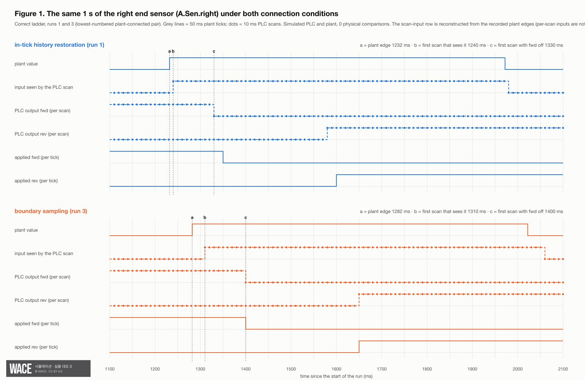
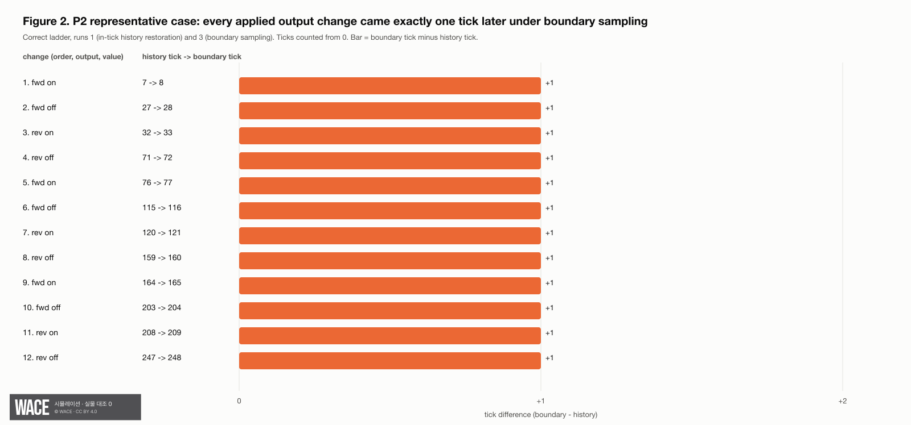
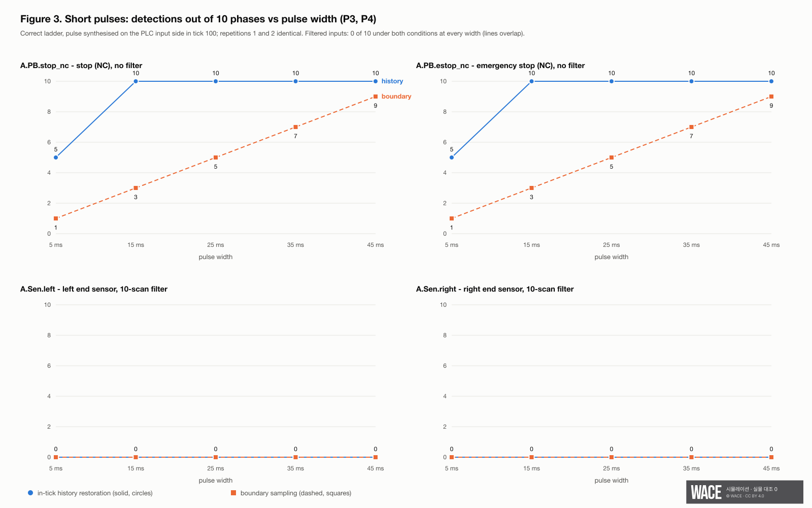

## Abstract

When a PLC scans faster than the plant model it is connected to, the connection has to decide what input the PLC sees at each scan inside one plant tick. The pre-registered question was: in one simulated cell (cell A: a shuttle conveyor with five Boolean inputs, PLC scan 10 ms, plant tick 50 ms, so 5 scans per tick), how differently do two connection methods make the same ladder's verdict come out? **Boundary sampling** gives all 5 scans the input value at the start of the tick; **in-tick history restoration** restores the input value at each scan time from the plant's 1 ms change record. The question, predictions, metric definitions and verdict lines were fixed in a pre-registration whose SHA-256 was committed to a public repository before the official round; the analysis code was written after the runs (Section 5). In that round (816 runs, every combination run twice with identical trace hashes, 0 invalid) all four pre-registered predictions held. No test-bench verdict changed (false alarm on the correct ladder 0/1, missed negative 0/2). In the same round boundary sampling missed short stop and emergency-stop pulses that restoration caught: a 15 ms pulse was missed in 7 of 10 phases under boundary sampling and in 0 of 10 under restoration. We also report, as pre-registered prediction P2, that on all three ladders every applied output change under boundary sampling came exactly one tick later than under restoration (12, 3 and 1 changes). This holds at the input-edge phases that occurred in this scenario (end-sensor edges 22 ms and 32 ms after the tick start on the correct ladder); it is not a general property of boundary sampling (Section 7). In a short-pulse test on the correct ladder, a stop or emergency-stop pulse of 5–45 ms was detected in 1, 3, 5, 7, 9 of 10 phases under boundary sampling and 5, 10, 10, 10, 10 of 10 under restoration; pulses on the two end sensors, which go through a 10-scan confirmation filter, were detected in 0 of 10 under both. These results cover one cell, three self-authored ladders, one scenario, a simulated PLC and a simulated plant whose physical values are assumed; no physical comparison is included (0 physical runs). A second cell (cell B, 10 ms tick) was dropped before the runs because the plant-model program fixes its tick length and does not record in-tick history for integer inputs.

## 1. Question

The pre-registered question, translated: **"In the cell-A connection, where the plant-model tick (50 ms) is longer than the PLC scan (10 ms), how differently do the two connection methods make the verdict of the same ladder come out?"** The title recorded with the pre-registration's hash in the public repository reads: "how often sampling plant inputs only at tick boundaries changes the PLC verdict, compared with restoring in-tick history (simulated cell A)".

A PLC connected to a plant model receives plant inputs once per plant tick but executes several scans per tick; here there are 5 scans per tick. The two methods:

- **Boundary sampling.** Every scan in the tick (T, T+50 ms] receives the input value at the tick start T. We did not use the non-causal variant that applies the tick-end value early.
- **In-tick history restoration.** The plant model reports every input change inside the tick with 1 ms resolution (`edges`); the connection restores the input value at each scan time T+10, T+20, …, T+50 ms. This is the connection used in our existing test bench. A change that begins and ends between two scans (shorter than 10 ms) is invisible to the PLC under both methods.
- **Outputs** are handled the same way in both: the outputs (Q) of the last scan of a tick are applied to the plant at the next tick.

Besides the verdicts, we report the timing of applied outputs and short-pulse detection, which the pre-registration also fixed as predictions (P2–P4) and metrics.

## 2. Why this is a simulation-only question

Both methods see the same ladder, the same plant model and the same plant inputs; only the connection differs. Changing one condition while keeping every other bit identical, and repeating the run with an identical trace hash, is possible only in simulation. The result says nothing about physical PLCs or physical conveyors (Section 7).

## 3. Experimental design

**Cell.** Cell A only: plant tick 50 ms, PLC scan 10 ms (5 scans per tick), belt speed 0.6 m/s (a value in the cell file; it is an assumed physical value, not a measured one). The five inputs are all Boolean: start button, stop button (normally closed), emergency stop (normally closed), left end sensor and right end sensor. Outputs are forward and reverse drive.

**Why cell B is not in this report.** The pre-registration first checked, in code, whether the second cell (cell B, a sorting line with a cumulative high-speed counter) could be run with a 50 ms tick. It could not, for two reasons. (1) The plant-model program fixes cell B's tick at 10 ms, has no command that changes the tick length, and its cell-B plant model is fixed at build time; rebuilding it was outside the scope of this report. (2) Even with a longer tick, integer inputs (such as cell B's counter) are reported as a single end-of-tick value, not as in-tick history, so "history restoration" would change the counter once per tick exactly as boundary sampling does and the two conditions would not differ on that input. An earlier run record confirmed both points (every tick 10 ms; every counter change stamped at the tick end, at most one per tick). The pre-registration therefore reduced the report to cell A before any official run and withdrew the cell-B predictions of its previous version (v0.2). v0.2 was never publicly registered; the withdrawal is recorded in the change note of v0.3, the version whose hash was committed, so readers can verify its wording but not that v0.2 existed in that form.

**Ladders.** Three ladders for cell A, all written by our team, fixed by SHA-256:
- `correct` — start latches a run memory and drives forward; the right sensor, confirmed over 10 consecutive scans, turns both directions off for 25 scans and then drives in reverse; the left sensor counts a round trip and drives forward again; after 3 round trips it stops. Stop and emergency stop act within one scan.
- `late-reverse` (negative) — after the right sensor, forward drive continues for 150 more scans with no pause and then reverses at once. By then the part has run off the open end (expected event `PART_DROP`). The applied outputs show this: forward off and reverse on in the same tick (5.3).
- `swapped-sensors` (negative) — the left and right sensor contacts are swapped in the decision rungs, so the shuttle cannot reverse at the right end (expected event `PART_DROP`).

**Conditions.** `history` and `boundary`, implemented by one fixed adapter that replaces only the input-restoration function of the test-bench runner and first passes every original restoration check (schema, edge times, end-of-tick reconstruction) before applying boundary sampling. The adapter imports the runner's own restoration function; that function and the runner's verdict code are released, the engines it drives are not (Section 8).

**Plant-connected test.** 3 ladders × 2 conditions × the `normal` scenario of 1,000 ticks × 2 repetitions = 12 runs.

**Short-pulse test.** Correct ladder only. For 4 inputs — two without a filter (`A.PB.stop_nc`, `A.PB.estop_nc`) and two with the 10-scan confirmation filter (`A.Sen.left`, `A.Sen.right`) — × pulse width {5, 15, 25, 35, 45 ms} × phase {0, 5, …, 45 ms} × 2 conditions × 2 repetitions = 800 runs, plus pulse-free baselines 2 conditions × 2 repetitions = 4 runs. Each run is 200 ticks. A pulse starts in tick 100 (0-based) at tick start + phase + 1 ms and lasts the given width; during the pulse the PLC receives the opposite of the plant value for that input. The plant model does not know about the pulse. Under boundary sampling a scan's input is inverted if its tick-start time falls inside the pulse; under restoration, if its own scan time does. The "tick phase" factor of an earlier version of the pre-registration was moved here, because in the plant-connected test the plant decides when inputs change.

**Metrics (definitions pre-registered).**
1. False alarm on the correct ladder ([PASS] → [FAIL]) and missed negatives (detected → not detected), reported separately and as numerator/denominator (denominators below 20).
2. Missed Boolean edges: plant edge pairs never visible in the PLC's scan inputs.
3. Plant events: difference in count per event name and in first-occurrence tick (tolerance 0).
4. Applied Q: the list of output changes (tick, tag, value) under each condition and the distribution of tick differences.
5. Short-pulse detection: a pulse is "detected" if the applied Q in ticks 100–140 (0-based) differs in at least one tick from the pulse-free baseline of the same condition and repetition number; reported as detections out of 10 phases per input and width.

**Run rules (pre-registered).** No pass/fail line; the result is published whichever way it comes out. A combination is invalid if its two repetitions have different trace hashes (no re-run before the cause is investigated), if child processes were not reclaimed, if input restoration raised an exception, or if the adapter hash differs from the fixed one. At most 2 retries per cause for the whole report, each preceded by a recorded code or procedure change. Every official run is numbered and listed with its outcome.

**Fixed inputs.** The three ladders, the tag map, the cell file, the plant-model executable, the test-bench runner and engine host, the judgement criteria, the reference logic, the PLC-engine build and the adapter are fixed by SHA-256 in the pre-registration, together with a manifest of 109 files covering the remaining test-bench files and the evidence for the cell-B check. The analysis re-checked the adapter hash for every run (5.0). The analysis code itself was not among the fixed inputs (Section 5, first paragraph).

## 4. Pre-registered predictions and verdicts

The predictions were derived from the structure of the correct ladder and from an earlier run record under the history condition, in which the end sensors changed 22 ms and 32 ms after the tick start. We state that we looked at that record before writing the predictions.

**Pre-registered derivation (quoted, translated; the pre-registration is fixed and is not edited).** "The end sensors go through a 10-scan confirmation filter. If an edge lies inside the tick at (T+10, T+50], history restoration confirms it at a scan between T+120 and T+140 and boundary sampling at the T+150 scan; both lie in the same tick (T+100, T+150], so they are applied to the plant with the same end-of-tick Q. The later delays in scans (the 25-scan pause, the 150-scan delay of late-reverse) are multiples of 5 and keep the tick alignment. The unfiltered start button, however, is seen in the same tick under restoration and in the next tick under boundary sampling. So the difference between the two conditions is predicted to be one tick of delay introduced at start."

**Notes on the quoted derivation (added in this report).** (a) The first scan that can see such an edge under restoration is T+20, T+30, T+40 or T+50, so the lower bound should read T+110, not T+120; the conclusion (same tick) is unchanged. This rests on a confirmation rule of "first scan that sees the edge + 90 ms", which a reviewer inferred from the raw records (for example, a right-sensor edge at 32 ms on the correct ladder led to an output change in the tick the rule predicts under each condition); it is an estimate, not a pre-registered or separately tested rule. (b) "The same end-of-tick Q" compares the two conditions from the moment the edge occurs. In the runs, the whole plant trajectory under boundary sampling is already one tick behind because the start was seen one tick later, so the edges themselves occur one tick later. The statement means: measured from the moment each condition's PLC first sees the edge, the filter adds no further tick of delay. (c) The derivation covers only edges in (T+10, T+50]. For an edge in the first 10 ms of a tick, (T, T+10], the same estimated rule would confirm it at T+100 under restoration and at T+150 under boundary sampling — one tick apart — which, added to the start delay, would give +2 ticks. This was not pre-registered and was not tested (Section 7).

**Table 1. Predictions (fixed before the runs) and verdicts (tr02-official-1)**

| # | Prediction | Verdict line | Verdict |
| --- | --- | --- | --- |
| P1 Verdicts unchanged | On the correct ladder and both negatives, the two conditions give the same count of plant events per event name and the same final verdict. False alarm 0/1, missed negatives 0/2 | Any difference → did not hold | **Held** |
| P2 Exactly one tick of delay | On all three ladders, the applied Q history under boundary sampling equals the history under restoration delayed by exactly one tick (same order and values, every change +1 tick); every first-occurrence tick of a plant event also differs by +1 | Any change not at +1 tick → did not hold | **Held** |
| P3 Short pulses, unfiltered inputs | For `A.PB.stop_nc` and `A.PB.estop_nc`, detections out of 10 phases: boundary sampling 1, 3, 5, 7, 9 and restoration 5, 10, 10, 10, 10 for widths 5, 15, 25, 35, 45 ms | Any difference → did not hold | **Held** |
| P4 Short pulses, 10-scan filter | For `A.Sen.left` and `A.Sen.right`, 0 of 10 for every width from 5 to 45 ms under both conditions | Any detection → did not hold | **Held** |

All four predictions held. Their holding should not be read as more than it is. P3 and P4 are close to arithmetic: under boundary sampling a pulse is seen only if it covers a tick start, and with a 5 ms phase grid that gives the grid values stated; under restoration any pulse of at least 10 ms covers a scan time; and no pulse shorter than 50 ms can survive a 10-scan filter. The pre-registration says so: P3 checks the adapter implementation and the ladder's one-scan response to stop together, not a new effect. P1 and P2 were derived from the ladder structure and a record we had already seen. What the round adds is that the prediction was checked on every applied output change of every plant-connected run, not only on the cases used to derive it.

## 5. Results

**How the numbers were computed.** The metric definitions were fixed before the runs; the analysis code was not. The analysis script was first written at about 10:20 KST on 2026-09-30, after the last official run had ended (10:16:25), and its SHA-256 is not in the pre-registration. Implementation choices made in that code, after the results existed: (1) tick numbers of applied outputs are counted from 0; (2) metric 2 is computed by re-applying each condition's fixed restoration to the recorded plant edges, because the traces log per-scan outputs but not per-scan inputs; (3) metrics 2, 3, 4 and the edge phases (5.6) use repetition 1 only — metric 2 covers 8 runs (the 6 plant-connected runs and the 2 baselines of repetition 1). Repetition 2 enters through the trace-hash comparison (5.0), which found every repetition 2 identical to its repetition 1.

**Tick numbering.** Output-change ticks (5.3) and the pulse tick and window are 0-based. First-occurrence ticks of plant events (5.2) are the runner's own tick counter as written in its summaries, which counts from 1. Differences between the two conditions are unaffected.

All numbers in this section come from the result file of round tr02-official-1, the run ledger or the per-run summaries; Appendix A lists the source of each.

**5.0 Validity.** The ledger has 816 rows with 816 distinct run numbers. No run returned a non-zero exit code, every run passed the child-process check, no run recorded an adapter hash different from the fixed one, and the adapter file itself matched. The 408 combinations each ran twice, and in all 408 the two trace hashes were identical — 0 invalid combinations. Re-running input restoration during analysis raised 0 exceptions. The analysis script was run twice and produced byte-identical result files.

**5.1 Verdicts (metric 1).** False alarm on the correct ladder: **0/1**. Missed negatives: **0/2**. The verdicts are those written by the test-bench runner in each run's summary, against its fixed judgement criteria. Re-running the runner's released verdict code on the recorded traces reproduces the verdict of all 816 runs (Section 8).

| Ladder | History (run · verdict) | Boundary (run · verdict) |
| --- | --- | --- |
| correct | 1 · [PASS] | 3 · [PASS] |
| late-reverse | 5 · [FAIL] | 7 · [FAIL] |
| swapped-sensors | 9 · [FAIL] | 11 · [FAIL] |

**5.2 Plant events (metric 3, repetition 1).** The correct ladder produced no plant event under either condition. Each negative produced one `PART_DROP` under each condition (count difference 0); the first occurrence was at runner tick 37 under restoration and tick 38 under boundary sampling (+1) for both `late-reverse` and `swapped-sensors`.

**5.3 Applied outputs (metric 4, repetition 1).** The number of applied output changes was the same under both conditions — 12 (correct), 3 (late-reverse), 1 (swapped-sensors) — with the same tags and values in the same order. Every one of those changes occurred exactly one tick later under boundary sampling (tick-difference distribution: +1 for 12 of 12, 3 of 3 and 1 of 1). On the correct ladder the first forward drive was applied at tick 7 under restoration and tick 8 under boundary sampling, and the last reverse-off at tick 247 and 248. On `late-reverse` forward drive went on at tick 7, and forward off and reverse on came together at tick 57 (restoration; 8 and 58 under boundary sampling); on the correct ladder forward went off at tick 27 and reverse on at tick 32 (restoration).

**5.4 Missed Boolean edges (metric 2, repetition 1, 8 runs).** Metric 2 is a recomputation, not a direct observation: per-scan inputs are not logged, so the analysis re-applied each condition's restoration to the recorded plant edges and counted plant edge pairs that fall between two neighbouring scan samples. On the two end sensors no edge pair was missed under either condition: every plant edge appeared as a scan-input transition (on the correct ladder, 5 left-sensor and 6 right-sensor edges). The stop and emergency-stop inputs had no plant edges in this scenario, so their metric 2 is 0 by construction. The start button had the same counts under both conditions — 6 plant edges, of which 2 appeared as scan-input transitions and 2 edge pairs were missed, because both edges of each of those pairs fell between the same two scan samples. The count therefore does not separate the two conditions; it describes the scenario's start input. (The tick in which the PLC first sees the start input does differ between the conditions — that is the one-tick shift of 5.3.) The bookkeeping check (plant edges − missed edges = scan-input transitions, and every restored value equals the plant value at its sample time) passed for every run and tag (0 mismatches); it is a self-consistency check inside the same recomputation.

**5.5 Short pulses (metric 5).** Detections out of 10 phases; repetitions 1 and 2 were identical in every cell, and the pulse-free baselines were identical across repetitions in the window under both conditions.

**Table 2. Short-pulse detections out of 10 (correct ladder, same in both repetitions)**

| Input | Condition | 5 ms | 15 ms | 25 ms | 35 ms | 45 ms |
| --- | --- | --- | --- | --- | --- | --- |
| `A.PB.stop_nc` | history | 5 | 10 | 10 | 10 | 10 |
| `A.PB.stop_nc` | boundary | 1 | 3 | 5 | 7 | 9 |
| `A.PB.estop_nc` | history | 5 | 10 | 10 | 10 | 10 |
| `A.PB.estop_nc` | boundary | 1 | 3 | 5 | 7 | 9 |
| `A.Sen.left` | history | 0 | 0 | 0 | 0 | 0 |
| `A.Sen.left` | boundary | 0 | 0 | 0 | 0 | 0 |
| `A.Sen.right` | history | 0 | 0 | 0 | 0 | 0 |
| `A.Sen.right` | boundary | 0 | 0 | 0 | 0 | 0 |

In this simulated connection, a stop or emergency-stop signal shorter than one tick is seen under boundary sampling only when it happens to cover a tick start: a 15 ms pulse in 3 of 10 phases, against 10 of 10 under restoration. The pulses are synthesised on the PLC input side; they are not a model of contact bounce or of a real operator's press (Section 7).

**5.6 Observed edge phases in the plant-connected test (repetition 1).** On the correct ladder the left sensor changed 22 ms after the tick start 2 times and 32 ms after it 3 times, and the right sensor 3 times at each; the start button changed at 1, 2 and 3 ms, 2 times each. On both negatives the right sensor changed once at 5 ms and once at 32 ms. The distributions are identical under the two conditions, as they must be, since the plant decides when its inputs change. Only phases that occurred are covered; the short-pulse test (5.5) is where phase is controlled. The 5 ms right-sensor edge on the negatives lies in the first 10 ms of a tick, the case the derivation does not cover (Section 4, note c). Observed after the fact: it is the sensor turning off as the part moved on toward the open end, before the drop event, and every applied output change on both negatives still differed by exactly +1 tick (5.3), so it produced no output change in either run.

**5.7 Checks that the analysis can fail — for P2, metric 2 and metric 5.** Comparing a history run with itself gives a tick difference of 0, which the P2 test rejects (the real comparison gives +1). Injecting, into an in-memory copy of one tick, a 12 ms / 17 ms edge pair on `A.PB.stop_nc` makes metric 2 report 1 missed edge pair with the bookkeeping check still consistent. For metric 5 there was no fault injection; we only observed that, for a 5 ms stop pulse, the detection test marks phase 45 under boundary sampling and phases 5, 15, 25, 35 and 45 under restoration, i.e. it does not return the same answer for both conditions. The code that turns P1, P3 and P4 into verdicts has no negative control. The run files were not modified.

**5.8 Recorded only — outside the pre-registered metrics.** Each run also writes a summary verdict against the test bench's general acceptance criteria. All 804 short-pulse and baseline runs have the summary verdict [FAIL]. This is not a metric of this report and does not indicate a fault: the general criterion for cell A asks for 3 completed round trips in a 1,000-tick normal run, and these runs are 200 ticks long. The 4 pulse-free baselines and 520 pulse runs had completed 2 round trips, and the ladder's run flag was still set at tick 200; the other 280 pulse runs — exactly the runs in which a stop or emergency-stop pulse was detected — stopped after 1 round trip, because the ladder stops on a stop signal. No plant event occurred in any of the 804 runs. (The breakdown into 524 and 280 is taken from the per-run summary records, not from the analysis result file; see Appendix A.)

## 6. Run ledger

**Table 3. Official rounds**

| Round | Runs | Valid? | Invalid combinations | Note |
| --- | --- | --- | --- | --- |
| tr02-official-1 | 816 (12 plant-connected, 800 short-pulse, 4 baseline) | valid · adopted | 0 of 408 | runs ended 2026-09-30 10:10:27–10:16:25 KST; per-run durations sum to 346.3 s |

There was one official round. Before it, while the pre-registration was being fixed, two 3-tick start-up checks were run (one per condition) to confirm that the processes start and are reclaimed. The ladder had not started by tick 3, so those runs carry no information about the verdicts; they were declared in the pre-registration and are not official runs.

The pre-registration's SHA-256 was committed to the public repository at 2026-09-30 08:52:18 KST (commit b743b0f). The ledger records end times and durations but not start times; the first official run ended at 10:10:27 after 0.9 s, so it started at about 10:10:26 KST, about 78 minutes after the commit.

At run time the test-bench repository was one commit past the tag named in the pre-registration; the only difference is a recording script not used by these runs. The run metadata does not record that repository's commit, but every fixed-input hash recorded in the run metadata (ladders, runner, engine host, cell file, plant-model executable, criteria, reference logic) matched the pre-registration.

## 7. Threats to validity and what this report does not claim

- **Physical systems.** The PLC is a simulated PLC engine and the plant is a simulated plant model with assumed physical values; 0 physical comparisons. We do not claim the same result on a physical PLC or conveyor.
- **Other ratios and output handling.** The result is limited to this connection's 5:1 scan-to-tick ratio and to holding the last scan's Q for the next tick. We do not claim it for other ratios or output interpolation schemes.
- **"Exactly one tick" is an observation at the edge phases that occurred, not a property of boundary sampling.** By the derivation in Section 4 it needs three conditions: the start button is the only unfiltered input that changes in this scenario; the scan delays in the ladders are multiples of 5; and every filtered-input edge the ladder acts on lies after the first scan of its tick (here 22 ms and 32 ms on the correct ladder). If a filtered edge that the ladder acts on fell in the first 10 ms of a tick, the estimated confirmation rule would give +2 ticks (Section 4, note c); this was not tested. The one such edge in this round (5 ms, on the negatives) produced no output change (5.6).
- **One cell, one scenario.** One cell with five Boolean inputs, three ladders written by the team that built the test bench, one scenario (`normal`, seed 1), 1,000 ticks.
- **Cell B and counters.** Cell B, the packing cell (which uses the same plant model as cell B) and ladders that locate parts by a cumulative high-speed counter are excluded (Section 3). This report says nothing about integer inputs.
- **Short pulses.** Pulses were synthesised on the PLC input side and the plant model does not know them. We do not claim they represent real contact bounce.
- **Products.** We do not claim that any commercial simulator or digital-twin product has this issue.
- **Predictions seen in advance; analysis written afterwards.** The predictions were written after looking at one earlier history-condition record (Section 4); P3 and P4 are close to arithmetic. The analysis code was written after the runs and is not covered by the pre-registration hash (Section 5).
- **Conclusion.** Exact counts on fixed inputs; no statistical test. Two identical repetitions are a reproduction on the same machine and the same inputs, not statistical replication.

## 8. Released files, and what a reader can and cannot check with them

Following the pre-registration (Section 10 there) and the publication plan for this series, the files below are released with this report in the folder `TR-2026-02/` of the repository github.com/waceinc/tech-reports (the release bundle). Paths below are relative to that folder. `MANIFEST.md` in the bundle lists every file with its SHA-256 and licence.

**Redaction of local paths.** Some files as run contained absolute local paths (the author's repository folder). They are released as *public versions* in which one local absolute directory prefix is replaced by the placeholder `<repos>/`; every other byte is unchanged. The replacement is done by a deterministic script released in the bundle (`scripts/redact_paths.py`); it refuses input that already contains the placeholder, and the author checked, for every changed file, that restoring the prefix gives back the original bytes. Packing the run records twice gave byte-identical archives. The prefix is not released, so the original hashes of the five path-redacted files (adapter, runner `run.py`, analysis script, official run script, ladder conversion script) and of the 1,632 changed archive members cannot be reproduced from the bundle alone. They are given only as correspondences: the adapter hash `f5241b5f…` with the pre-registration, the result file and every run's adapter side record; the runner hash `4bbcfaf8…` with the pre-registration and every run's metadata; the analysis-script hash `b1ca7dcd…` with the result file; for the official run script, the conversion script and the archive members, the original hashes are stated by the author (`MANIFEST.md`, `tr02-official-1_files.tsv`). Files that contained no local path are released byte-identical.

1. **Pre-registration** v0.3 (Korean), `preregistration/TR-2026-02_사전등록_v0.3.md`, released byte-identical: SHA-256 `5e610e77633369fe5dd001af80451e58a09fe24699a3585065c13712eab217c4`, as committed in `PREREGISTRATIONS.md` (commit b743b0f). It names private repositories and their commits, source-file locations and line numbers, an executable path, internal approval codes and relative names of the author's working folders (listed in `MANIFEST.md`); it is not edited, because its hash was committed before the runs.
2. **Ladders, public versions** (`ladders/`). The ladder files used in the runs (run versions) carry a top-level field that the PLC-engine parser requires, so it could not be removed from them. It is line 4 of each run version and reads, in full:

   `  "marker": "CONFIDENTIAL — WACE trade secret",`

   The company withdrew the trade-secret designation on 2026-09-20 and confirmed the removal of the remaining markings on 2026-09-29; the field remains only because the PLC-engine parser requires it. The public version of each ladder is the run version with exactly that line removed and every other byte unchanged, produced by the deterministic conversion script `ladders/공개본_변환.py` (released in its path-redacted version; original SHA-256 `4c9dab5a5f8ac533c21d898f3a28d56bee8a6ce69d815fe14ea705f0f7c11561`, public `c295e305d33277c9fd6265cf78d43122528b6a298f99b64416ea3481de94d660`). The run versions are not released. A reader can reproduce each run-version hash below by inserting the line above as line 4 of the public version (including its two leading spaces and trailing comma) and hashing the result:

| Ladder | Run version SHA-256 | Public version SHA-256 |
| --- | --- | --- |
| `cell-a/correct` | `5058bd0b97644e66c0310a540a0403931bf6bd8195445576430d6dd1cabf8ef1` | `c63691f6cdb5918bd05c421bb5a920b77ae3dd36592b95a99b3b5b6d743aea39` |
| `cell-a/late-reverse` | `76018c387dddc09aa5411da241897c1ba20a4629844c301ccd3200140f1b7aa1` | `d19d4920d3590961840e30a02daf8173d8a3ca8c5dc6cadac90f66fd9574770c` |
| `cell-a/swapped-sensors` | `7fd10917b31949e24528fbc5398501cdd9852cda18537af07671c0d308e8c6e5` | `ed7588886884fb4741d972f5b88b44f975f053221056fc8107d5f30c6986e1d3` |

3. **Connection-condition adapter**, `adapter/TR-02_연결조건_어댑터.py`, path-redacted. Original SHA-256 `f5241b5f5d5286ff6366bdff33da8ec599e343d67ba6fd1ebaf129f1a7d10c40` (the hash fixed in the pre-registration and recorded in every run), public version `d837802aa993ec0f8b3aa141da6524c37b94bc17f278f7a2d2ef591bb5a882c2`. It imports the private runner's restoration function and does not run on its own.
4. **Run records** (`runs/`): the run ledger `ledger.jsonl` (816 rows, SHA-256 `80de3ea71eb82f76388a47f03122830e97eee0b0adcfd0d4a1ae7d5496ea79e6`, no local path, byte-identical) and the per-run records of all 816 runs as one archive, `tr02-official-1.tar.xz` (tick traces with plant edges and applied outputs, summaries, metadata, process checks, adapter side records; 7,346 files). `tr02-official-1_files.tsv` lists every archived file with its public and original SHA-256. Only two kinds of file changed: the 816 `metadata.json` files and the first line (run metadata) of the 816 `trace.jsonl` files, each with 10 path replacements; the other 5,714 files are byte-identical. The tick rows of the traces are untouched, so every trace hash in the ledger can be recomputed from the public traces (the trace hash is the SHA-256 of the compact, key-sorted JSON list of the per-tick `hash` fields). The run metadata still lists the file names and hashes of the private runner's files. Each run folder also holds four files that are not metrics of this report: `static.json` (the static check of the ladder by the PLC-engine host; [PASS] in all 816 runs, with its warnings), `reference-10ms-differences.json` (per-scan differences between the correct ladder's outputs and the private reference logic fed the same scan inputs, recorded only for the correct ladder; empty in all 816 runs), `plc-stderr.log` (empty in all 816 runs) and `vision-stderr.log` (the plant-model program's start-up line); the archive root holds `STATUS.txt` (the run script's end status).
5. **Results** (`results/`): the result summary `TR-02_결과_tr02-official-1.json` (SHA-256 `f1838a4229247d12ea182a414cc30629e32dd4990cc26e3ac615668473bc6da3`, byte-identical) and its Korean Markdown rendering, the analysis check record (determinism and positive controls, Korean) and the separate check record (Korean).
6. **Scripts** (`scripts/`):
   - the **analysis scripts** that produced the result file: analysis `TR-02_분석.py`, path-redacted (original `b1ca7dcd…`, public `a27ad316…`), and table rendering `TR02_분석_표.py` (`82a43131…`, byte-identical). The analysis script does not run without the private runner.
   - the **separately written check script** `TR-02_리드독립검산.py` (`0c20628e…`, byte-identical), which recomputes the four prediction verdicts and the 5.8 split from the traces and summaries without the analysis script or the adapter. It runs unchanged on the extracted archive; its output there is identical to its output on the original run folder and to the separate check record.
   - the **number re-extraction script** `reextract_numbers.py`, which re-extracts every number in Sections 1–10 of this report from the bundle and compares it with the text (pre-release gate 1, Section 9). Numbers that cannot come from the bundle are printed at the end of its output with their source: the creation time of the analysis script, the commit time in the public repository and the design constants of the pre-registration.
   - the **recomputation script** `recompute_metrics_1_2.py`, which recomputes metric 1 and metric 2 from released files only (item 8). Its output from the isolated run is released as `results/recompute_metrics_1_2_output.txt`.
   - the **official run script** `TR-02_공식실행.py`, path-redacted (original `5764b684…`, public `9f93df96…`), which fixed the order and numbering of the 816 runs and wrote the ledger. It calls the adapter and does not run without the private engines.
   - the **figure script** `make_figures.py` and the **redaction script** `redact_paths.py` described above.
7. **Figures** (`figures/`), the three listed in the pre-registration: (1) the same 1 s of the right end sensor under both conditions; (2) the P2 representative case, the one-tick shift of applied outputs; (3) the short-pulse curves (P3, P4). They are drawn directly from the traces and the result file by `make_figures.py` (no generative imaging) from bundle files only; every applied-output change drawn and the detection counts are asserted against the result file, and the drawn values are released as `figures/figure_values.json`. In Figure 1 the row of inputs seen by each scan and the marker for the first scan that sees the edge are reconstructed by the figure script from the recorded plant edges, because per-scan inputs are not logged (5.4); the tick-start inputs are checked against the traces. The script writes SVG files with the watermark badge drawn in (the WACE wordmark file `figures/wace-wordmark-white.svg` is read from the bundle) and renders PNG files with `rsvg-convert`; both are released. The SVG files are byte-reproducible from the bundle; the PNG pixels depend on the renderer and the installed fonts (the released PNGs were rendered with librsvg 2.63.2; in a check without the badge font installed, the SVGs were identical and the PNGs differed). The representative runs follow the pre-registration's rule (lowest-numbered combination): runs 1 and 3. Figure 1 shows the plant value, the input seen by each PLC scan, the PLC output per scan and the applied output per tick; the pre-registration also named the ladder's confirmation bit, which is not recorded in the traces, so the per-scan forward output (which switches off when the right-sensor confirmation completes on the correct ladder) is shown instead. The figures are reproduced in Section 5; no number in this text is read from them.

8. **Thin layer of the test-bench runner** (`runner_thin_layer/`, from the private repository at commit af9cc40, the tag named in the pre-registration). `bridge/run.py` (the runner: input restoration `reconstruct` and verdict code `verdict`; path-redacted, original `4bbcfaf8…` — the pre-registered hash, also recorded in every run's metadata — public `e0462ac1…`), `bridge/transport.py` (imported by `run.py`; process and JSON helpers), `bridge/scenarios_3j.py` and `bridge/scenarios_3i.py` (per-tick negative judgments) and the judgement criteria `experiments/S2/criteria-3k.md` (Korean, `295af9c0…`, the pre-registered hash); the last four are byte-identical and their hashes equal those in every run's metadata. `run.py` starts the engines when a run is executed, but importing it starts nothing. In an isolated folder that held only a copy of the bundle, with every other location of the author's machine made unreadable by the operating system's sandbox, `recompute_metrics_1_2.py` recomputed the verdict of all 816 runs with `run.verdict` from the traces (cell A defines no per-tick negative judgments: all 172,800 recorded judgment lists are empty, and `negative_judgments` returns empty lists, so that part of the check is trivially satisfied): every verdict field equals the run's summary and the ledger status, and metric 1 equals the result file (false alarm 0/1, missed negatives 0/2). It recomputed metric 2 with the released adapter, the released `reconstruct` and the analysis script's own `missed_edges`: 8 of 8 entries equal the result file. The verdict reads the plant events, plant state and PLC probes recorded in the traces; those values were produced by the private plant model and PLC engine and are not recomputed. The end-sensor visit list that the verdict uses is computed inline in `run.run`; the recomputation script copies those lines.

**What stays private.** The PLC simulator engine (with the engine host), the plant-model program (internal program name Vision 2 extctl, including the cell file and the reference logic of the plant-device library) and the rest of the test-bench runner (tag maps and the other bridge files) are in private repositories and are not released.

**What a reader can and cannot check with the released files.**

| Item | Can a reader check it? |
| --- | --- |
| Pre-registration existed before the runs | Yes — hash against commit b743b0f (Section 6 for run times) |
| Public ladders ↔ run-version hashes | Yes — by re-inserting line 4 as described in item 2 |
| Hashes of all released files; trace hashes in the ledger | Yes — `MANIFEST.md`, `tr02-official-1_files.tsv`; trace hashes from the public traces |
| Original hashes of the path-redacted files (adapter `f5241b5f…`, runner `run.py` `4bbcfaf8…`, analysis and run scripts, conversion script, metadata, trace first lines) | No — not from the bundle alone. They are given as correspondences with values recorded in the pre-registration, the result file and the run records, or stated by the author (see *Redaction of local paths*) |
| Judgement criteria (`criteria-3k.md`) of the pre-registration's Section 7 | Yes — released byte-identical |
| Hashes of the other fixed inputs in the pre-registration's Section 7 (tag map, cell file, plant-model executable, engine host, reference logic, engine build, 109-file manifest) | No — those files are not released |
| Metric 1 verdicts | Yes, from the recorded traces — `recompute_metrics_1_2.py` re-runs the released verdict code. The plant events, plant state and PLC probes that the verdict reads come from the private plant model and engine and are taken as recorded |
| Metric 2 (missed edges) | Yes — `recompute_metrics_1_2.py` re-runs the released restoration (`run.reconstruct` through the adapter) and the analysis script's `missed_edges` |
| Metric 3 (plant events) | The comparison, yes; the events themselves, no. Event names and ticks are read from the runner's summaries, generated by the private plant model and runner |
| Metrics 4 and 5 | Partly with released code — the separate check script gives, for metric 4, the number of output changes, their tag/value order and the set of tick differences, and, for metric 5, the repetition-1 detection counts. The change lists (ticks), the tick-difference distribution and repetition 2 need the reader's own code on the traces |
| Edge phases (5.6) | Yes, from the traces, with the reader's own code |
| Prediction verdicts P1–P4 and the 5.8 split | P1, P3, P4, the output part of P2 and the 5.8 split — yes, with the separate check script (P1 reads the runner's verdicts, which the recomputation script reproduces). The event part of P2 (first-occurrence ticks +1) is not in that script; it can be read from the summaries with the reader's own code |
| Every number in this report against the bundle | Yes — `reextract_numbers.py`, except the numbers it lists as not re-extractable |
| Re-executing any run | No |

**Licence.** Report text, tables, the three figures (charts), the result files, the run records (ledger and archive), the ladder JSON files, the judgement criteria (`criteria-3k.md`) and the pre-registration: CC BY 4.0. Code — every `.py` file in the bundle (scripts, the runner thin layer, the adapter and the ladder conversion script): MIT, Copyright (c) 2026 WACE Inc. (주식회사 웨이스). Files whose hashes are fixed carry no licence notice inside; the licence of each file is declared outside it, in `MANIFEST.md`, the licence texts in `LICENSES/` at the repository root and the repository README. This release does not grant any licence under patents of WACE Inc., including Korean patents No. 10-2904772 and No. 10-3003470 and pending applications. The charts carry a badge that reads, in Korean, "simulation · 0 physical comparisons" and "© WACE · CC BY 4.0"; it marks them as simulation results and states their licence. CC BY 4.0 does not grant trademark rights; the WACE wordmark in the badge remains a trademark, and the wordmark file `figures/wace-wordmark-white.svg` is not licensed. The notice "no reuse without permission" is used only on screen captures and videos from the company's 3D viewer (internal program name Vision 2). No such captures or videos are included in this report; where they are published with this series, they are not covered by CC BY 4.0 and may not be reused without permission.

## 9. Checks before release

(1) A script re-extracts every number in this report from the released files and matches the text: done for this version with the released script `reextract_numbers.py` against the bundle (0 mismatches; the numbers it cannot re-extract are listed at the end of its output). (2) Review by AI agents given earlier drafts as external drafts, with no drafting context (two review rounds; this version responds to both). There is no human reviewer and the report is not peer-reviewed. (3) Fact check of the company facts and names against the company's records (one date corrected). (4) Release approved by the CEO on 2026-09-30.

## 10. Use of generative AI

The experiment code (test bench, adapter, run and analysis scripts) was written with LLM coding agents — Claude (Anthropic) and Codex (OpenAI) — under the author's direction. The pre-registration text and this report were also drafted by an LLM agent. P1, P3, P4, the output part of P2 and the 5.8 split were recomputed with a separately written script that reads the traces and summaries directly and does not use the analysis script; it matched. The event part of P2 was not in that script. That script was written after the analysis, by an agent of the same model families. Metric 2, the edge phases and the event first-occurrence ticks were not recomputed independently; the recomputation of metrics 1 and 2 from released files (Section 8, item 8) re-runs the same verdict, restoration and analysis code, so it is a reproduction from the released files, not an independent check. The path-redaction script, the number re-extraction script, the recomputation script and the figure script were also written by an LLM agent; the figures are drawn by code from the data, not by an image-generation model. The two reviews of earlier drafts and the other checks in this work were carried out by agents of the same model families. This report is not peer-reviewed. "Third-party" or "independent" review here means agent runs that did not read each other's output or the drafting context, not human reviewers. The design, the fixing of the pre-registration, run-validity decisions, interpretation and every claim in this report are the responsibility of the named author.

## Appendix A. Where each number comes from

Sources: **R** = result file `TR-02_결과_tr02-official-1.json` (field path given); **L** = run ledger `ledger.jsonl`; **M** = run metadata `0001-correct-history-r1-plant/metadata.json`; **S** = per-run `summary.json`; **K** = analysis check record `TR-02_분석_결정성·대조확인_tr02-official-1.md`; **I** = separate check record `TR-02_리드독립검산_tr02-official-1.md`; **PR** = pre-registration v0.3 (section); **G** = public repository commit b743b0f. **B** = the release bundle (`MANIFEST.md`, `runs/tr02-official-1_files.tsv`, `scripts/redaction_map_public.json`). The full row-by-row comparison is produced by the released script `reextract_numbers.py`.

| # | Number(s) in the text | Source |
| --- | --- | --- |
| A1 | scan 10 ms, tick 50 ms, 5 scans per tick | M `plc_scan_ms`, `factory_tick_ms`; 5 = 50/10 |
| A2 | 0 physical comparisons; scenario `normal`, seed 1 | M `physical_comparison`, `scenario`, `seed` |
| A3 | 816 runs, 816 distinct numbers | R `validity.ledger_rows`, `validity.distinct_no` |
| A4 | 408 combinations, 0 invalid | R `validity.combos`, `validity.invalid_combos`, `validity.rep_hash_mismatch` (empty) |
| A5 | 0 non-zero exit, 0 process failures, 0 adapter mismatches | R `validity.rc_nonzero`, `validity.processes_not_pass`, `validity.adapter_sha_mismatch` (all empty), `validity.adapter_file_sha_ok` |
| A6 | 0 restoration exceptions | R `metric2.*.reconstruct_exceptions` |
| A7 | 12 / 800 / 4 runs; 1,000 and 200 ticks | L count by `kind` (plant / pulse / baseline) and `ticks` |
| A8 | false alarm 0/1, missed negatives 0/2 | R `metric1.false_alarm`, `metric1.missed_negative` |
| A9 | runs 1, 3, 5, 7, 9, 11 and their verdicts | R `metric1.detail` |
| A10 | `PART_DROP` 1/1, first tick 37 / 38 (+1) | R `metric3.late-reverse.PART_DROP`, `metric3.swapped-sensors.PART_DROP` |
| A11 | 12, 3, 1 output changes; all +1 tick | R `metric4.*.changes_history`, `changes_boundary`, `tick_diff_hist`, `same_tag_value_order` |
| A12 | ticks 7 / 8, 247 / 248, 27 and 32 (correct); 7, 57 / 58 and 8 (late-reverse) | R `metric4.correct.history_changes`, `boundary_changes`; `metric4.late-reverse.history_changes`, `boundary_changes` |
| A13 | metric 2 covers 8 runs; start button 6 edges, 2 transitions, 2 missed pairs; sensors 5 and 6 edges; 0 missed on sensors; stop inputs 0 edges; 0 mismatches | R `metric2` (8 keys, `run` fields 1, 3, 5, 7, 9, 11, 13, 15), `per_tag.*`, `reconstructed_value_mismatches`, `identity_ok` |
| A14 | short-pulse detections (Table 2) | R `metric5.<tag>|<width>|<mode>.count` |
| A15 | baselines identical across repetitions | R `baseline_reps_equal` |
| A16 | edge phases 22 / 32 ms, 1 / 2 / 3 ms, 5 / 32 ms and their counts | R `edge_phase_ms` |
| A17 | 804 summary [FAIL] | R `other_status_tally` |
| A18 | 2 round trips at 200 ticks; 524 / 280 split; 0 plant events in 804 runs; 3 round trips at 1,000 ticks | S `probes.Rounds`, `probes.Running`, `event_count` tallied over runs 13–816 (the 280 runs are, run by run, the stop/emergency-stop runs marked detected in R `metric5.*.detected`); I (same split); the 3-round-trip criterion is item F1.3 of the fixed judgement criteria (hash in PR §7), and runs 1 and 3 record 3 in S `probes.Rounds` |
| A19 | positive-control values (tick difference 0 vs +1; 12 ms / 17 ms injected pair → 1 missed pair; phases 45 and 5–45) | K; phases also R `metric5.A.PB.stop_nc|5|*.detected` |
| A20 | analysis ran twice, identical outputs | K |
| A21 | end times 10:10:27–10:16:25; sum 346.3 s; first run 0.9 s → start about 10:10:26; about 78 minutes after the commit | L `ended` (min, max), sum of `seconds`, run 1 `ended` − `seconds`; G commit time |
| A22 | analysis script first written about 10:20 KST | file creation time of the analysis script (10:20:30) and the table script (10:21:31); not in the result file |
| A23 | widths 5–45 ms, phases 0–45 ms, pulse tick 100, window 100–140, 2 repetitions, 2 retries, 109 manifest files, belt 0.6 m/s, 10-scan filter, 25-scan pause, 150-scan delay, 3 round trips | PR §3-2, §4, §5, §6, §7 (design constants, not results) |
| A24 | earlier-record edge phases 22 ms and 32 ms; derivation bounds T+120–T+140, T+150, (T+100, T+150] | PR §3-2 (quoted) |
| A25 | T+110, T+20…T+50, "+ 90 ms", T+100, +2 ticks | estimates in Section 4 notes (a)–(c): arithmetic on the scan grid and a confirmation rule inferred by the reviewer from the raw traces; not results and not pre-registered |
| A26 | commit time 2026-09-30 08:52:18 KST | G |
| A27 | line 4 of the run-version ladders | the ladder files (diff of run and public versions) |
| A28 | all hashes in Section 8 | the files themselves (`shasum -a 256`), matching PR §7 and §10; original hashes of path-redacted files from B (`tr02-official-1_files.tsv`, `MANIFEST.md`) and, for the adapter and analysis script, also R `adapter_sha256`, `analysis_sha256` |
| A29 | 7,346 archived files; 816 `metadata.json` and 816 `trace.jsonl` changed, 10 replacements each; 5,714 unchanged; 3 figures; runs 1 and 3 as representative runs | B `tr02-official-1_files.tsv` (`changed`, `replaced_prefixes`), L (lowest-numbered plant-connected pair of the correct ladder) |
| A30 | 816 run verdicts reproduced; 8 of 8 metric-2 entries; false alarm 0/1, missed negatives 0/2 (recomputed) | B `results/recompute_metrics_1_2_output.txt` (output of `recompute_metrics_1_2.py` in the isolated folder) |
| A31 | 7 of 10 and 0 of 10 missed (15 ms pulse); 172,800 empty judgment lists; static check [PASS] in all 816; reference differences empty in all 816; `plc-stderr.log` empty in all 816 | R `metric5.A.PB.stop_nc|15|*.count` (10 − 3, 10 − 10); run archive (tick rows of all 816 traces, `static.json`, `reference-10ms-differences.json`, `plc-stderr.log`) |
