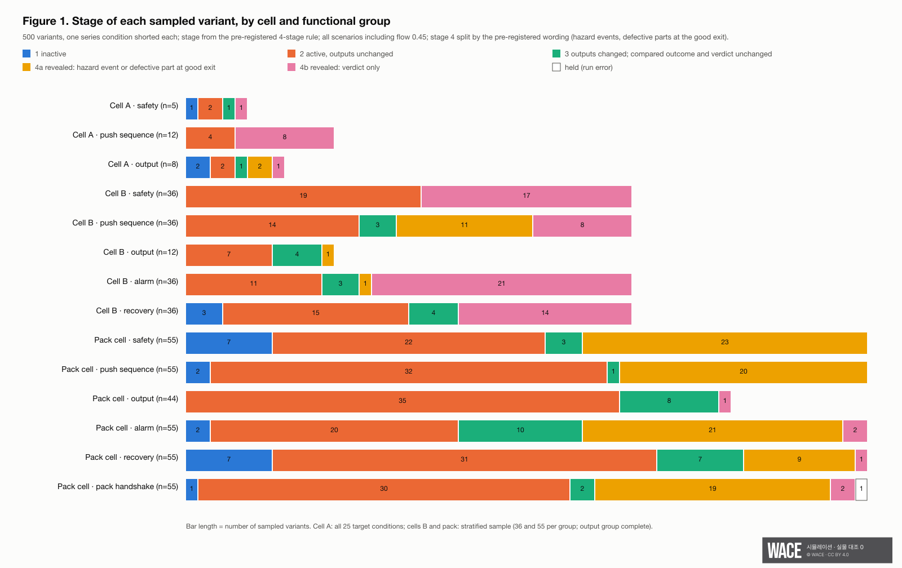
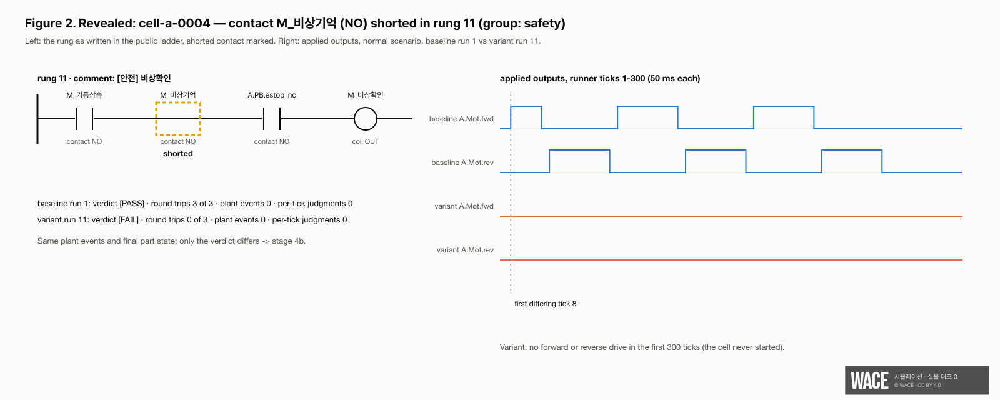
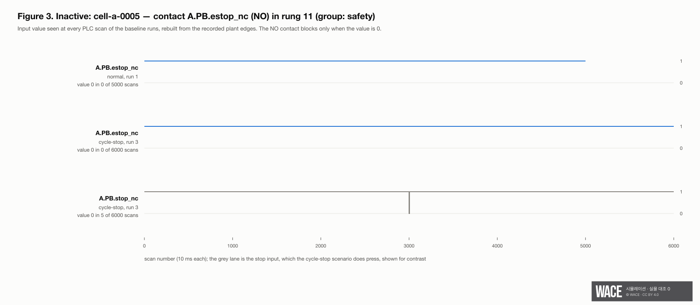

## Abstract

A PLC ladder that passes a test scenario set can still lack an interlock that the set never exercises. We asked, before any run: if the series interlock conditions of three correct ladders are removed one at a time, how many removals does a fixed scenario set reveal, and are the unrevealed ones not exercised by the scenarios, masked inside the ladder, or invisible to the plant model and the verdict? Three simulated cells were used (cell A, a shuttle conveyor; cell B, a sorting line; the pack cell, cell B with a packing station), with ladders written by our team. A removal replaces every contact of one condition (one tag and one contact mode within one rung) with a wire. The counting rule, the sampling, the scenario sets, a four-stage classification and two predictions were fixed in a pre-registration whose SHA-256 was committed to a public repository before the official round. Of 1,316 target conditions, 500 were run (all 25 of cell A; stratified samples of 156 and 319 in the other two cells) against 2, 11 and 6 scenarios: 3,680 variant runs and 38 baseline runs, the 19 baseline pairs all with identical trace hashes. 183 of the 500 removals were revealed. Split as the pre-registration words stage 4a (hazard events, including a defective part leaving through the good exit), 107 changed such an outcome (stage 4a) and 76 changed only the verdict (stage 4b); the interpretation fixed before the results, which counts every event and every part's final outcome, gives 165 and 18. Taking the wording as the main split was decided after the results, in response to review. Of the 316 that were not revealed, 25 were never exercised (stage 1), 244 were exercised in at least one scan but the applied outputs did not change (stage 2), and 47 changed the outputs without changing the compared outcome or the verdict (stage 3; in 37 of these the plant model's full final state did differ). One removal could not be classified: all six of its runs ended in an error of the plant model. Both predictions were wrong. P1 predicted that the recovery and pack-handshake groups would go unrevealed at least 20 percentage points more often than the safety group; the difference was 11.68 points (68.97 % against 57.29 %). P2 predicted that at least half of the unrevealed removals would be unexercised; 7.91 % were. These results cover three simulated cells, self-authored ladders, fixed scenario sets and a plant model with assumed physical values; no physical comparison is included (0 physical runs).

## 1. Question

The pre-registered question, translated: **"If the interlocks (series conditions) of a correct ladder are removed one at a time, how many of these removals does a fixed scenario set reveal? Is a removal that is not revealed missed because the scenarios do not test that condition, because it is masked inside the ladder, or because the verdict and the plant model do not see it?"** The working title recorded with the pre-registration's hash in the public repository reads: "Interlock-removal what-if: which removed interlock conditions show up in a scenario set and which do not (simulated cells, correct ladders with one condition shorted at a time)".

## 2. Why this is a simulation-only question

Removing an interlock and then running the plant through a person entering a guarded area, or through an ignored emergency stop, cannot be done on physical equipment. In simulation each variant differs from its correct ladder in one condition, every other byte is identical, and the baseline can be repeated with an identical trace hash, so a difference in outcome can be attributed to that condition. The plant model's physical values are assumed and were not varied; the counts reported here may depend on them, and removals whose effect needs an event the model does not produce cannot be revealed. The result says nothing about physical PLCs or plants (Section 7).

## 3. Experimental design

**Cells and ladders.** Three correct ladders, all generated by our team's ladder generator and fixed by SHA-256: cell A (27 rungs; PLC scan 10 ms, plant tick 50 ms), cell B (569 rungs; tick 10 ms) and the pack cell (864 rungs; tick 10 ms).

**Counting rule (pre-registered, applied before any run).** Power flow follows the compiler of the PLC engine: vertical wires join into junctions; a run of contacts, boxes, wires and a coil in one row is a segment; a segment starts at the power rail, at a junction or at a break. Output elements are coils and executing boxes (`MOVE`, `ADD`, `SUB`, `MUL`, `DIV`); comparison boxes pass power. A **condition** is every contact in one rung with the same tag and the same mode (normally open NO or normally closed NC). A **series condition** is one whose contacts, all blocked, cut power to at least one output element that power reached before. Excluded and only counted: conditions with no power, conditions inside a parallel branch, P/N contacts (0 in these ladders), self-holding contacts (0), comparison boxes and groups outside the target set. The functional group is read mechanically from the first `[...]` of the rung comment. **Target groups:** safety, push sequence, output, alarm, recovery, pack handshake; outside the target set are input filtering, tracking, recheck counting and HMI status words. The **variant** replaces every contact cell of the condition with a horizontal wire (always conducting); every other byte is unchanged. The unit changed from "one contact" (v0.2) to "one condition" because the generator repeats the same interlock in each parallel branch of a rung; with contacts as the unit, most representative interlocks would have fallen inside a parallel branch.

**Counts and sampling (fixed before the runs).**

| Cell | Contact cells | Conditions | In a parallel branch | Series | Series, outside target | **Target** | Comparison boxes |
| --- | --- | --- | --- | --- | --- | --- | --- |
| Cell A | 51 | 47 | 20 | 27 | 2 | **25** | 12 |
| Cell B | 747 | 666 | 138 | 528 | 63 | **465** | 321 |
| Pack cell | 1,301 | 1,114 | 223 | 891 | 65 | **826** | 502 |

If (variants × scenarios) exceeded 2,000 in a cell, a stratified random sample per functional group was drawn: n = ⌊2,000 ÷ (scenarios × groups with conditions)⌋ per group, every condition in a group with n or fewer. Cell A: all 25 (50 runs). Cell B: n = 36 (safety, push sequence, alarm and recovery 36 each; output all 12), 156 variants, 1,716 runs. Pack cell: n = 55 (output all 44; the other five groups 55 each), 319 variants, 1,914 runs. Random generator: Python `random.Random("20260930:<cell>")`. All 500 sampled variants compiled without error before the round (static compile only).

**Scenario sets (fixed; only scenarios already implemented in the runner).** Cell A: `normal` (1,000 ticks), `cycle-stop` (1,200). Cell B: `normal` seeds 1, 2, 3 (5,000 each), `cycle-stop` (1,200), `curtain` (1,000), `recovery` (3,420), `recovery-retract` (3,420), `batch` (2,600), `stroke75` (2,600), flow factor 0.60 and 0.45 (1,000 each). Pack cell: `normal` seeds 1, 2, 3 (10,000 each), `cycle-stop` (1,200), `curtain` (1,000), `packfault` (6,000). Flow 0.45 was added from an earlier exploration, so results are reported with and without it; the main result includes it. Each baseline scenario ran twice (trace hashes compared); each variant ran once per scenario.

**Four stages (computed mechanically from the records).** 1 **inactive** — in the baseline runs the condition conducted at the end of every scan of every scenario (NO: tag 1; NC: tag 0), read by re-scanning the correct ladder with the baseline's per-scan inputs. 2 **active, outputs unchanged** — it blocked in at least one scan, but the applied output history equals the baseline's (applied outputs are the output values handed to the plant model at each plant tick: once per 5 scans in cell A, once per scan in cells B and pack). 3 **outputs changed, events unchanged** — plant events, final part state and verdict equal the baseline's. 4 **revealed** — in the pre-registration's words, (a) **hazard events**: the plant model's physical events (motion in the person zone, a drop, a collision, a jam, a defective part through the good exit and the like) differ; (b) the physical events are the same and the control verdict differs. The same section defines "same as the baseline" as equal event counts by name and equal final state, so the wording admits two readings. The analysis fixed one before the results (I-3): 4a when any event count (production events such as parts packed included) or a part's final outcome differs, with non-production events counted separately. This report gives the pre-registration's wording as the main split — non-production events plus the number of defective parts at the good exit, which the records keep as final part state rather than as an event — and the I-3 split beside it (5.2); the revealed total is the same under both. Taking the wording as the main split was decided after the results, in response to review (5.2). A variant takes its highest stage over the scenarios. "Stage" below always means this pre-registered classification.

**Run rules (pre-registered).** No pass/fail line; the result is published whichever way it comes out. A baseline scenario is invalid if its two repetitions differ in trace hash or either fails; a run is invalid on an unreclaimed child process, an input-restoration exception or a hash mismatch of a fixed input. At most two retries per cause for the whole report. Denominators below 20 are given as numerator/denominator only.

**Fixed inputs.** The three ladders, tag maps, cell files, the plant-model executable, the test-bench runner `bridge/run.py` and the scenario definitions, the judgement criteria, the variant generator, the variant list, the variant compile check and a manifest of the remaining test-bench files are fixed by SHA-256 in the pre-registration (Section 8 there). The official run script, its common module and the variant adapter were written after the pre-registration, as it foresaw, and their hashes were recorded in the run-start record (not publicly timestamped). The run script checked every fixed input at the start and at the end of the round; both checks found no mismatch.

## 4. Pre-registered predictions and verdicts

**Table 1. Predictions (fixed before the runs) and verdicts (tr03-official-1, flow 0.45 included)**

| # | Prediction | Verdict line | Value | Verdict |
| --- | --- | --- | --- | --- |
| P1 | Over the sampled variants of all three cells, the share not revealed (stages 1–3) in the recovery and pack-handshake groups is at least 20 percentage points higher than in the safety group | Difference below 20 points or reversed → wrong | 100/145 (68.97 %) against 55/96 (57.29 %): 11.68 points | **Wrong** |
| P2 | At least half of the variants not revealed are in stage 1 (inactive) | Below 50 % → wrong | 25 of 316 (7.91 %) | **Wrong** |

The pooled comparison puts the 5 cell-A safety variants on one side only; per cell, the difference was 8.33 points in cell B (22/36 against 19/36) and 13.38 in the pack cell (78/109 against 32/55), both below 20. For reference, not a verdict: recovery alone was not revealed in 67/91 (73.63 %, 16.34 points above safety) and pack handshake alone in 33/54 (61.11 %, 3.82 points). The verdicts are the same without flow 0.45. The held variant (5.5) is outside both denominators by the rule fixed before the results (I-5); counting it as revealed would give a P1 difference of 11.20 points, counting it as not revealed 11.89 points, and P2 would be 25 of 317 (7.89 %) in the second case; the verdicts do not change (our arithmetic, not pre-registered).

P2 rested on the idea that a fixed scenario set misses an interlock mainly because it never exercises it. In this round most unrevealed removals were exercised: the condition blocked in at least one scan, and the applied outputs came out the same. Stage 2 is defined by that observation; the pre-registration labels it "masked inside the ladder". We did not examine, variant by variant, why the outputs were unchanged — for example whether another contact in the same rung or another rung blocks the same output (Section 7).

## 5. Results

**How the numbers were computed.** The analysis code (five files) and interpretations I-1 to I-8 of the pre-registration's wording were written and their SHA-256 recorded between 18:55 and 19:03 KST on 2026-09-30 (released as `results/TR-03_분석_고정기록.md`). The official round was then still running, and results already existed: by 19:03, 2,536 of the 3,718 runs had finished — all 1,792 runs of cells A and B and 744 pack-cell runs. The LLM agent that wrote the analysis records that it did not open the official run folder, and that it tested the code on synthetic records and on the 3-tick start-up check (a re-scan matched its 15 recorded scan digests). A reader cannot check that statement, and the hashes were not committed publicly before the results; a reader can check only that the released analysis files are the ones named in the record and in the result-file header (Section 8). The main interpretations: 4a counts every event, production included, and non-production events are counted separately (I-3; 5.2); the final state is the outcome of every part at the last tick (class and route; for the pack cell also stage and reason), not continuous values (I-2); a run ending in an error is not counted as revealed, and a variant with such a run is held unless another scenario revealed it (I-4, I-7); held variants are outside the prediction denominators (I-5); stage 1 wins over a changed run outcome, with a sensitivity check (I-1).

**Tick numbering.** Tick numbers of first output differences and of first events are the runner's own tick counter, which starts at 1. Rung numbers are 0-based indices into the ladder's `rungs` list.

All numbers in this section come from the result file of round tr03-official-1, the run ledger or the per-run records; Appendix A lists the source of each.

**5.0 Validity.** The ledger has 3,718 rows with 3,718 distinct numbers: per cell 4, 22 and 12 baseline runs and 50, 1,716 and 1,914 variant runs, as pre-registered. All 19 baseline pairs had identical trace hashes, so no scenario was dropped. Every run passed the child-process check; in every completed run the trace hash and verdict in the summary, the adapter's side record and the ledger agree, and the adapter and ladder hashes equal the fixed values. Six runs ended with a non-zero exit code (5.5). Re-scanning the correct ladder over the 19 baseline runs (80,440 scans) reproduced every recorded scan digest and output: 0 mismatches.

**5.1 Revealed share (metric 1).** Denominators: all sampled variants, and active variants (stages 2–4).

**Table 2. Revealed (stage 4) per cell and group**

| Cell | Group | Revealed / sampled | Revealed / active |
| --- | --- | --- | --- |
| Cell A | safety · push sequence · output | 1/5 · 8/12 · 3/8 | 1/4 · 8/12 · 3/6 |
| Cell A | all | 12/25 (48.0 %) | 12/22 (54.55 %) |
| Cell B | safety · push sequence · output | 17/36 (47.22 %) · 19/36 (52.78 %) · 1/12 | 17/36 · 19/36 · 1/12 |
| Cell B | alarm · recovery | 22/36 (61.11 %) · 14/36 (38.89 %) | 22/36 · 14/33 (42.42 %) |
| Cell B | all | 73/156 (46.79 %) | 73/153 (47.71 %) |
| Pack cell | safety · push sequence · output | 23/55 (41.82 %) · 20/55 (36.36 %) · 1/44 (2.27 %) | 23/48 (47.92 %) · 20/53 (37.74 %) · 1/44 |
| Pack cell | alarm · recovery · pack handshake | 23/55 (41.82 %) · 10/55 (18.18 %) · 21/55 (38.18 %) | 23/53 (43.4 %) · 10/48 (20.83 %) · 21/53 (39.62 %) |
| Pack cell | all | 98/319 (30.72 %) | 98/299 (32.78 %) |

Weighted by the number of target conditions per group (the sample is stratified), the revealed share is 48.0 % in cell A, 48.48 % in cell B and 35.45 % in the pack cell.

**5.2 Stage distribution (metric 2).** Over the 500 variants: stage 1, 25; stage 2, 244; stage 3, 47; revealed, 183; held, 1. **Revealed, pre-registered wording (main split):** stage 4a, 107; stage 4b, 76. Per cell (1 / 2 / 3 / 4a / 4b / held): cell A 3 / 8 / 2 / 2 / 10 / 0; cell B 3 / 66 / 14 / 13 / 60 / 0; pack cell 19 / 170 / 31 / 92 / 6 / 1. Figure 1 shows each group. A run is 4a when its counts of non-production events by name differ from the baseline's (motion in a zone, drops, collisions, jams and every other event that the runner's verdict code does not treat as production) or when the number of defective parts that ended at the good exit differs. The second test reads `classification` (id, defective, route) in the summaries: the good exit is route 2 in cell B and route 5 in the pack cell, as in the runner's verdict code and in every baseline run (good parts at 2 or 5; defective parts at 1 in cell B — the verdict code also accepts 3, which no baseline run used — or at 6 in the pack cell, or not yet routed); cell A has no sorting exit. That count differed in 11 cell-B variants, each by +1 and only in `recovery` and `recovery-retract`; 6 of them (cell-b-0244, 0254, 0263, 0281, 0306 and 0361) changed no event. In cell B none of the 17 revealed safety-group variants changed a hazard event or the good-exit count; all are 4b. **Revealed under I-3** (every event and every part's final outcome; the split in the result file): stage 4a, 165; stage 4b, 18 (cell A 2 / 10, cell B 69 / 4, pack cell 94 / 4). The 58 variants that move between the two readings differ only in production counts or in parts' final outcomes other than the good-exit count, and every one of them also changed the verdict in at least one run; the revealed total, P1 and P2 therefore do not depend on the reading. The main split is computed by `scripts/reclassify_hazard_v2.py` from the result file and the released summaries (the analysis code is unchanged) into `results/TR-03_재분류_위험사건_v2_tr03-official-1.json`.

**How the main split was chosen.** The split fixed before the results is I-3. The review of the first draft pointed out that the pre-registration words 4a as hazard events; the next draft therefore made the wording the main split, but counted non-production events only (101 / 82), with version 1 of the script. The second review pointed out that this left out the pre-registration's own example of a defective part through the good exit, which is recorded as final part state; version 2 adds it (107 / 76). Both changes were made after the results. Version 1 and its output are kept in the bundle (`scripts/old/`, `results/old/`).

Stage 3 does not mean that the plant model saw nothing. In 37 of the 47 stage-3 variants the plant model's full final state (positions and speeds included) differed from the baseline's in at least one run; in no stage-2 variant did it. The comparison fixed in I-2 looks at each part's final outcome (class and route; for the pack cell also stage and reason), not at continuous values, so stage 3 means "outputs changed, and the compared outcome and the verdict did not". The timing column pre-registered in §5 is in the result file (`run_levels`: first differing output tick, shift of each event's first tick): 12 runs shifted the first tick of some event, none of them a stage-3 run. No variant was inactive while any of its runs changed the outputs (the I-1 sensitivity case: 0), so the scan-end reading of stage 1 changed no classification here.

**5.3 Which scenario revealed a variant (metric 3).** The first revealing scenario in the order of Section 3 was `normal` for all 12 in cell A, `normal` seed 1 for 53 of 73 in cell B (then `recovery` 17, `stroke75`, `recovery-retract` and `curtain` 1 each) and `normal` seed 1 for 96 of 98 in the pack cell (`curtain` and `packfault` 1 each). Variants revealed by exactly one scenario: 0 in cell A, 4 in cell B, 2 in the pack cell. No variant was revealed by flow 0.45 alone: without it every stage and both verdicts are unchanged, and only the count of revealing scenarios moves for three cell-B variants.

**5.4 Representative cases (pre-registered rule: lowest variant number in the category).** Revealed: `cell-a-0004`, the NO contact `M_비상기억` (an internal memory bit) in rung 11 of the safety group. With it shorted, the shuttle never started: 0 of 3 round trips in both scenarios, no plant event, and the verdict changed from [PASS] to [FAIL]; the applied outputs first differed at tick 8 (Figure 2). It is revealed through the verdict only (4b) under both readings: no plant event occurred, and the shuttle's round-trip count is not part of the compared outcome (I-2). This rung's output is an emergency-stop confirmation bit, so the removal made the cell stop rather than lose protection (Section 7). Inactive: `cell-a-0005`, the NO contact on the emergency-stop input `A.PB.estop_nc` in the same rung. Neither cell-A scenario presses the emergency stop, so the contact conducted in all 5,000 and 6,000 scans (Figure 3).

**5.5 The held variant.** `cell-b-pack-0523` shorts the NO contact `M_R0요청시작` in pack-cell rung 606 (pack handshake), whose output moves 1 into a response-stage register. All six of its runs ended at tick 7 with an error from the plant model (`INVALID_REQUEST`, "pack request_count exceeds available queue"), runs 3275–3280. By the interpretation fixed before the results (I-7), an error run is not counted as revealed, and the variant is held (I-4). The removal did stop the simulation; whether an error of the plant model should count as revealing it is a question the pre-registration did not settle. Section 4 gives the verdicts under both readings.

**5.6 Checks that the analysis can fail.** Before the round, the analysis was run on synthetic records built with the real PLC engine and with differences planted on purpose: one planted case per stage, an invalid run, an error run, a skipped scenario, an inactive variant with changed outputs, a damaged scan digest, a repetition-hash mismatch and an input-restoration error; each was classified as planted (the fixed record, Section 2 there). On the official records, the separate check (5.7) found the two repetitions of every baseline scenario equal (19 of 19), as they must be; the recomputation and variant-rebuild scripts in the bundle were run with deliberately altered inputs and reported the alterations (Section 8).

**5.7 Separate check.** A separately written script reads only the ledger and the per-run summaries and applies the stage-4 definition directly, without the analysis code. It gives 165 (4a), 18 (4b) — the I-3 split — 316 not revealed and 1 held, the same per cell and group, and the same P1 numbers; 0 disagreements with the analysis over the 500 variants. It cannot separate stages 1–3 (that needs the traces and a re-scan), so P2 rests on the analysis alone.

**5.8 Recorded only — outside the pre-registered metrics.** Each run also carries the test bench's general verdict. The correct ladder's own verdict is not a metric; a difference between a variant's verdict and its baseline's is what stage 4b counts. For 7 of the 19 baseline scenarios the correct ladder's verdict was [FAIL] (cell B `cycle-stop`, `batch`, `stroke75`, flow 0.60, flow 0.45; pack cell `cycle-stop`, `packfault`). The pre-registration anticipated this: a [FAIL] baseline is not invalid, because each variant is compared with its baseline. Why those general criteria fail on these scenarios was not examined in this report.

## 6. Run ledger

**Table 3. Official rounds**

| Round | Runs | Valid? | Problem runs | Note |
| --- | --- | --- | --- | --- |
| tr03-official-1 | 3,718 (38 baseline, 3,680 variant) | valid · adopted | 6 (one variant, 5.5) | runs ended 2026-09-30 11:05:02 – 2026-10-01 05:26:58 KST; per-run durations sum to 66,119.0 s |

There was one official round. The pre-registration's SHA-256 was committed to the public repository at 2026-09-30 08:52:18 KST (commit b743b0f); the run script's start record is 11:05:01 KST, about 2 hours 13 minutes later. Before the round, a 3-tick start-up check of cell A (not an official run) confirmed the record format.

## 7. Threats to validity and what this report does not claim

- **Physical systems.** Simulated PLC engine and simulated plant model with assumed physical values; 0 physical comparisons. We do not claim that a removal not revealed here is safe or unsafe on real equipment.
- **Self-authored ladders.** The three ladders were written by the team that built the test bench. The generator repeats interlocks in each parallel branch, so the counts of conditions depend on how it writes rungs; hand-written plant ladders may have a different distribution.
- **Stage 2 is an observation, not a mechanism.** We did not test why an exercised condition left the outputs unchanged. Redundant interlocks written by the generator are one possible reason; it was not examined.
- **Stage 1 at scan end.** An internal bit written later in the same scan can differ from its value when the rung executes. The sensitivity count for this case was 0 (5.2).
- **Scenario sets.** Only scenarios already implemented in the runner; the set is not a sufficient condition for site commissioning tests. Flow runs cover 1,000 ticks.
- **Model limits.** Removals whose effect depends on events the plant model does not represent (for example contact forces on a person) cannot be revealed.
- **Single conditions.** One condition removed at a time; no pairs.
- **Sampling.** 816 target conditions were not run; for them only the group-weighted estimates apply.
- **Analysis written during the round.** The analysis code and its interpretations were fixed while the round was running, when 2,536 of the 3,718 runs had finished. The agent that wrote them records that it did not open the run folder; this cannot be checked, and the hashes were committed publicly only with this report (Section 5).
- **Stage 3 and the stage-4 split depend on fixed interpretations.** Stage 3 rests on comparing parts' final outcomes (I-2); the 4a/4b split differs between the pre-registration wording and I-3, and the main split was chosen after the results (5.2).
- **Removals that stop the cell.** A removal in a rung whose output is itself a stop or alarm memory can make the cell stop rather than lose protection; the representative revealed case is of this kind. We did not separate these.
- **Products.** We do not claim that any commercial PLC, simulator or digital-twin product has this issue.
- **Conclusion.** Exact counts on fixed inputs; no statistical test.

## 8. Released files, and what a reader can and cannot check with them

Following the pre-registration (Section 11 there) and the publication plan for this series, the files below are released in the folder `TR-2026-03/` of the repository github.com/waceinc/tech-reports (the release bundle). `MANIFEST.md` lists every file with its SHA-256 and licence.

**Scope of the run records.** The compressed tick traces of the round total 69.6 GB (cell B 2.4 GB, pack cell 67.2 GB; one 10,000-tick pack-cell trace is up to 75 MB compressed). That exceeds both the repository and the 50 GB limit of a Zenodo record, so the release draws one line per cell, the same for every run: **released for every run, each of these files the run produced** — summary, metadata, process check, adapter side record, static check, both stderr logs and the six error records (the six error runs produced no summary and no adapter record, so there are 3,712 of each); **released for cell A only** — the 54 tick traces and reference-difference files; **not released** — the tick traces and reference-difference files of cells B and pack, the 474 per-run constants responses and the 316 per-run flow cell files of cell B (a plant-model cell file). In the summaries of cells B and pack the list `tick_hashes` (one hash per tick; 96 % of the bytes of those summaries) is removed and the trace hash that is computed from it is kept; for cell A the summaries are byte-identical and the list can be recomputed from the released traces. Every file left out is listed with its size and SHA-256 in `runs/tr03-official-1_<cell>_not_released.tsv` (for compressed traces, the hash of the compressed file as recorded in the ledger).

**Redaction of local paths.** Files that contained absolute local paths are released as public versions in which three local directory prefixes are replaced by `<repos>`, `<work>` and `<tmp>`; every other byte is unchanged. The deterministic script `scripts/redact_pack.py` does this, refuses input that already contains a placeholder and checks for every file that restoring the prefixes gives back the original bytes; packing twice gave byte-identical archives. The prefixes are not released, so original hashes of redacted files are given only as correspondences: the ledger `4d7bed1d…` with the result file; the adapter `0caed4f0…` with the run-start record and every adapter side record; the variant generator `06e4c112…` and compile check `0268f45b…` with the pre-registration; the runner `run.py` `4bbcfaf8…` with the pre-registration and every run's metadata; the rest (`MANIFEST.md`, the archive TSVs) are stated by the author. The prefixes are ordinary local paths; they are replaced to keep machine paths out of the files, not because they are secret, and they can be guessed and confirmed against the published original hashes.

1. **Pre-registration** v0.3 (Korean), byte-identical, SHA-256 `603635d205233477e6d3d987b639ac363a16edb34805aec150c974aac91d1c1c`, as committed in `PREREGISTRATIONS.md` (commit b743b0f). It names private repositories, source locations and internal approval codes; it is not edited, because its hash was committed before the runs.
2. **Ladders** (`ladders/`): public versions of the three correct ladders — the run version with line 4, `  "marker": "CONFIDENTIAL — WACE trade secret",`, removed and every other byte unchanged (the trade-secret designation was withdrawn on 2026-09-20; the field remains in run versions because the PLC-engine parser requires it). Re-inserting that line gives the pre-registered run-version hashes `5058bd0b…`, `05999e23…` and `5a4cc91d…`.
3. **Variants** (`variants/`): the variant list (all 1,316 target conditions, byte-identical, `bc61eab4…`), the generator and the compile check (path-redacted), the table of the 500 variant-ladder hashes recorded at the start of the round and `rebuild_variants.mjs`, which rebuilds the run version of every sampled variant from the public ladders and the list and matches all 500 hashes of that table. The variant ladders themselves are not released.
4. **Runner** (`runner/`, `runner_thin_layer/`): the official run script (byte-identical, `52b1d838…`, as in the run-start record), its common module and the adapter (path-redacted); from the private test bench at commit af9cc40, `bridge/run.py` (input restoration `reconstruct` and verdict code; path-redacted), `transport.py`, `scenarios_3j.py`, `scenarios_3i.py` and the judgement criteria `criteria-3k.md` (byte-identical, pre-registered hashes).
5. **Run records** (`runs/`): the ledger (path-redacted) and three archives, `tr03-official-1_cell-a.tar.xz` (493 files, with the round's root files), `_cell-b.tar.xz` (12,166) and `_cell-b-pack.tar.xz` (13,476), with a TSV per archive listing each member's public and original SHA-256 and transform.
6. **Results** (`results/`): the result file `TR-03_결과_tr03-official-1.json` and its Korean rendering (byte-identical), the separate check record, the fixed record of the analysis (one temporary path redacted), the main stage-4 split (`TR-03_재분류_위험사건_v2_tr03-official-1.json`; the superseded version-1 output in `results/old/`) and the output of the recomputation.
7. **Scripts** (`scripts/`): the five analysis files (byte-identical; their hashes equal those in the result-file header), the synthetic-record generator of the analysis tests (path-redacted), the separate check script, `recompute_tr03.py`, `reclassify_hazard_v2.py` (version 1 kept in `scripts/old/`), `reextract_numbers.py`, `make_figures.py` and `redact_pack.py`.
8. **Figures** (`figures/`): the three figures of the pre-registration's Section 10, drawn by `make_figures.py` from bundle files only; SVG byte-reproducible, PNG rendered with librsvg 2.63.2 (pixels depend on renderer and fonts). The pre-registration's Figure 2 pairs the rung with a view of the 3D viewer (internal program name Vision 2); that view is a capture of a private program and cannot be drawn from the bundle, so the applied outputs from the traces are shown instead.

**Isolated recomputation.** In a folder holding only a copy of the bundle and the extracted archives, with every other user location made unreadable by the operating system's sandbox (a control read of the private repository under the same sandbox failed), `recompute_tr03.py` reproduced: the validity checks of 5.0 from the ledger and records; the 54 cell-A trace hashes; the separate check's output byte for byte; the stage of all 50 cell-A variant runs from the traces with the released analysis functions; the blocked-scan counts of the 5 cell-A conditions on input tags with the released `reconstruct`; every table and both verdicts of both scenario sets by re-aggregating the result file's per-run levels with the released analysis code; and the main stage-4 split from the result file and the released summaries, byte for byte. `rebuild_variants.mjs` matched all 500 variant hashes. With altered inputs both scripts reported the alterations.

**What stays private.** The PLC simulator engine and engine host, the plant-model program (internal program name Vision 2 extctl) with its cell files and reference logic, tag maps, the other runner files, the variant ladders and the traces of cells B and pack.

| Item | Can a reader check it? |
| --- | --- |
| Pre-registration existed before the runs | Yes — hash against commit b743b0f; that the runs came later rests on the run records' own times |
| Public ladders ↔ pre-registered run-version hashes | Yes — by re-inserting line 4 |
| The 500 variant ladders used in the runs | Yes — `rebuild_variants.mjs` reproduces all 500 recorded hashes |
| Counting and sampling (which conditions are series conditions, which were drawn) | Read the rule and the list, yes; re-run the generator, no — it reads the private repository |
| Validity (5.0): counts, repetition hashes, hash agreement | Yes — `recompute_tr03.py` |
| Re-scan (stage 1) | Cell A conditions on input tags (5 of 25), yes; internal bits and cells B and pack, no — needs the private PLC engine and, for B and pack, the traces |
| Stage 3, and "outputs unchanged" of stage 2 | Cell A, yes, from the traces; cells B and pack, no — only the per-run levels in the result file |
| Whether a condition on an internal bit was active (stage 1 or 2) | No — needs the private PLC engine (20 of 25 cell-A conditions; all of cells B and pack) |
| Stage-4 split under both readings | Yes — from the released summaries of all cells: the separate check gives the I-3 split, and `reclassify_hazard_v2.py` gives the main split from the result file and the summaries |
| Stage 4 (revealed) and P1 | Yes — the separate check script on the summaries, independent of the analysis code |
| Metrics 1–3, P2 | Re-aggregation from the result file's per-run levels, yes (same code, not independent); from raw records, only as far as the rows above |
| The analysis code was fixed before it read the results | No — the author's record says so; a reader can check only that the released files match the recorded hashes |
| Every number in this report against the bundle | Yes — `reextract_numbers.py`, except the numbers it lists as not re-extractable |
| Re-executing any run | No |

**Licence.** Report text, tables, the three figures (charts), result files, run records, ladder and variant JSON files, the judgement criteria, the pre-registration and every other file of the bundle that is not code, including `MANIFEST.md` and the TSV and JSON records: CC BY 4.0. Code — every `.py` and `.mjs` file in the bundle: MIT, Copyright (c) 2026 WACE Inc. (주식회사 웨이스). Files whose hashes are fixed carry no licence notice inside; the licence of each file is declared in `MANIFEST.md`, the licence texts in `LICENSES/` at the repository root and the repository README. This release does not grant any licence under patents of WACE Inc., including Korean patents No. 10-2904772 and No. 10-3003470 and pending applications. The charts carry a badge that reads, in Korean, "simulation · 0 physical comparisons" and "© WACE · CC BY 4.0". CC BY 4.0 does not grant trademark rights; the WACE wordmark in the badge remains a trademark, and the wordmark file `figures/wace-wordmark-white.svg` is not licensed. No screen captures or videos of the company's 3D viewer are included.

## 9. Checks before release

(1) The numbers of this report were re-extracted from the released files with `reextract_numbers.py`: each phrase that states a number is rebuilt from the bundle and must occur in the text, and each row of Table 2 is matched as a whole row (0 mismatches; numbers that cannot come from the bundle are listed at the end of its output). (2) Isolated recomputation as described in Section 8, with negative controls. (3) Review by an AI agent given an earlier draft as an external draft, with no drafting context (one round; this version responds to it). There is no human reviewer and the report is not peer-reviewed. (4) Fact check of the company facts and names against the company's records (no correction needed). (5) Release under the CEO's approval of 2026-09-30, given in advance on the condition that every pre-release check passes.

## 10. Use of generative AI

The experiment code (test bench, ladder generator, variant generator, run and analysis scripts) was written with LLM coding agents — Claude (Anthropic) and Codex (OpenAI) — under the author's direction. The pre-registration and this report were drafted by an LLM agent. The separate check script was written by an agent of the same model family after the round, before it read the analysis output; the recomputation, reclassification (both versions), re-extraction and figure scripts were written by an LLM agent after the results. The figures are drawn by code from the data, not by an image-generation model. Reviews were carried out by agents of the same model family that did not read each other's output or the drafting context; they are not human reviewers. The design, run-validity decisions, interpretation and every claim in this report are the responsibility of the named author.

## Appendix A. Where each number comes from

Sources: **R** = result file `TR-03_결과_tr03-official-1.json` (field path); **L** = ledger; **S** = per-run `summary.json`; **H** = `run-header.json` and `fixed-inputs-*.json` in the cell-A archive; **V** = variant list; **PR** = pre-registration v0.3 (section); **F** = fixed record of the analysis; **I** = separate check record; **G** = public repository commit b743b0f; **B** = bundle files (`MANIFEST.md`, archive TSVs, `not_released` TSVs, `recompute_tr03_output.txt`). The row-by-row comparison is produced by `reextract_numbers.py`.

| # | Number(s) in the text | Source |
| --- | --- | --- |
| A1 | rungs 27 / 569 / 864; tick 50 ms (cell A) and 10 ms | PR §3-1; S / metadata `factory_tick_ms` |
| A2 | counting table; 1,316 target; n = 36, 55; 156 / 319 / 25 variants; 50 / 1,716 / 1,914 runs; 2,000 cap | V `cells.*`; PR §3-1, §3-2 |
| A3 | scenarios and tick lengths; 2 / 11 / 6 scenarios | PR §4; L `ticks` |
| A4 | 3,718 rows and numbers; 4 / 22 / 12 baseline; 19 pairs identical; 6 problem runs 3275–3280 | R `validity.*`; L |
| A5 | 80,440 re-scanned scans, 0 mismatches | R `validity.rescan.*.checks` |
| A6 | Table 2, weighted 48.0 / 48.48 / 35.45 % | R `sets.full.metric1` |
| A7 | stage counts; I-3 split 165 / 18 and per cell; I-1 sensitivity 0 | R `sets.full.metric2`, `inactive_but_q_changed` |
| A7b | main split 107 / 76 and per cell; 11 good-exit variants, 6 without an event change; 58 moved, all with a verdict change; 37 of 47 stage-3 full-state differences; 12 timing shifts; per-cell P1 8.33 and 13.38; version 1 values 101 / 82 | `results/TR-03_재분류_위험사건_v2_tr03-official-1.json` (from R `run_levels` and S `classification`); `results/old/` for version 1 |
| A8 | P1 100/145, 55/96, 11.68; 67/91, 33/54, 16.34, 3.82; P2 25/316, 7.91 % | R `sets.full.predictions` |
| A9 | 11.20, 11.89, 25/317, 7.89 % | arithmetic on A8 with the held variant added (not pre-registered) |
| A10 | first revealing scenario counts; 0 / 4 / 2 single-scenario variants; flow 0.45 comparison | R `sets.*.metric3`, `sets.no045` |
| A11 | cell-a-0004: rung 11, 0 of 3 round trips, tick 8, runs 1 and 11; cell-a-0005: 5,000 and 6,000 scans | R `variants`, `run_levels`, `representatives`; S `probes.Rounds`, `status`; figures `figure_values.json` |
| A12 | cell-b-pack-0523: rung 606, tick 7, runs 3275–3280 | V; L `failure`; R `variants.cell-b-pack-0523.missing` |
| A13 | 7 of 19 baseline verdicts [FAIL] | L `status` of baseline repetition 1 |
| A14 | 11:05:02 – 05:26:58; 66,119.0 s; 11:05:01; 08:52:18; about 2 h 13 min | L `ended`, `seconds`; H `started`; G |
| A15 | 18:55–19:03 analysis files; 2,536 runs (1,792 of cells A and B, 744 pack) finished by 19:03; 15 start-up digests; 05:26:58 round end | file times of the analysis files and F (author's record); L `ended` up to 19:03 |
| A16 | 69.6, 2.4, 67.2 GB; up to 75 MB; 474; 316; 96 % | B `not_released` TSVs (sum and maximum of sizes); summary byte counts before and after removal (public sizes in the archive TSVs; original sizes stated by the author) |
| A17 | 493 / 12,166 / 13,476 archive members | B archive TSVs |
| A18 | hashes in Section 8 | the files themselves; PR §8, §11; R header; H |
| A19 | recomputation results (54, 50, 5 of 25, 500) | B `recompute_tr03_output.txt`; `rebuild_variants.mjs` output |
