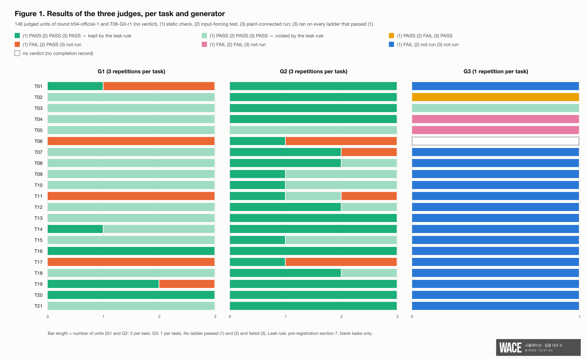

## Abstract

A PLC ladder that an LLM writes from a specification can pass a static check and a test that forces inputs and compares outputs, and still behave wrongly once it drives a plant. We asked, before any run: of the ladders that pass (1) a static check and (2) an input-forcing test, what share fails (3) a run connected to a simulated plant, and why? Three simulated cells were used (cell A, a shuttle conveyor; cell B, a sorting line; the pack cell, cell B with a packing station). 21 tasks (one whole ladder and several blank blocks per cell) were given to three generators: G1 Claude Code, G2 Codex CLI and G3 a local open-weight model, Qwen3-Coder-Next Q6_K. Each generator ran inside an operating-system sandbox that blocked reads of the correct ladders, the plant model and the other units. The judges, the specifications, the 62 input-forcing tests, the metrics, a rule that voids a blank-block output containing a comment string of the correct block, and one prediction were fixed in a pre-registration whose SHA-256 was committed to a public repository before the official round. The prediction was that at least 10 % of the ladders passing (1) and (2) would fail (3), and that at least half of those failures would come from timing or physical assumptions. 147 generation units were produced (G1 63, G2 63, G3 21). The G3 second and third repetitions were not run as planned: the author stopped G3 after repetition 1 during the round, a deviation from the pre-registration, and 8 second-repetition units that the runner started by mistake were set aside unjudged. 146 units were judged; one G3 unit ended without a completion record because of a harness defect and is counted as failing (1). 109 of the 146 judged ladders passed (1) and (2) (G1 51/63, G2 57/63, G3 1/20); 11 of the 15 G3 units that timed out spent at least 25 of their 40 minutes waiting for earlier requests (9 of them all 40) because of a second harness defect (Section 6). The voiding rule was missing from the fixed run code and was applied after the results, following its wording (the matching details were fixed after the results; Section 5); it flagged 55 of the 109, and we keep the registered rule as the main metric so as not to choose between the two counts after seeing them. **Main metric: 0 of 54 remaining ladders (G1 10, G2 44, from 20 tasks; 6 of the 54 ladders come from the three whole-ladder tasks, to which the rule does not apply) failed (3). Without the voiding rule: 0 of 109.** 44 of the 54 are G2 ladders. The task-level bootstrap 95 % interval is 0.0–0.0 % in both cases; exact binomial one-sided 95 % upper bounds, which assume independent ladders and were not pre-registered, are 5.4 % (0/54) and 2.7 % (0/109). As observed, the prediction was wrong under both counts. Eight G3 units that timed out wrote an answer after their unit had ended; these were not judged in the round. In a worst case that counts all of them as failing (3) alone, the main metric would be 7/61 (11.5 %; T12's late answer is leak-flagged and would be voided), above the 10 % line. After the results, at the author's decision, the 8 late answers were judged with the fixed judges as a sensitivity analysis outside the official round and outside the main metric: none passed (1) and (2); 5 did not compile, and had no repair chance; one of them (T12) is leak-flagged, and 4 remain unknown. Applying the bound rule the author chose after the results (K12: count every G3 unit whose request would have finished within 40 minutes without the queue; a bound should err high), and counting also T06-G3-r1, which lost a repair to a harness defect, 5 units remain unknown (T06, T08, T13, T14, T15): at most 5/59 (8.5 %) with the rule, 6/115 (5.2 %) without it, or 6/60 (10.0 %), at the 10 % line, if T12's late answer is also assumed to have lost its leak-flagged comment in a repair. Under the literal rule (leaving out T08, whose own request took 42.2 minutes) the worst case is 4/58 (6.9 %), or 5/59 (8.5 %) under the T12 assumption. This run alone therefore cannot show that the defects could not have changed the verdict. The 7 G3 units that never answered would have run past 40 minutes without the queue as well, by the server log, or, for T19, could not have delivered an answer containing its whole 250-rung block within 40 minutes, by the size of the G1 and G2 answers (a ground the author confirmed after the results, K12a), and are counted as timeout results. Of the 13 G3 answers that were judged (5 in the round and the 8 late ones), 1 passed (1) and (2) (T03-G3-r1, flagged by the leak rule); counted by unit, 1 of the 20 G3 units with a completion record (21 with T06-G3-r1), of which 7 never produced an answer. The cause classification was not run, because there was nothing to classify. The voiding rule cannot tell copying of the correct block from imitation of the comment format that the task's own base ladder uses, so the flagged ladders are not shown to have seen the answer, nor shown not to. The zero is bounded by what judge (3) looks at: its six pre-registered criteria, 1 to 6 scenario runs per cell, no overflow start, and a plant model with assumed physical values. Before the round, the same judge returned [FAIL] on 7 of 7 negative-control records from an earlier stage, but this round contains no demonstrated case of a ladder that passes (1) and (2) and fails (3). The result does not show that a plant-connected run is unnecessary, or that (1) and (2) are sufficient. These results cover three simulated cells and 21 tasks; no physical comparison is included (0 physical runs).

## 1. Question

The pre-registered question, translated: **"Of the ladders an LLM makes from a specification alone, what share passes (1) a static check and (2) an input-forcing test and then fails (3) a run connected to a plant model? What causes it?"**

## 2. Why this is a simulation-only question

The three judges look at the same ladder and the same plant model; what is compared is how much each judging method detects. In simulation, the generated ladder, the specification, the tests and the plant model are fixed by hash, and the correct ladder passes all three judges under the same settings (5.0), so a [FAIL] can be attributed to the generated ladder. Connecting an untested generated ladder to physical equipment to find out what it does is not something this study does. The plant model's physical values are assumed and were not varied; a difference that would only appear with a physical effect the model does not produce cannot appear in (3). The result says nothing about physical PLCs or plants (Section 7).

## 3. Experimental design

Below, "the author" is the named author. The run, the analysis and the leak check were carried out for him by an LLM agent session (Section 10). The decision to stop G3 after repetition 1 was made by him during the round. Three judgements were first taken by that agent session — the handling of T06-G3-r1 after the generation results and before judging, the other two after the results — and were then decided by the author after seeing the results, on 2026-10-02: the handling of T06-G3-r1 (5.4), not treating the orphaned G3 clients as an invalidity case (Section 6), and taking the registered leak rule as the main metric (5.1). Also on 2026-10-02, after reviews of this report, the author decided, on proposals of the agent session, to judge the 8 late G3 answers as a sensitivity analysis and to publish the worst-case bound (5.7, K11), chose the rule that decides which G3 units the bounds include (K12), and confirmed an additional ground for leaving T19 out of them (K12a; Section 6 (e)). Other handling decisions are attributed where they occur.

**Cells and ladders.** The three correct ladders are those of TR-2026-03: cell A 27 rungs, cell B 569, the pack cell 864. Blank blocks range from 4 rungs (T03) to 250 (T19).

**Tasks (fixed).** 21 tasks: per cell one whole ladder and blank blocks — cell A T01 (whole) and T02–T05 (blanks), cell B T06 (whole) and T07–T16 (blanks), the pack cell T17 (whole) and T18–T21 (blanks: the four blocks of the pack ladder that differ from cell B — T18 its safety block, T19–T21 pack handshake, output and HMI words). A task folder holds `TASK.md` (what to do, the one file to write, the rules), the specification(s) of the cell (the pack cell receives the cell-B and the pack-cell specification), an appendix listing the engine's supported instructions, an I/O table `io.json`, and for blank tasks `base.ldprog.json` — the correct ladder with that block's rungs, the tags used only inside the block, and the `marker` field removed. The task bundle is reproducible: building it twice gave the same bytes (tree hash `9182c074…`). The specifications were written in requirement language from the correct ladders (cell A: requirements A-01 to A-13; cell B: B-01 to B-88 plus same-scan processing order, fault-code and HMI-word tables; pack cell: P-01 to P-43 plus PB-01 to PB-06), with no code, internal tag names, rung numbers or local paths; where the Python reference logic and the correct ladder differed at a boundary, the correct ladder was taken as the reference, because judges (2) and (3) use it as the reference.

**Generators (pre-registered).**

| | Generator | How it ran | Recorded |
| --- | --- | --- | --- |
| G1 | Claude Code | `claude -p` with model argument `claude-opus-5-5`; tools Read, Write, Edit, Glob, Grep; Bash and web tools disallowed; 0 MCP connections | prompt hash; models listed in the responses: `claude-opus-5-5` and `claude-haiku-4-5-20251001` in all 63 sessions. The CLI version, which the pre-registration lists, was not recorded |
| G2 | Codex CLI | `codex exec` without a model argument, Codex's own sandbox off (the operating-system sandbox below does the blocking) | model check output; prompt hash; in all 64 sessions (63 units and one repair) the session header shows codex-cli 0.159.2, model `gpt-6.1-sol`, reasoning effort medium |
| G3 | Qwen3-Coder-Next Q6_K | official Qwen GGUF (4 files, SHA-256 checked 4/4 before the round), Apache-2.0, 65.5 GB; `llama-server` on localhost with llama.cpp 0.4.1 build 10964, context 262,144, one request at a time (`-np 1`); temperature 0.7, top_p 0.8, top_k 20, repeat penalty 1.05, at most 131,072 tokens; repetition r1 = seed 1 | fixed model file |

The prompt was the same for all three: read `TASK.md` in this folder and do it; write only the one file to be made. G3 has no tools, so a client joins the folder's files into one message and writes the first JSON object of the reply to the file. Planned size: 21 tasks × 3 generators × 3 repetitions = 189 ladders, plus a G3 determinism comparison (temperature 0, 21 units) outside the sample. Repair: if the judge's assembly or compile step reports a format or compile error, the error text is returned in a new session, **at most twice**.

**The `marker` field.** The engine's parser requires a fixed `marker` string at the top level. Generators were told not to write it; the assembly step removes any `marker` the generator wrote and inserts the engine's string. For blank tasks, the generated rungs and tags are inserted into `base`. Assembling the correct blocks this way reproduces the correct ladders exactly (21/21).

**Judges (pre-registered).**

| Judge | What it checks | Runs on |
| --- | --- | --- |
| (1) static | S1 compile (the engine accepts the file) · S2 double coil (more than one OUT coil on one tag) · S3 specification I/O (names, addresses and types match the table; `required` inputs are read and outputs written) · S4 forbidden patterns F1 writing an input tag, F2 %I/%Q address outside the specification, F3 a non-head rung that writes no result, F4 a physical output driven by SET/RESET. Any [FAIL] → (1) [FAIL] | every assembled ladder |
| (2) input forcing | the PLC engine alone, no plant model: a fresh engine per test, all inputs set every scan, outputs compared with expected values over intervals. 62 tests (cell A 12, cell B 30, pack cell 20), written by Claude Code inside the same sandbox, seeing only the specification, `io.json` and a writing guide. Any test [FAIL] → (2) [FAIL] | ladders that pass S1 |
| (3) plant-connected | the test-bench runner with the plant model; 1, 6 and 4 scenario runs per cell (1, 4 and 2 scenarios; `normal` with three seeds in cells B and pack): cell A `normal` (1,000 ticks); cell B `normal` seeds 1, 2, 3 (5,000 each), `curtain` (1,000), `recovery` and `recovery-retract` (3,420 each); pack cell `normal` seeds 1, 2, 3 (10,000 each) and `packfault` (6,000). Only inputs, outputs and plant state are judged: J1 no physical event (for `packfault`, the same event names and counts as the correct ladder) · J2 no I/O verdict from the runner · J3 normal production completed · J4 curtain stop · J5 order of the recovery stage word · J6 order of the pack-fault word. Any [FAIL] → (3) [FAIL] | ladders that pass (1) |

Criteria of earlier test-bench stages that rely on values internal to the correct ladder (arrival counts, latch memories, internal recovery stages) were removed from (3), because a generated ladder need not have them. A run in which the runner's end summary fails while looking up such an internal value is treated as finished if every tick is in the trace and the child processes ended normally; it is then judged from the trace (pre-registration §6-2; see 5.5). Neither (2) nor (3) uses an overflow start: the test bench injects it into the correct ladder's internal words, which a generated ladder does not share (pre-registration §4).

**Sensitivity of the judges (measured before the round, pre-registered §12).** (1): the three correct ladders [PASS]; 7 of 7 deliberately broken ladders [FAIL] on the intended check. (2): the correct ladders passed 12/12, 30/30 and 20/20 tests (no test was dropped); 9 of 13 negative ladders were detected (cell A 2/2, cell B 3/7, pack cell 4/4); the 4 undetected kinds need long runs or an overflow start to show. (3): the correct ladders [PASS] in every scenario run; 7 of 7 negative-control records from an earlier test-bench stage (S2-5) [FAIL].

**Isolation.** Each generator ran under a macOS `sandbox-exec` profile that blocks reading and writing of the repositories, the company's document folder and the result folder (correct ladders, scenarios, judge criteria and other units' results), blocks writes outside the unit folder and tool state, and for G3 blocks networking beyond localhost. A self-check before every unit (a read outside the sandbox succeeds; inside, the file read and the folder listing are refused; writes inside the unit folder succeed and outside are refused) must pass, or the unit is not generated. Before generation started, a gap was found: unit folders sit side by side, and a blank task's `base` contains other tasks' correct blocks, so a neighbouring unit folder showed answers. Amendment 1 (2026-10-01, before any ladder was generated) adds `--deny-siblings`, which blocks every other entry under the same parent; with it, a read of a neighbouring folder is refused (shell and Claude Code both). Positive controls before the round had Claude Code (2026-09-30) and Codex (2026-10-01) try to read a correct ladder from inside the sandbox; both reads were refused. Behaviour, judges, tasks, tests, metrics and the prediction were not changed. The SHA-256 of the amendment document (which lists the hashes of its two changed code files) was added to `PREREGISTRATIONS.md` in the public repository in commit cf10dd5 (2026-10-01 07:22:55 KST), before the first official generation attempt (07:23:02). One more rule follows from the task design: a blank task's `base` necessarily contains other blocks of the correct ladder, so the pre-registration (§7) says: "if a comment string of the blank block's correct rungs appears in the output, it is treated as a leak and that ladder is void (count reported)". The fixed run code did not implement this check; it was applied after the results (5.1, Section 6).

**Run rules (pre-registered).** A run is invalid on a determinism-hash mismatch, an unreclaimed child process, an input-restoration audit failure, a fixed-input hash mismatch or generation while the isolation self-check failed; at most two retries per cause for the whole report. [NOT_RUN] is provided for units cut off by a usage limit; the sample is not refilled. Whole-task generation failures (timeouts) are counted as results, not removed from denominators. The pre-registration states this for the whole-ladder tasks only; the 14 blank-task timeouts were counted the same way, as (1) [FAIL]. Denominators below 20 are given as numerator/denominator only. No pass/fail line; the result is published whichever way it comes out. The generation time limit was set in the local configuration before the round (2,400 s); the pre-registration names the setting but not its value. The fixed code applies it to each attempt and does not send a repair after a timeout, whereas the pre-registration's wording is "per unit, repairs included". All 15 timeouts ended on the first attempt, so the two readings give the same units.

**Fixed inputs.** The task list, the three specifications, the appendix, the test-writing guide, the three test sets, the G3 model file, the task-bundle tree hash and eleven code files (assembly, input-forcing tester, G3 client, generation unit, plant-connected judge, isolation, judge bundle, task-bundle builder, forbidden patterns, runner, static checker) are fixed by SHA-256 in the pre-registration (§14 there); the correct ladders, engine, runner and cells are fixed as in the earlier version v0.3 of this pre-registration (manifest `5630e095…`). Before the round, all 22 entries of §14 matched, the runner's check step passed, and the 109 fixed repository files matched commit af9cc40.

## 4. Pre-registered prediction and verdict

**Table 1. Prediction (fixed before the runs) and verdict (tr04-official-1)**

| # | Prediction | Verdict line | Value | Verdict |
| --- | --- | --- | --- | --- |
| P1 | Among ladders that pass (1) and (2), the share that fails (3) is at least 10 %, and at least half of those failures are caused by timing or physical assumptions | either part not met → wrong | **main (leak rule applied): 0/54 (0.0 %)**, bootstrap 95 % interval over 20 tasks 0.0–0.0 %; without the rule: 0/109 (0.0 %), 21 tasks, 0.0–0.0 % | **Wrong** as observed (both counts); see Section 6 (e) for the worst case over G3 units without a judged answer |

The first part is not met as observed, so the prediction is wrong without the second. The G3 timeout defects leave G3 units unjudged. Before the late G3 answers were judged, the worst case with the leak rule was 7/61 (11.5 %). After judging them (5.7), and applying the bound rule the author chose after the results (K12, Section 6 (e)) with T06-G3-r1 added, 5 units remain unknown (T06, T08, T13, T14, T15): the worst case is 5/59 (8.5 %) with the leak rule and 6/115 (5.2 %) without it, and 6/60 (10.0 %) with the leak rule if T12's late answer is also assumed to have lost its leak-flagged comment in a repair, which reaches the predicted 10 %. The prediction is therefore wrong as observed, but this run alone cannot show that the harness defects could not have changed the verdict. K12 is the more inclusive of two rules considered, because a bound should err high; under the literal rule the worst case is 4/58 (6.9 %), or 5/59 (8.5 %) under the T12 assumption (Section 6 (e)). For the weight of the worst case: of the 13 G3 answers that were judged (5 in the round, 8 late), 1 passed (1) and (2) (T03-G3-r1, flagged by the leak rule); counted by unit, 1 of the 20 G3 units with a completion record (21 with T06-G3-r1), of which 7 never produced an answer. The cause classification (§6-3: timing · physical assumption · safety and recovery · handshake · other, by two classifiers who do not see each other's output) applies only to ladders that fail (3) alone; there were none, and the classifiers were not started.

The bootstrap resamples tasks (10,000 resamples, seed 0): the 20 tasks that keep at least one ladder after the leak rule (T05 keeps none), or the 21 tasks without it. With no failure in any task, every resample gives 0, so the interval carries no information beyond the count. As reference values that the pre-registration does not contain, the exact binomial one-sided 95 % upper bounds (1 − 0.05^(1/n)) are 5.4 % for 0 of 54 and 2.7 % for 0 of 109. They treat the ladders as independent. They are not: up to seven ladders come from the same task (three repetitions each for G1 and G2, one for G3), and repetitions of the same generator on the same task are likely to be alike.

**What the zero does and does not say.** It is a zero within what judge (3) can see: the six criteria J1–J6, the 1, 6 and 4 scenario runs per cell, no overflow start, and a plant model with assumed physical values. The same judge returned [FAIL] on 7 of 7 negative-control records before the round, so it is able to fail a ladder. Those records come from an earlier test-bench stage; whether their faults would have passed (1) and (2) was not checked, so this round contains no demonstrated case of the event metric 1 counts. The design runs (3) only on ladders that pass (1). It therefore says nothing about what (3) would find in the 36 judged ladders that failed (1); the 37th ladder outside the denominator, T02-G3-r1, failed (2) and passed (3). The 55 ladders voided by the leak rule all passed (3); they are outside the main count by rule, not by result. We do not conclude from this round that a plant-connected run is not needed, or that (1) and (2) are enough. In the sensitivity analysis outside the round (5.7), (3) returned [FAIL] on all six runs of one generated ladder, T07-G3-r1's late answer; it had also failed (2), so it is not an instance of metric 1.

## 5. Results

**How the numbers were computed.** The analysis script `TR-04_분석.py` was written on 2026-10-02 **after** the runner's summary of the results had been read. The metric definitions are those of pre-registration §8, unchanged. Choices the pre-registration does not make were fixed in the scripts after the results and are listed here: the binomial bound (a reference value), the bootstrap settings (10,000 resamples, seed 0, tasks with at least one ladder), task size measured as `TASK.md` bytes, the leak check's matching rule (Section 6), the 5-second late-file rule (no output lies near it: generated files are within a few seconds of the finish time, late ones at least 97 s after), and applying the voiding rule to metric 1 only. One error was corrected after the first output: the first version counted the `marker` that the assembly step inserts as if the generator had written it; the script now reads `generator_wrote_marker` from the assembly records. A separate recount (5.6), written without opening the analysis script, its output or the runner's summary, checked nine claims put to it; it reproduced 0/109, the verdict, the per-generator and per-cell counts, the result combinations, the (1) failure items, the repair and compile counts and the recovery-scenario conditions. Table 4, the repairs-by-pass figures, the bootstrap and the G3 timing figures were not part of it. The leak check `TR-04_누출검사.py` was written for the author after the results (Section 6); the main-metric values (0/54, per generator, per task, interval, bound) were computed from its output list and the verdicts. A second separate recount, written from the raw records and the wording of §7 without opening the leak-check script, its output or this draft, confirmed all five claims put to it: the 112 outputs and 8 late files, the 60 flagged (G1 45, G2 13, G3 2), 0/54 (G1 10, G2 44, 20 tasks), the 3 strings found verbatim in the task bundle, and that no G3 ladder remains in the 54. Both recounts were given the claims to check; neither counted without knowing the claimed values.

All numbers in this section come from the analysis output, the two recounts, the leak-check record and output, the run record, the per-unit run records or the T06-G3-r1 investigation; Appendix A lists the source of each.

**5.0 Validity and completeness.** The baseline phase (the three correct ladders through (1), (2) and (3)) passed before generation: cell A 12/12 tests and its 1 scenario run; cell B 30/30 and all 6 scenario runs; pack cell 20/20 and all 4 scenario runs; every child process reclaimed. The round produced 147 generation folders (G1 63, G2 63, G3 r1 21), 146 completion records `unit.json` and 146 verdicts; no unit with a completion record lacks a verdict, and no verdict lacks a completion record. The one folder without a completion record is T06-G3-r1 (5.4). Leak rule: 60 of 112 blank-block outputs were flagged (G1 45, G2 13, G3 2); 55 of the flagged ladders had passed (1) and (2) and are void for metric 1 (G1 41, G2 13, G3 1). The 112 outputs are the 126 blank-task units less 6 G3 units that never wrote a file and 8 G3 units whose file was written only after the unit had ended on a timeout (Section 6). The first count, made the same day, read those 8 late files as well and gave 61 of 120 (G3 3); it was corrected to leave them out, because they are not generation output (a file counts as late if it is more than 5 seconds newer than the unit's recorded finish time). The one unit that dropped out, T12-G3-r1, did not pass (1) and (2), so the main metric is unchanged. The run record keeps the first count as written on the day; the correction is in the leak-check record.

**5.1 Ladders that fail only the plant-connected run (metric 1).** **Main, leak rule applied: 0 of 54.** The rule removes 41 of the 51 G1 ladders, so 44 of the 54 are G2's; for G1 the main count is 0 of 10. Per task: T01 0/4, T02 0/3, T03 0/3, T04 0/3, T06 0/1, T07 0/2, T08 0/2, T09 0/1, T10 0/1, T11 0/1, T12 0/2, T13 0/3, T14 0/4, T15 0/1, T16 0/6, T17 0/1, T18 0/2, T19 0/5, T20 0/6, T21 0/3 (T05: all 6 ladders that passed (1) and (2) were voided). By cell: cell A 13, cell B 24, pack cell 17. Of the 54, 6 (G1 1, G2 5: T01-G1-r1, T01-G2-r1 to r3, T06-G2-r3, T17-G2-r1) come from the whole-ladder tasks T01, T06 and T17, to which the leak rule does not apply; counting blank tasks only, the main metric is 0/48 (G1 9, G2 39; 17 tasks). **Without the rule: 0 of 109.** Per task: T01 0/4, T02 0/6, T03 0/7, T04 0/6, T05 0/6, T06 0/1, T07 0/5, T08 0/6, T09 0/6, T10 0/6, T11 0/2, T12 0/6, T13 0/6, T14 0/6, T15 0/6, T16 0/6, T17 0/1, T18 0/6, T19 0/5, T20 0/6, T21 0/6. All 109 ladders that passed (1) and (2), voided or not, were [PASS] in (3).

**What the leak rule can and cannot tell.** The 60 flagged outputs contain 1,135 matching comment strings, counted as the sum over units of the number of distinct correct-block comments found in each: 631 are assignment or arithmetic forms (for example `[function] D_x ← 1`, `= … ADD 1`), 218 are fixed alarm phrases (`… occurrence condition`, `SET memory / … reset`), and 286 are names. Only 3 occur verbatim in the task bundle (specifications, appendix, `TASK.md`, `base`): `[안전] 안전허가` (a safety-group comment) in T07-G1-r1, r2 and r3. The correct ladder's comments are written mechanically as `[functional group] + rung content`, and the other rungs of `base`, which the generator is meant to read, carry comments in the same form; a generator that follows that form and writes the same rung produces the same comment string. The rule therefore cannot separate imitation of the format from reading the correct block. As a weaker indicator: with comments removed, the share of output rungs whose structure equals a rung of the correct block is 47.9 % (1,528 of 3,188) in flagged units and 30.4 % (853 of 2,802) in the others; but simple rungs come out identical whoever writes them, so this does not decide the question either. The isolation positive controls (Section 3) showed that reading the correct ladders was refused. We do not conclude that there was no leak, or that there was one.

**5.2 Results by generator and cell (metric 3).**

**Table 2. Judge results by generator (T06-G3-r1 excluded; with it counted as a (1) [FAIL] in brackets)**

| Generator | Judged | (1) pass | (1)(2) pass | (1)(2) pass, leak rule applied | Fail (3) only, after passing (1)(2) (main · without rule) | Compiled (S1) | Repairs used (units) |
| --- | --- | --- | --- | --- | --- | --- | --- |
| G1 | 63 | 51 | 51/63 | 10/63 (41 void) | 0/10 · 0/51 | 63/63 | 0: 63 |
| G2 | 63 | 57 | 57/63 | 44/63 (13 void) | 0/44 · 0/57 | 63/63 | 0: 62 · 1: 1 |
| G3 | 20 [21] | 2 [2/21] | 1/20 [1/21] | 0/20 [0/21] (1 void) | – · 0/1 | 4/20 [4/21] | 0: 19 · 2: 1 [+1 unit with 1 repair, cut short] |
| All | 146 [147] | 110 | 109/146 [109/147] | 54/146 [54/147] (55 void, all from blank tasks; of the 54, 48 blank-task and 6 whole-ladder ladders) | 0/54 · 0/109 | 130/146 [130/147] | |

The voiding rule is applied to metric 1 only; Tables 2 to 4 otherwise count every judged ladder.

**Table 3. Combinations of results ((1), (2), (3))**

| Generator | (1) PASS (2) PASS (3) PASS | (1) FAIL (2) PASS (3) not run | (1) FAIL (2) FAIL (3) not run | (1) FAIL (2) not run (3) not run | (1) PASS (2) FAIL (3) PASS |
| --- | --- | --- | --- | --- | --- |
| G1 | 51 | 12 | 0 | 0 | 0 |
| G2 | 57 | 6 | 0 | 0 | 0 |
| G3 | 1 | 0 | 2 | 16 | 1 |

Judge (3) ran on every ladder that passed (1), whatever (2) gave: T02-G3-r1 passed (1), failed (2) and passed (3). It is outside the denominator of metric 1, because it did not pass (2). (2) ran on every ladder that passed S1, including those that failed S2–S4: all 18 G1 and G2 ladders that failed (1) passed (2), and T04-G3-r1 and T05-G3-r1 compiled, failed other static checks and failed (2). In total, (3) ran on 110 ladders (cell A 30, cell B 56, pack cell 24), 462 runs.

By cell, (1) and (2) were passed by 29/35 ladders in cell A, 56/76 in cell B [56/77 with T06-G3-r1] and 24/35 in the pack cell.

**(1) failures of G1 and G2.** 18 ladders (G1 12, G2 6). The failing checks were S2 and S4 only (S1 and S3: 0): S2 alone in 13 ladders, S2 and S4 in 4, S4 alone in 1; 22 failing check results in all, in six tasks — T01 S2 2; T06 S2 4, S4 3; T07 S2 1; T11 S2 4; T17 S2 5, S4 2; T19 S2 1 (ladders per task: T01 2, T06 5, T07 1, T11 4, T17 5, T19 1). Every S4 failure is rule F4 (a physical output driven by SET/RESET), on the tags `B.Conv.run`, `B.Buzzer`, `B.Feed.hold`, `B.Lamp.green` and `B.Stp.sol`; F1–F3: 0.

**G3.** Of 21 units, 15 (T07–T21, every cell-B blank task and every pack-cell task) ended on the 40-minute limit: each completion record shows one attempt with result `timeout` after 2,400 s and no repair. When the unit ended there was no output file, so the assembly step failed with "No such file or directory". For the cell-B blank tasks the decision record of 2026-10-01 gives the reason: an input of about 150,000 tokens took more than 30 minutes to read on this machine. That held for the first three cell-B units (T07–T09, read at 70 to 77 tokens per second; T07-G3-r1: 157,552 prompt tokens, about 38 minutes), but not later: T10–T16 were read at about 116 to 151 tokens per second (T12–T16: 143,579 to 157,099 tokens in 19 to 23 minutes), and in the set-aside second repetition the same T07 input was read in 23 minutes. The cause of the slower period was not recorded. The pack-cell blank inputs were larger, about 190,000 to 250,000 tokens (T19: 191,669 tokens read at about 96 tokens per second). Because of the harness defect described in Section 6, the server processed one request at a time while the requests of units that had already timed out kept running, so 11 of the 15 waited at least 25 of their 40 minutes: for 9 of them (T10–T14, T18–T21) the server began the unit's request only after the unit had ended. T17 (the pack-cell whole ladder, 40,368 prompt tokens) waited about 11 minutes, then generated about 122,000 tokens without finishing, until its client gave up after 2 hours. T01-G3-r1 (cell A whole) did not compile after two repairs. T04 and T05 compiled and failed other static checks and (2). T02 passed (1) and failed (2); T03 passed all three. T06-G3-r1 is described in 5.4. The G3 rows are affected by this defect and are not a measure of the model's ability.

**Repairs.** Ladders that passed (1) and (2), by repairs used: 0 repairs 108/144, 1 repair 1/1, 2 repairs 0/1 (T06-G3-r1 excluded).

**`marker`.** No generator wrote a `marker` field: 0 of 63 (G1), 0 of 63 (G2) and 0 of 6 (G3: T01–T05 and the repaired output of T06-G3-r1). The denominator is the units whose generator output reached the assembly step and therefore has a `generator_wrote_marker` record; the 15 G3 units that had no output file when they ended have none.

**Table 4. Per task: ladders passing (1) and (2), and task size**

Task size is given as the number of rungs of the block (from the task list) and as the byte count of `TASK.md`, which the analysis script reports.

| Task | Cell · kind | Rungs | (1)(2) pass / judged | `TASK.md` bytes | Task | Cell · kind | Rungs | (1)(2) pass / judged | `TASK.md` bytes |
| --- | --- | --- | --- | --- | --- | --- | --- | --- | --- |
| T01 | A · whole | 27 | 4/7 | 967 | T12 | B · blank | 69 | 6/7 | 2,295 |
| T02 | A · blank | 9 | 6/7 | 1,571 | T13 | B · blank | 55 | 6/7 | 2,309 |
| T03 | A · blank | 4 | 7/7 | 1,592 | T14 | B · blank | 8 | 6/7 | 1,665 |
| T04 | A · blank | 9 | 6/7 | 1,603 | T15 | B · blank | 24 | 6/7 | 2,567 |
| T05 | A · blank | 5 | 6/7 | 1,695 | T16 | B · blank | 31 | 6/7 | 2,181 |
| T06 | B · whole | 569 | 1/6 [1/7] | 967 | T17 | pack · whole | 864 | 1/7 | 1,017 |
| T07 | B · blank | 9 | 5/7 | 1,891 | T18 | pack · blank | 175 | 6/7 | 3,415 |
| T08 | B · blank | 19 | 6/7 | 1,810 | T19 | pack · blank | 250 | 5/7 | 2,594 |
| T09 | B · blank | 37 | 6/7 | 1,752 | T20 | pack · blank | 34 | 6/7 | 2,492 |
| T10 | B · blank | 175 | 6/7 | 3,365 | T21 | pack · blank | 11 | 6/7 | 1,708 |
| T11 | B · blank | 142 | 2/7 | 2,133 | | | | | |

The three whole-ladder tasks have the three smallest `TASK.md` files (967, 967 and 1,017 bytes) although they ask for a whole ladder; the byte count measures the task card, not the size of the ladder to be written.

**5.3 Cause classification (metric 2).** Not run: there was no ladder that failed (3) alone.

**5.4 The unit without a completion record (T06-G3-r1).** Cell-B whole ladder, G3, repetition 1 (temperature 0.7, seed 1). Its first output was not valid JSON; the assembly step reported it and the first repair was sent. The repaired output assembled (`format_ok` true, no `marker` written by the generator), but its rungs' grids were one flat list of cells instead of a list of rows. The static checker assumes each grid row is a list; the code that flattens the grid sits outside the `try` that records S1 failures, so the checker ended with `TypeError: row.forEach is not a function` before writing its result file. The generation unit then failed while reading that missing file and wrote no `unit.json`; the runner discards a child's exit code and error output, so nothing was logged and the runner moved on. Running the same fixed checker on a copy of the assembled file reproduced the error (exit code 1, no result file); loading the file into the engine alone rejects it (`rungs.0.grid.0: Expected array, received object`), so S1 fails. Under the pre-registration the unit should have received the S1 error text as its second repair; it did not. It is the only one of the 147 generation units without a completion record.

**Handling (taken by the agent session after the generation results and before the judging phase, without changing code; decided by the author after seeing the results, on 2026-10-02).** The unit is counted as a (1) [FAIL] that received one of its two repairs, and tables show the values with and without it. The investigation judged the unit invalid and recommended an amendment 2 and a regeneration of this one unit; the counting above was chosen instead, so that no harness code would change after the generation results existed. The pre-registered invalidity criteria do not name this case. (1) failures are outside the denominator of metric 1, so neither 0/54 nor 0/109 depends on this choice. The G1 and G2 ladders all compiled (126/126), and the judging phase re-runs the static checker only on compiled ladders, on which the checker had already run to completion during generation.

**5.5 Recovery scenarios and the runner's end summary.** In 112 runs of (3) the runner exited with code 1 and its end summary reported the error `'Locked'`: all 56 `recovery` and all 56 `recovery-retract` runs, which are the two cell-B recovery scenarios run on all 56 cell-B ladders; no run of another scenario had a non-zero exit code. In the runner, `run_finished` is set only after the end summary is written; in the recovery scenarios the summary's recovery check looks up a value internal to the correct ladder, which a generated ladder does not have, and fails. This is the case pre-registered in §6-2. The separate recount checked its two conditions on all 112 runs: the trace has tick records 1 to 3,420 without a gap, the failure record gives 3,420 completed ticks, the plant-model and PLC processes exited with 0, and there were no clean-up errors. These runs were judged from their traces (process check [PASS] and run status [PASS] in all 112). The ladder-side exit field is empty in all 462 runs, so normal termination rests on the plant-model and PLC exit codes.

**5.6 Separate recounts.** An agent that did not open the analysis script, its output, the runner's summary or the status file recounted from the verdicts, the static-check records, the completion and assembly records and the per-run process, failure and trace files. It checked nine claims: eight [PASS], one [FAIL]. The [FAIL] was in wording: the author's draft called the 15 G3 units "without an assembly record"; every unit has an assembly record, and the 15 are units whose only assembly record is a failure because there was no output file. The wording was corrected; the count is unchanged. The recount reproduced 0/109 and the verdict, the per-generator and per-cell counts, the result combinations, the (1) failure items, the repair and compile counts, and the recovery-scenario conditions with no exception. A second recount, by an agent that did not open the leak-check script, its output, the analysis files or this draft, recounted the leak rule from the task list, the correct ladders, the unit folders and the verdicts: five claims, five [PASS] (112 outputs, 8 late files, 60 flagged, 0/54 with 20 tasks and no G3 ladder, 3 strings in the task bundle). It counted matching strings by occurrence (1,562, of which 350 distinct) rather than as distinct comments per unit; the 3 in the task bundle are the same under both counts. It also noted that the 54 include the 6 whole-ladder ladders (0/48 for blank tasks alone).

**5.7 Sensitivity analysis after the results: the 8 late G3 answers (not a metric, outside the official round).** After the third review of this report pointed out that the worst case including T07 and T08 is 7/61 (11.5 %), the author decided on 2026-10-02 to judge the 8 answers that G3 clients wrote after their units had ended, and to publish the worst-case bound. `TR-04_민감도_늦은답안판정.py` copies the 8 unit folders, assembles each late answer and runs the fixed static checker and judges (Amendment 1 code) on it, with no repair chance; the official run gives up to two repairs after a compile error. Results were written to a separate result folder (round name tr04-sens-late-1, 2026-10-02 13:59–14:00 KST); the official records were only read. The S1 records of the 5 answers that did not compile are in the copied unit folders, released with the script output.

**Table 7. The 8 late G3 answers under the fixed judges (sensitivity analysis; not in any metric)**

| Unit | (1) | (2) tests passed | (3) |
| --- | --- | --- | --- |
| T07-G3-r1 | [PASS] | [FAIL] (3/30) | [FAIL] |
| T10-G3-r1 | [FAIL] | [FAIL] (4/30) | not run |
| T16-G3-r1 | [FAIL] | [FAIL] (2/30) | not run |
| T08, T12, T13, T14, T15-G3-r1 | did not compile (S1) | not run | not run |

None of the 8 passed (1) and (2), so none would have entered either denominator as it stands. The 5 that did not compile might have compiled with the repairs the official run allows. T12's answer carries a correct-block comment and would be voided under the leak rule. If the other 4 (T08, T13, T14, T15) had each passed (1) and (2) and failed (3) alone, metric 1 would be at most 4/58 (6.9 %) with the leak rule and 5/114 (4.4 %) without it (adding T12 as well). These bounds still assume that a unit would have delivered the answer its request later produced. Section 6 (e) states the rule (K12) that decides which units a bound includes; under it, T06-G3-r1 is added and T08 stays counted.

## 6. Run ledger

**Table 5. Official round**

| Round | Units | Valid? | Problem units | Note |
| --- | --- | --- | --- | --- |
| tr04-official-1 | 147 generated (G1 63, G2 63, G3 r1 21); 146 judged | valid · adopted | 23 units set aside after a tool start failure; 1 unit with a harness defect (5.4); 1 unfinished unit moved aside on a resume; 8 G3 r2 units outside the plan set aside; 15 G3 timeouts with clients left running (below); 55 ladders voided by the leak rule (applied after the results) | pre-registration committed 2026-09-30 18:38:47 KST (f1c095a); baseline 2026-10-01 07:05–07:09; Amendment 1 committed 07:22:55 (cf10dd5); first generation attempt 07:23:02, first valid generation after 07:33:10; judging 2026-10-02 07:13 to 12:45 KST |
| tr04-sens-late-1 | 8 late G3 answers re-judged | not an official round · sensitivity analysis only (5.7) | — | 2026-10-02 13:59–14:00 KST; copies of the unit folders; no repair chance |

**Units set aside after a tool start failure.** At the first start of generation (2026-10-01 07:23–07:24), 22 G1 units (r1 21, r2 1) each ended within 0.8 seconds with exit code 1 and no output, on all three attempts; the log ends with `EEXIST: file already exists, mkdir '/tmp/claude-501'`. A local block list had been extended to `/private/tmp/claude-501`, an agent work area that held copies of the correct ladders; the Claude CLI always uses `/tmp/claude-<uid>` and could not start. A 23rd unit, cut off by a pause, showed the same error. All 23 were moved to a separate folder (none deleted); the result folder held no trace of them. None of the five pre-registered invalidity criteria names a tool that fails to start, and the isolation self-check had passed. The units were treated as invalid by analogy, because the failure came from the harness setup and no model had produced any output; they were generated again, and this was counted as the first of the two retries allowed per cause. The fix changed local settings and the environment only, not the bytes of the fixed code; it was not registered as an amendment. Claude's temporary folder was moved into each unit folder; the fixed code was copied byte for byte to a local folder (11 SHA-256 values checked on every start), because the G3 client could not be read from the original location under the sandbox; and test folders and the local configuration were added to the block list. A positive control then generated T03 with each of G1, G2 and G3 outside the official results (all wrote a file and compiled on the first attempt), and the runner's check step passed (38 hashes and the isolation self-check).

**Not run.**

| Item | Planned | In the sample | Reason |
| --- | --- | --- | --- |
| G1 r1–r3, G2 r1–r3 | 126 | 126 | — |
| G3 r1 | 21 | 21 | — |
| G3 r2, r3 | 42 | 0 ([NOT_RUN]); 8 r2 units started outside the plan, set aside (see below) | Decided by the author on 2026-10-01 to stop G3 after repetition 1 (the switch-over script that carries it out was started at 19:36 KST). Reading the cell-B and pack-cell task inputs (about 150,000 tokens at about 80 tokens per second, as estimated at the time; the server log gives 69.75 tokens per second for T07) took more than 30 minutes against the 40-minute unit limit, and the remaining G3 work was estimated at about 43 hours. The limit was not changed after the start. This is a deviation from the pre-registration, which provides [NOT_RUN] only for units cut off by a usage limit. The decision was made during G3 repetition 1, after its first cell-B unit (T07) had timed out and before any ladder was judged. The reading speed behind this estimate was measured in a slower period; later cell-B requests (T10–T16) were read 1.5 to 2.2 times faster, and the larger pack-cell input of T19 about 1.3 times faster (5.2) |
| G3 determinism comparison (temperature 0) | 21 (outside the sample) | 0 ([NOT_RUN]) | same decision |

**Outside the plan.** Because T06-G3-r1 left no completion record, the switch-over script that was to pause after 21 of 21 G3 r1 units waited at 20 of 21, and the runner went on to G3 repetition 2 at 04:22 on 2026-10-02. The round was paused at 07:09. The 8 G3 r2 units it had started (7 finished, 1 in progress) were moved to a not-run folder (none deleted) and are not in any sample, verdict or table.

**Pauses.** The round was paused and resumed several times at the author's request so that the machine could be used; these pauses are not failures and are not counted against the retry limit. On resume, a unit that had not finished is moved aside and produced again from the start; this happened once (2026-10-01 13:08:03).

**Leak check applied after the results.** Pre-registration §7 voids a blank-block output that contains a comment string of the correct block and asks for the count. The fixed run code (Amendment 1 code) did not include this check. After the result 0/109 was known, `TR-04_누출검사.py` was written for the author, applying the wording as it stands: for each blank task, the non-empty comments of the correct block's rungs (leading and trailing spaces removed); a unit is flagged if any of them occurs as a substring anywhere in the generator's `out/blank.json`; for each match it also records whether the string occurs in the task bundle. Because the check was written knowing the result, the registered rule is the main metric (0/54) and the count without it (0/109) is given beside it, rather than one of them being chosen after seeing both; this was first taken by the agent session and then decided by the author after seeing the results, on 2026-10-02; the verdict on the prediction is the same.

**Harness defect: G3 clients left running after a timeout.** On a timeout the generation unit (`gen_one.py` line 34, `subprocess.run(timeout)`) ends only the isolation wrapper `isolate.py`, so in all 15 G3 units that timed out the G3 client was left running. In 8 (T07, T08, T10, T12–T16) the server's reply arrived (reply metadata: finish reason `stop`) and the client wrote `out/blank.json` 1.6 to 63 minutes after the unit had ended (longest: T12-G3-r1); in the other 7 (T09, T11, T17–T21) the client ended on its own 2-hour request limit (`g3_client.py` line 64) and wrote no file. The server processed one request at a time (`-np 1`, `run_tr04.py` line 65), so every G3 unit that started while an earlier request was still being processed waited for it. Matching the server log's request times to the units (Table 6) shows how much: for 9 of the 15 timeouts the server began the unit's request only after the unit had ended. The defect was found while this report was being drafted; no such process remained on 2026-10-02. Not treating it as an invalidity case was first taken by the agent session and then decided by the author after seeing the results, on 2026-10-02, by reading the registered criterion "unreclaimed child process" as TR-2026-02's pre-registration (§6) defines it — a [FAIL] in the judging bridge's `processes.json` —, which all 462 plant-connected runs passed. Read literally, the criterion could also cover the generation stage; under that reading the 15 G3 timeout units (all (1) [FAIL]) would be void, and the counts above would not change because none of them is in either denominator. Its effects are reported instead. (a) The late files were never assembled or judged; judging follows the completion records. (b) 11 of the 15 G3 units that timed out spent at least 25 of their 40 minutes waiting for earlier requests (9 of them all 40); the G3 descriptive figures (for example (1) and (2) passed by 1 of 20, 15 timeouts) should not be read as a measure of G3's ability. (c) The defect may have changed the denominators of metric 1. Once the server began their requests, 6 units (T10, T12–T16) took 14 to 33 minutes, within the 40-minute limit; without the queue they would probably have delivered a ladder. Counting all 6 as passing (1) and (2) and failing (3) alone gives at most 6/115 (5.2 %) without the leak rule and 5/59 (8.5 %) with it (the six queued units, before the late answers were judged) (assuming each unit would have delivered the output its request later produced — same prompt and seed; T12's late output contains a correct-block comment, so it would be voided; without that assumption the worst case for the six queued units is 6/60, 10.0 %). T07 and T08 (41.6 and 42.2 minutes of processing) did not wait (T08 for 1.6 minutes), but they ran in the slower period described in 5.2. In the set-aside second repetition, T07-G3-r2 (same prompt, seed 2) delivered a compiled ladder in 1,494.8 s (not judged, outside the sample), and T08-G3-r2's request took 26.8 minutes. If T07 and T08 are added (their late outputs carry no correct-block comment), the worst case is 7/61 (11.5 %) with the leak rule, above the 10 % line, and 8/117 (6.8 %) without it. Which units to include in such a bound was chosen after the results; (e) states the rule. (d) The 8 late answers were then judged after the results (5.7); with that, the worst case over the late answers becomes 4/58 (6.9 %) with the leak rule and 5/114 (4.4 %) without it. (e) Bounds after judging the late answers. Which G3 timeouts count as kept from a judged answer was decided after the results by one of two rules considered; the rule was chosen by the author after the results, on 2026-10-02, and is applied to all 15. The more inclusive one is used, because a bound should err high; the values under the literal rule are given alongside at the end of this paragraph. A unit counts if its request would have finished within 40 minutes of server processing without the queue: the 6 queued units, whose own requests took 13.8 to 32.8 minutes once begun, and T07 and T08, whose own requests took 41.6 and 42.2 minutes in the unexplained slow period but whose requests took 24.9 and 26.8 minutes in the set-aside second repetition (seed 2). A unit does not count if, by the server log, its request would not have finished within 40 minutes even without the queue. Runaway generation: T09, T11 and T17 generated 53,400, 43,208 and 122,045 tokens without stopping, against 647 to 9,272 for every reply that finished; at the generation speed seen at that context length in the normal period (about 11 tokens per second, T19; 14 and 19 for the shorter contexts of T11 and T17), T09's 53,400 tokens alone take more than 45 minutes (about 80 at 11 per second), so T09, which ran in the same slow period as T07 and T08, is excluded by its generation, not by its 116 minutes. Reading alone over 40 minutes: T18, T20 and T21 were read at the speed expected for their length (read speed falls in inverse proportion to prompt length, and theirs match the normal period, unlike T07–T09), and their prompts of about 215,000 to 252,000 tokens would take more than 40 minutes to read alone. These 6 are timeout results, as the pre-registration counts timeouts, not units the defects kept from being judged. T19, the 250-rung pack handshake block, is also a timeout result. Its prompt was read at the normal speed in 33.3 minutes, leaving about 6.7 minutes, or about 4,290 tokens at the 10.6 tokens per second it generated; it had generated 4,023 tokens without finishing. The G1 and G2 answers to T19 are 59 to 170 kB, and G3 answers ran at 2.6 to 3.8 bytes per generated token, so an answer covering the block would have needed well over 4,290 tokens (about 15,000 or more for the size of the shortest G1 answer). The grounds the author's K12 record gives for the 7 (runaway generation, or reading alone over 40 minutes) do not fit T19, which generated 4,023 tokens and read its prompt in 33.3 minutes; the classification and the values are kept as the author decided them; the answer-size grounds above were proposed by the agent session, and the author confirmed this additional ground on 2026-10-02 (K12a) (Table 8). T06-G3-r1, which lost one of its two repairs to the static-checker defect (5.4), also counts. Of the counted units, T07, T10 and T16 were judged and failed (1) or (2), T12's answer is leak-flagged, and 5 remain unknown. With T06, T08, T13, T14 and T15 unknown, counting them as passing (1) and (2) and failing (3) alone gives at most 5/59 (8.5 %) with the leak rule and 6/115 (5.2 %) without it (T12 added). If T12's answer had lost its correct-block comment in a repair, the worst case with the rule is 6/60 (10.0 %), which reaches the predicted 10 %. This is why this report does not say that the defects could not have changed the verdict. Under the literal rule — a unit whose own request needed more than 40 minutes of processing would have timed out without the queue — T08 (and T07, already judged) would also be left out, leaving T06, T13, T14 and T15 unknown: 4/58 (6.9 %), 5/114 (4.4 %) and, under the T12 assumption, 5/59 (8.5 %).

**Table 8. The 7 G3 requests that never finished (server log; times converted as in Table 6)**

| Unit | Server began | Released | Uninterrupted processing | Prompt tokens read · generated | State at release |
| --- | --- | --- | --- | --- | --- |
| T09 | 19:46:29 | 21:42:38 | 116.1 min | 152,051 · 53,400 | generating, not finished (slow period) |
| T11 | 21:56:29 | 23:02:39 | 66.2 min | 129,721 · 43,208 | generating, not finished |
| T17 | 01:14:03 | 03:02:39 | 108.6 min | 40,368 · 122,045 | generating, not finished |
| T18 | 03:02:40 | 03:42:52 | 40.2 min | 208,896 (97 %) · 0 | still reading, at the normal speed for its length |
| T19 | 03:43:05 | 04:22:40 | 39.6 min | 191,669 (in 33.3 min) · 4,023 | generating, not finished |
| T20 | 04:22:40 | 05:02:46 | 40.1 min | 208,896 (85 %) · 0 | still reading, at the normal speed for its length |
| T21 | 05:02:57 | 05:43:26 | 40.5 min | 208,896 (83 %) · 0 | still reading, at the normal speed for its length |

Every reply that finished (the 8 late answers and the two set-aside second-repetition requests) generated 647 to 9,272 tokens. Processing is measured from the server's start of the request to its release; the client's cancel came 0 to 46 seconds earlier (by cancel time, T18 40.0, T19 39.6, T20 40.0, T21 39.7 minutes).

**Table 6. G3 timeouts: unit window and server request (server log times converted with the server start 2026-10-01 17:53:43 KST, fixed by matching three request ends to file and log times; times are truncated to the second)**

| Unit | Unit window | Server began request | Request | End |
| --- | --- | --- | --- | --- |
| T07 | 18:22:37–19:02:37 | 18:22:37 | 157,552 prompt tokens; 41.6 min | reply (late file) |
| T08 | 19:02:37–19:42:38 | 19:04:14 | 154,114; 42.2 min | reply (late file) |
| T09 | 19:42:38–20:22:38 | 19:46:29 | 152,051 read, then about 53,000 generated | cancelled 21:42:38 |
| T10 | 20:22:38–21:02:38 | 21:42:39 (after the unit) | 120,087; 13.8 min | reply (late file) |
| T11 | 21:02:38–21:42:38 | 21:56:29 (after) | 129,721 read, then about 43,000 generated | cancelled 23:02:39 |
| T12 | 21:42:38–22:22:38 | 23:02:39 (after) | 143,579; 23.3 min | reply (late file) |
| T13 | 22:22:38–23:02:38 | 23:25:56 (after) | 145,647; 23.4 min | reply (late file) |
| T14 | 23:02:38–23:42:38 | 23:49:19 (after) | 157,099; 25.9 min | reply (late file) |
| T15 | 23:42:38–00:22:38 | 00:15:14 | 152,674; 32.8 min | reply (late file) |
| T16 | 00:22:39–01:02:39 | 00:48:01 | 152,351; 26.0 min | reply (late file) |
| T17 | 01:02:39–01:42:39 | 01:14:03 | 40,368 read, then about 122,000 generated | cancelled 03:02:39 |
| T18 | 01:42:39–02:22:39 | 03:02:40 (after) | still reading (208,896 tokens, 97 %) | cancelled |
| T19 | 02:22:39–03:02:39 | 03:43:05 (after) | 191,669 read, then generating | cancelled |
| T20 | 03:02:39–03:42:39 | 04:22:40 (after) | still reading (208,896 tokens, 85 %) | cancelled |
| T21 | 03:42:39–04:22:39 | 05:02:57 (after) | still reading (208,896 tokens, 83 %) | cancelled |

"Request" is the server's total processing time for requests that finished, and the prompt tokens read and the tokens generated (tokens at release minus prompt tokens) for those cancelled.

## 7. Threats to validity and what this report does not claim

- **Physical systems.** Simulated PLC engine and simulated plant model with assumed physical values; 0 physical comparisons. We do not claim that the same share holds on physical PLCs, or that a plant-connected simulation replaces site commissioning.
- **What judge (3) sees.** Six criteria on inputs, outputs and plant state, a fixed set of scenario runs (one in cell A), no criterion that uses the correct ladder's internal values, and no fault injection other than the pre-registered scenarios. A fault that shows only with a scenario that was not run, or with a physical effect the model does not produce, cannot appear. Neither (2) nor (3) uses an overflow start: the test bench injects it into the correct ladder's internal words, which a generated ladder does not share (pre-registration §4). Faults that show only from such a start, two of the four kinds (2) missed in calibration among them, cannot appear in (3) either.
- **No positive case for metric 1.** The negative-control records that (3) failed before the round were not checked against (1) and (2); no ladder in this round is a demonstrated example of the event metric 1 counts.
- **Sensitivity of (2).** The 62 tests are the work of one LLM author; they detected 9 of 13 negative ladders. A weaker (2) lets more faulty ladders reach (3), so the 4 missed kinds cannot explain the zero unless (3) is also blind to them; for the overflow kinds it is (see the item above).
- **Same model family.** The specifications, the input-forcing tests and G1 all come from Claude (Opus 5.5) models. An assumption shared by them could stay hidden in both (2) and (3).
- **Instructions outside the task folder.** G1 (Claude Code) reads the user's global instruction file, which holds company working rules and contains no ladder or answer information; the sandbox did not block it. The pre-registration lists this as a limit on interpretation (§7 there). At review time, after the round, both tools were configured to load user-level hooks (one of them is passed the company document folder, which the sandbox blocks), and Claude Code user-level skills and plugins; the settings at run time were not recorded. Codex's Stop hook is known to have run during the round. What, if anything, these added to a session was not recorded. G2's global instruction file was empty (unchanged since 2026-08-10).
- **Generators are not ranked.** Three generators and 21 tasks; G3 ran one repetition, and 15 of its 21 units had no output file when they ended. The main count is mostly G2 (44 of 54). The per-generator rows are descriptive.
- **Model versions.** Subscription tools do not let the user fix model version and sampling completely; the versions given are those shown at run time. The G1 CLI version was not recorded.
- **Ladders not independent.** Up to seven ladders per task; the binomial bound in Section 4 assumes independence, which does not hold.
- **Deviations and decisions made during or after the round.** G3 repetitions 2 and 3 and the determinism comparison were dropped during the round, a deviation from the pre-registration (Section 6). The handling of the 23 units after the tool start failure was decided before any model output existed; the handling of T06-G3-r1, of the 8 unplanned second-repetition G3 units, of the orphaned G3 clients and of the late files was decided after generation results existed, and the leak check after the results; each is stated where it occurs. As observed, none changes the verdict on the prediction; the G3 timeout defects may have changed the denominators of metric 1, and which units to include in the worst-case bound was chosen after the results (Section 6, 5.7).
- **The harness defect in T06-G3-r1.** One G3 unit lost one repair (5.4). It does not change the observed counts of metric 1; had the unit received its second repair, it could have entered the denominator, and it is included in the bounds of Section 6 (e); it changes the G3 and T06 rows of the descriptive tables, which are given both ways.
- **Leak rule applied after the results.** The registered voiding rule was not in the fixed run code and was applied, by its wording, after 0/109 was known. A second separate recount reproduced its main-metric count (5.6). The rule flags matches of a mechanical comment format that the task's own `base` teaches, so it does not establish that the 55 voided ladders saw the correct block, and the structural-match share (47.9 % against 30.4 %) does not settle it. Both counts give the same verdict.
- **Harness defect in G3 timeouts.** On a timeout the harness ended only the isolation wrapper, leaving the G3 client running, in all 15 units (8 files arrived late, 7 clients ended on their own 2-hour limit; Section 6). Later G3 units waited for those requests, 9 of them for their whole 40 minutes, so the G3 rows are not a measure of the model's ability. Up to 9 G3 units may have been kept from a judged answer: 6 by this queue, 2 that ran in an unexplained slow period, and T06-G3-r1, which lost a repair to the static-checker defect; after the late answers were judged, 5 remain unknown. Before the late answers were judged, the worst case with the leak rule was 7/61 (11.5 %; the 8 late answers, T12 voided); after judging them, under the bound rule the author chose after the results (K12, the more inclusive of two), it is 5/59 (8.5 %) with the leak rule, 6/115 (5.2 %) without it, and 6/60 (10.0 %), at the 10 % line, if T12's late answer is also assumed to have lost its leak-flagged comment in a repair (the K12 unknowns and T12); under the literal rule at most 5/59 (8.5 %) (Section 6 (e)). This run alone does not show that the defects could not have changed the verdict. These bounds rest on 5 units that did not compile or lost a repair, and on the assumption that each unit would have delivered the answer its request later produced. The 7 G3 requests that never finished would have run past 40 minutes without the queue as well, or, for T19, could not have delivered an answer containing its whole block within 40 minutes (K12a), and are counted as timeout results (Table 8). Of the 13 G3 answers that were judged, 1 passed (1) and (2).
- **Sensitivity analysis after the results.** The judging of the late G3 answers (5.7) was decided and run after the results and after review; it is reported beside the metrics, not as one, and it gave no repair chance.
- **Analysis written after the results.** The analysis script was written after the runner's summary had been read; the metric definitions are the pre-registered ones, the choices the pre-registration does not make are listed in Section 5, and a separate recount that did not read the script reproduced the nine claims put to it.
- **Tasks.** Tasks start from a specification; editing an existing ladder and the quality of real site specifications are not covered. Task sizes are uneven (4 to 864 rungs).
- **Products.** We do not claim that any commercial PLC, simulator, digital-twin product or LLM has or lacks this property.
- **Conclusion.** Exact counts on fixed inputs; the bootstrap interval is degenerate at zero, and no statistical test is made.

## 8. Released files, and what a reader can and cannot check with them

Following the pre-registration and the publication plan for this series, the files below are released in the folder `TR-2026-04/` of the repository github.com/waceinc/tech-reports and in the Zenodo record's release bundle; files larger than 5 MB are in the Zenodo record only, and `MANIFEST.md` lists every file with its SHA-256, licence and location.

| # | Category | Content |
| --- | --- | --- |
| 1 | Pre-registration | v0.4 (Korean), byte-identical, SHA-256 `668b0a2bf36f89e41be0a7d740a36b73f37d22f12fbffcb65c97e657ad254b01`, as committed in `PREREGISTRATIONS.md` (commit f1c095a); Amendment 1, byte-identical, SHA-256 `5d94d4ef5bbbf3f84e38d8cca998081badbdf7d3a23c8d91dff555e7ba70d85c` (commit cf10dd5). They name private repositories, local paths and internal approval items; they are not edited, because their hashes were committed before the runs. The amendment's header still reads "draft"; it is released byte-identical for the same reason. Task-bundle tree hash `9182c074189130593ad5f34670ce05b9fdfcff1b6789420800a33203926820b6`; manifest of the v0.3 fixed inputs `5630e09569d9eadeed58a2d2dd507919a022fe22bf492c05b221d91d8993eb8d` |
| 2 | Task bundle | task list, `TASK.md` files, `io.json` and the three specifications are released; the appendix v2 (the engine's supported-instruction list) is not released, only its SHA-256 (`cabe4dacc3673122abe722359b781a4874e8fcfa17ca20b8d97b6d1d539eb512`, pre-registration §14). In `tasks/`: the task list, the three specifications, the G3 model record and the task-bundle hash list `TR-04_과제묶음_해시_v1.txt` (its own SHA-256 is the tree hash); each unit's copy of `TASK.md`, `io.json`, `base.ldprog.json` and the specifications is in `runs/tr04-run-1_generation.tar.xz` (the 147 appendix copies are left out and listed with their SHA-256) |
| 3 | Input-forcing tests | the three test sets (62 tests) are released; with them the writing guide, all byte-identical (pre-registered hashes), in `tests/` |
| 4 | Fixed code | the eleven files as run in `code/` (nine byte-identical to pre-registration §14, `gen_one.py` and `isolate.py` as changed by Amendment 1) and the two files as they were before Amendment 1 in `code/pre-amendment-1/` |
| 5 | Generated ladders | released as public versions (`marker` removed by the pre-registered conversion), in `ladders/tr04-official-1_ladders_public.tar.xz`: 133 files (the 130 generated ladders that compiled and the 3 correct baseline ladders; the 16 G3 outputs that did not compile have a verdict but no ladder file), with public and original SHA-256 per file in `ladders/tr04-official-1_ladders_public.tsv`; the raw generator outputs (`out/`) are in the generation archive |
| 6 | Run records | judging records per cell in `runs/tr04-official-1_cell-a.tar.xz`, `_cell-b.tar.xz` and `_cell-b-pack.tar.xz` (verdicts, static-check and input-forcing records, per-run metadata, summary, process, failure and I/O-verdict records; tick traces for cell A only — the 442 traces of cells B and pack, 56.4 GB, are listed with size and SHA-256; `g3_server.log`, the round summary and status are root files of the cell-A archive); generation records of all 147 units in `runs/tr04-run-1_generation.tar.xz` (completion, assembly and compile records, prompts, G1 and G3 generator logs, G3 reply metadata, task folders, generator outputs, with original file times); the 63 G2 generator logs are not released because they contain the appendix text — their session headers are in `runs/tr04-run-1_g2_session_headers.tsv`; the 32 set-aside unit folders are listed in `runs/tr04-run-1_set_aside.tsv`, and of them only the completion record of T07-G3-r2 is released (`runs/tr04-run-1_set_aside_T07-G3-r2_unit.json`); the log of the G3 switch-over script is `runs/tr04-run-1_g3_switchover.log`. Local paths are replaced by placeholders; every member's original SHA-256 is in the `*_files.tsv`. G2 generator logs and the tick traces of cells B and pack are not released (see `MANIFEST.md`) |
| 7 | Results and scripts | `TR-04_분석.py` and its output; `TR-04_누출검사.py`, its corrected output and the first-count output; the leak-check record; both separate recount records with their scripts; the T06-G3-r1 investigation; the run record, in `results/` and `scripts/` (the two recounts, the T06-G3-r1 investigation and the run record as public versions under their original names, local paths replaced and, in the run record, the status block set to the final state; original SHA-256 in `MANIFEST.md`). The sensitivity script and its output are in `sensitivity/` (row 10) |
| 8 | Figures | Of the three pre-registered figures, the event moment and the cause-class bars cannot be drawn: no ladder failed (3) alone. Figure 1 (`figures/fig1_judge_results_by_task.svg` and `.png`) shows the result combination of the three judges per task and generator, drawn by `scripts/make_figures.py` from bundle files (values in `figure_values.json`). The round folder holds no screen capture of a scenario run, so no capture figure is given |
| 9 | Decisions | `decisions/TR-2026-04_decisions.md`: the author's decisions about the study (K6–K8, K8a, R1, R2, K9, K10-1 to K10-3, K11, K12, K12a), each with date and whether it was made before, during or after the results |
| 10 | Sensitivity analysis (post hoc, not a metric) | `sensitivity/`: the script and its output (public version), `tr04-sens-late-1.tar.xz` (judging records of the 3 late answers that compiled, their public ladders, and for all 8 the assembly and compile records — for the 5 that did not compile also the assembled ladder as a public version), the member list and the list of 6 tick traces not released |

| Item | Can a reader check it? |
| --- | --- |
| Pre-registration existed before the runs | Yes — hash against commit f1c095a; that the runs came later rests on the run records' own times |
| Amendment 1 existed before generation | Yes — hash against commit cf10dd5 |
| Metric 1, the verdict and the counts by generator, cell and task | Yes — `TR-04_분석.py` on the extracted judging and generation archives reproduces its output byte for byte |
| The leak-rule count (60 of 112 flagged; 0/54) | Yes — `TR-04_누출검사.py` with the correct ladders released with TR-2026-03 reproduces its output byte for byte; the late-file rule reads the file times kept in the generation archive |
| Each ladder's result under judges (1), (2) and (3) | The verdicts and check records, yes; re-running the judges needs the private engine and plant model |
| Judging times | Yes — file times of `verdict.json` in the archives (first 07:13:53, last 12:45:13 KST) |
| What the generators were given | Yes except the appendix: task cards, specifications, `io.json`, `base` and prompts are released; the appendix is released by SHA-256 only |
| G2 model and settings | From the session headers of the withheld logs (`runs/tr04-run-1_g2_session_headers.tsv`), with each log's SHA-256 |
| The G3 timing figures and the bounds of Section 6 (e) | Yes — `g3_server.log` (cell-A archive root), the completion records and file times, the completion record of T07-G3-r2 and the switch-over log |
| Plant-connected runs of cells B and pack in detail | Partly — summaries without the per-tick hash list; tick traces not released (size and SHA-256 listed) |
| That the generators could not read the correct ladders | Not from the bundle — the isolation code and the per-unit self-check outputs (G3 `generator.log`) are released; the sandbox runs cannot be repeated from it |
| The sensitivity analysis (5.7) | Its records and output, yes (`sensitivity/`); re-running needs the private engine |
| The author's decisions | Yes as stated (`decisions/TR-2026-04_decisions.md`); the internal decision records behind them are not released |

**What stays private.** The appendix v2 (SHA-256 `cabe4dac…`) and the 63 G2 generator logs that contain its text; the PLC simulator engine, the engine host, the plant-model program and the test-bench runner beyond the files released with TR-2026-02 and TR-2026-03; the tick traces of cells B and pack (442 files, 56.4 GB) and of the sensitivity round (6 files); the assembled ladders that carry the engine's marker string (released as public versions); generator tool state; the contents of the 32 set-aside unit folders except the completion record of T07-G3-r2 (listed with the reason and, where one exists, the SHA-256 of the completion record); the switch-over script itself (its log is released); the local configuration used to build the bundle. Every file left out of an archive is listed with its size and SHA-256.

**Licence.** Report text, tables, figures (charts), result files, run records, ladders, specifications, tests, judge criteria, the pre-registration and every other file of the bundle that is not code, except the WACE wordmark file: CC BY 4.0. CC BY 4.0 does not grant trademark rights; the WACE wordmark in the figure badge remains a trademark of WACE Inc., and the wordmark file `figures/wace-wordmark-white.svg` is not licensed. Code — every `.py` and `.mjs` file in the bundle: MIT, Copyright (c) 2026 WACE Inc. (주식회사 웨이스). Files whose hashes are fixed carry no licence notice inside; the licence of each file is declared in `MANIFEST.md`, the licence texts in `LICENSES/` at the repository root and the repository README. This release does not grant any licence under patents of WACE Inc., including Korean patents No. 10-2904772 and No. 10-3003470, or under any pending or future patent application of WACE Inc. No screen captures or videos of the company's 3D viewer are included; the round folder holds none.

## 9. Checks before release

The checks were: (1) separate recount of the results from the raw records by an agent that did not read the analysis script or its output (5.6): nine claims, eight [PASS], one wording [FAIL], corrected. (2) Second separate recount of the leak rule and the main metric (5.6): five claims, five [PASS]. (3) Review by an AI agent given an earlier draft as an external draft (eight rounds: 38 points, then 10, then 6, then 12, then 9, then 8, then 7, then 10; this version responds to all eight; one statement proposed in the first round, on why T17 timed out, was found wrong in the second against the server log and corrected). (4) Checks of the release bundle: recomputation from the bundle in a folder outside the user directories, under a sandbox that denied reading them (the analysis, leak-check and figure outputs were byte-identical; an altered verdict and an altered file time were detected); a string search of every file and archive member and of the PNG text chunks for local paths, user and machine names, the engine's marker string and the appendix text (no match beyond the hash-fixed pre-registration items listed in `MANIFEST.md`; a positive control was found first); every MANIFEST hash matched (66 files); a patent keyword check found no real match (positive control 16 of 16). There is no human reviewer and the report is not peer-reviewed.

## 10. Use of generative AI

The experiment code (test bench, task-bundle builder, judges, isolation, runner, G3 client) was written with LLM coding agents — Claude (Anthropic) and Codex (OpenAI) — under the author's direction. The cell-B and pack-cell specifications were each written by a separate LLM agent; the input-forcing tests were written by Claude Code inside the sandbox. G1, G2 and G3 are themselves the objects of study. The round was run and watched by an LLM agent session for the author. The pre-registration, the investigation of T06-G3-r1, the analysis script and the leak-check script (both after the results) and this report were drafted by an LLM agent; the two separate recounts were written by agents of the same model family that did not read the scripts or outputs they checked. Reviews were carried out by agents of the same model family that did not read each other's output or the drafting context; they are not human reviewers. The design, run-validity decisions, interpretation and every claim in this report are the responsibility of the named author.

## Appendix A. Where each number comes from

Sources are files of the release bundle (Section 8) or public commits. **PR** = pre-registration `TR-2026-04_사전등록_v0.4.md` (section); **AM** = Amendment 1 `TR-2026-04_사전등록_개정1_2026-10-01.md`; **P2** = TR-2026-02 pre-registration `TR-2026-02_사전등록_v0.3.md` (released with TR-2026-02); **G** = public repository github.com/waceinc/tech-reports, commits f1c095a and cf10dd5 (`PREREGISTRATIONS.md`, commit times); **TL** = task list `TR-04_과제목록_v1.json`; **FC** = fixed code `gen_one.py`, `g3_client.py`, `run_tr04.py` (line); **X** = run record, public version `results/TR-2026-04_실행기록.md` (section); **T6** = `TR-04_T06-G3-r1_조사_2026-10-02.md` (section); **O** = `TR-04_분석_출력_2026-10-02.txt` (line); **S** = `TR-04_분석.py` (line); **I** = `TR-04_독립검산_2026-10-02.md` (claim or output line); **I2** = `TR-04_독립검산2_누출_2026-10-02.md` (claim); **LK** = `TR-04_누출검사_기록_2026-10-02.md` (line); **LO** = `TR-04_누출검사_출력_2026-10-02.txt` (line); **LO1** = `TR-04_누출검사_출력_2026-10-02_첫계산.txt`; **LS** = `TR-04_누출검사.py`; **RR** = run records of row 6 (`unit.json`, `generator.log`, `g3_reply_meta.json`, `verdict.json`, `summary.json`, `g3_server.log`, file times) — in `runs/tr04-official-1_cell-*.tar.xz` and `runs/tr04-run-1_generation.tar.xz` (`g3_server.log` and the round `summary.json` are root files of the cell-A archive; file times kept); the G2 `generator.log` files are not released (appendix text) — their session headers are in `runs/tr04-run-1_g2_session_headers.tsv`; set-aside files: `runs/tr04-run-1_set_aside_T07-G3-r2_unit.json` and the switch-over log `runs/tr04-run-1_g3_switchover.log`; **D** = **DEC** = `decisions/TR-2026-04_decisions.md` (R2, the author's decision of 2026-10-01 to stop G3 after repetition 1, and his decisions of 2026-10-02, K9 to K12 and K12a); **SE** = `TR-04_민감도_늦은답안판정.py` and `TR-04_민감도_늦은답안판정_출력_2026-10-02.txt`.

| # | Number(s) in the text | Source |
| --- | --- | --- |
| A1 | 21 tasks; T01/T06/T17 whole; cell A 4, cell B 10, pack 4 blanks; T18–T21 blocks | PR §3, §5; TL |
| A2 | rungs 27 / 569 / 864; blocks 4 (T03) to 250 (T19); Table 4 rung column | TL `rungs`, `rung_count` |
| A3 | tree hash `9182c074…`; manifest `5630e095…` | PR §3, §14 |
| A4 | A-01–A-13, B-01–B-88, P-01–P-43, PB-01–PB-06 | PR §4 |
| A5 | G1 `claude-opus-5-5`; G3 Q6_K, 65.5 GB, llama.cpp 0.4.1 build 10964, context 262,144, 0.7, 0.8, 20, 1.05, 131,072 | PR §5 |
| A6 | G1 models in responses (63 sessions); G2 codex-cli 0.159.2, `gpt-6.1-sol`, reasoning effort medium (64 sessions); G3 sha256 4/4 | RR `generator.log` (G1: `modelUsage`); G2 session headers in `runs/tr04-run-1_g2_session_headers.tsv` (the G2 logs themselves are not released); X §1 |
| A7 | 189 planned; at most 2 repairs; [NOT_RUN] wording | PR §5 |
| A8 | marker assembly 21/21 | PR §6-4 |
| A9 | judges S1–S4, F1–F4, J1–J6; scenario runs and ticks; 62 tests (12/30/20); no overflow start in (2)(3) | PR §4, §6, §6-1 |
| A10 | (1) 7/7 broken; (2) 12/12, 30/30, 20/20, 9/13 (2/2, 3/7, 4/4), 4 kinds; (3) 7/7 negative records | PR §6-1, §12 |
| A11 | 22/22 fixed inputs; 109 repo files, af9cc40 | X §1 |
| A12 | f1c095a 2026-09-30 18:38:47 KST; v0.4 SHA-256 | G |
| A13 | cf10dd5 2026-10-01 07:22:55 KST; amendment SHA-256 `5d94d4ef…` | G |
| A14 | 2,400 s limit; per-attempt; no repair after timeout; 15 timeouts on the first attempt | FC `gen_one.py` lines 93–104, `run_tr04.py` line 7; RR `unit.json` |
| A15 | 0/109; per-task numerators/denominators | O lines 5–6; I claim 2 |
| A16 | bootstrap 0.0–0.0 %, 10,000 resamples, seed 0 | O line 7; S lines 45–54 |
| A17 | binomial bound 2.7 % | O line 8; S lines 55–57 |
| A18 | 147 folders, 146 unit.json, 146 verdicts, T06-G3-r1 | O lines 1–3; I claim 1 |
| A19 | G1 51/63, G2 57/63, G3 1/20; combinations 51/12, 57/6, 2/16/1/1 | O lines 15–17; I claims 3–4 |
| A20 | (1) pass 110 (51 + 57 + 2) | sum of the (1) PASS combinations in O lines 15–17 |
| A21 | G3 bracketed values 2/21, 1/21, 4/21; all 109/147, 130/147; T06 1/7; cell B 56/77 | O lines 17–23, 38 with T06-G3-r1 added as a (1) FAIL (T6 §3: engine rejects the file) |
| A22 | compile 63/63, 63/63, 4/20; repairs 0:63; 0:62, 1:1; 0:19, 2:1; total compiled 130 | O lines 21–23; I claim 8 |
| A23 | repairs vs pass 108/144, 1/1, 0/1 | O lines 25–28 |
| A24 | cells 29/35, 56/76, 24/35 | O line 18; I claim 5 |
| A25 | 18 (1) failures, 12 + 6; 13 / 4 / 1; 22 items; per-task items and ladders; F4 tags | I claim 6 and output lines 201–206 |
| A26 | marker 0 of 63, 63, 6; G3 15 without output at unit end (T07–T21), "No such file or directory" | O line 30; I claim 7, auxiliary output lines 222–242 |
| A27 | T01-G3 two repairs not compiled; T04/T05 compiled, (1)(2) FAIL; T02 (P,F,P); T03 (P,P,P) | I claim 7 (note), claim 8 |
| A28 | (3) ran on 110 ladders (30 / 56 / 24); 462 runs | I output line 214 (462 runs) and auxiliary scenario counts (normal 270, curtain 56, recovery 56, recovery-retract 56, packfault 24); per-cell split derived from those counts and the scenario sets in PR §6 |
| A29 | Table 4 (1)(2) pass and `TASK.md` bytes | O lines 32–53 |
| A30 | 150,000 tokens, 80 tokens/s, 30 min, 40 min, 43 hours | D |
| A31 | T07 prompt tokens 157,552 in the server log (`g3_reply_meta.json` reports 157,581, of which 29 cached); 28,502 not used in the text | RR `g3_server.log`, `g3_reply_meta.json` |
| A32 | T06-G3-r1: temperature 0.7, seed 1; error texts; flat grid; exit code 1; 1 of 147; investigation's recommendation | T6 §1–§5 |
| A33 | 126/126 compiled G1+G2 | O lines 21–22 |
| A34 | 112 runs rc 1, `'Locked'`, 56 + 56, 3,420 ticks, exit 0; ladder exit field empty in 462; `run_finished` | I claim 9, output line 215, auxiliary output lines 243–247, handling note at the end of I |
| A35 | recount 9 claims, 8 [PASS], 1 [FAIL] | I header and summary table |
| A36 | judging 07:13 to 12:45; 13:08:03 resume with 1 unfinished unit | RR `verdict.json` times (first 07:13:53, last 12:45:13) and `summary.json` (12:45:13); X §4 |
| A37 | baseline 07:05–07:09; 12/12, 30/30, 20/20; scenario runs | X §2 |
| A38 | 22 + 1 = 23 set aside; 0.8 s; 3 attempts; `/tmp/claude-501`; 07:23–07:24; first attempt 07:23:02; first valid after 07:33:10 | X §4, §5 |
| A39 | 11 SHA-256 checked; 38 hashes; positive control T03 | X §5 |
| A40 | G3 r2/r3 42, determinism 21; switch-over script started 19:36 | PR §5 (189 − 147; 21 outside the sample); X §4; D (R2); `runs/tr04-run-1_g3_switchover.log` (start 10-01 19:36:08) |
| A41 | T07 timed out 19:02:37 | RR `unit.json` `finished` |
| A42 | runner moved to r2 at 04:22; pause 07:09; 8 units (7 + 1) | X §4 |
| A43 | 60/112 flagged (45 / 13 / 2), first count 61/120 (G3 3); 55 void among (1)(2) pass; 0/54 (G1 10, G2 44), 20 tasks; 0/109 | LK lines 11–12, 22; LO line 20; LO1; I2 claims 2–3 |
| A44 | main per-task 0/n and T05 all void; cells 13 / 24 / 17; void by generator 41 / 13 / 1; 41 of 51 G1 removed | LO and RR `verdict.json`; I2 claim 3 and note |
| A45 | bootstrap 0/54 over 20 tasks 0.0–0.0 %; bounds 5.4 % and 2.7 % | same method as S lines 45–57 on LO and RR `verdict.json`; 1 − 0.05^(1/54) = 0.0540, 1 − 0.05^(1/109) = 0.0271 |
| A46 | 1,135 strings (distinct comments per unit, summed); 631 / 218 / 286; 3 in the task bundle (T07-G1 r1–r3); 47.9 % (1,528/3,188), 30.4 % (853/2,802) | LK last two lines; LO line 21 |
| A47 | second recount 5/5 [PASS]; 1,562 occurrences, 350 distinct; 0/48 (G1 9, G2 39; 17 tasks); 6 whole-ladder ladders (G1 1, G2 5) | I2 (summary table, note to claim 3) |
| A48 | 112 = 126 − 6 − 8; 120 = 126 − 6; 8 late G3 files (> 5 s after finish); T12-G3-r1 dropped; late files at least 97 s | LO lines 20–95 (`산출 없음` and late-file rows); LK line 22; LS; I2 claim 1 |
| A49 | 15 G3 timeouts at 2,400 s, 0 repairs; late files 1.6 to 63 min after the unit ended (longest T12-G3-r1); 7 clients ended at 2 hours (`TimeoutError`) | RR `unit.json`, `out/` file times, `generator.log`, `g3_server.log` (request start, release and cancel per task); FC `g3_client.py` line 64 |
| A50 | orphan cause `gen_one.py` line 34; `-np 1`; 462/462 process checks [PASS]; no process left 2026-10-02 | FC `gen_one.py` line 34, `run_tr04.py` line 65; RR `g3_server.log`; X §7; I claim 9; P2 line 87 (`processes.json` [FAIL]) |
| A51 | Table 6; 9 of 15 begun after the unit; T07 157,552 tokens, about 38 min reading; pack blank inputs about 190,000–250,000; T17 40,368, 11 min wait, about 122,000 generated; 6 units 13.8–32.8 min; T07/T08 41.6/42.2 | RR `g3_server.log` (launch, prompt-processing progress, `print_timing` total time, release `n_tokens`, cancel) and `unit.json` `finished` |
| A52 | bounds 6/115 = 5.2 %, 5/59 = 8.5 %; T12 late output flagged | arithmetic on A15/A43 and A51; LO1 (first-count flags: G3 T03, T04, T12); `runs/tr04-run-1_set_aside_T07-G3-r2_unit.json` and `g3_server.log` tasks 323672, 325359 |
| A53 | positive controls 2026-09-30 (Claude Code) and 2026-10-01 (Codex) | PR §7; X §1 |
| A54 | three judgements decided 2026-10-02; sensitivity analysis and bound publication decided 2026-10-02; inclusion rule for the bounds (K12); public scope (appendix v2 hash only) | DEC; PR §14 (appendix v2 SHA-256) |
| A55 | read speeds 69.75 (T07), 71.5 (T08), about 77 (T09), about 116–151 (T10–T16), about 96 (T19), 114.8 and 117.5 (T07-r2, T08-r2); T07-r2 read in 23 min; T10–T16 143,579–157,099 tokens in 19–23 min | RR `g3_server.log` (`prompt eval time`, or the last prompt-processing line for cancelled requests; tasks 29440, 30808, 33015, 36759, 61567, 88853, 99881, 132832, 137075, 143506, 244286, 323672, 325359) |
| A56 | T07-G3-r2 1,494.8 s, compiled; T08-G3-r2 request 26.8 min | `runs/tr04-run-1_set_aside_T07-G3-r2_unit.json`; `g3_server.log` task 325359 |
| A57 | worst cases 7/61 = 11.5 %, 8/117 = 6.8 %, 6/60 = 10.0 % | arithmetic on A15/A43, A51 and LO1 (no flag on the late outputs of T07, T08) |
| A58 | Table 7; 13:59–14:00; worst cases 4/58 = 6.9 %, 5/114 = 4.4 % | SE (output lines 1–16); arithmetic: (0 + 4)/(54 + 4), (0 + 5)/(109 + 5) |
| A59 | 11 of 15 waited at least 25 minutes (9 all 40; T15 32.6, T16 25.4) | Table 6 (RR `g3_server.log`, `unit.json`) |
| A60 | bounds after (e) (rule chosen by the author, K12 in DEC; T19 answer-size ground confirmed by the author, K12a in DEC): unknowns T06, T08, T13, T14, T15; 5/59 = 8.5 %, 6/115 = 5.2 %, 6/60 = 10.0 % (T12 assumption); literal rule (T08 out) 4/58, 5/114, 5/59; T19 answer-size grounds: G1/G2 answers to T19 59,099–169,906 bytes, G3 2.6–3.8 bytes per generated token, 4,290 tokens about 16.5 kB at most | arithmetic on A15/A43, A58; T6 (lost repair); RR `g3_server.log` tasks 244286 (T19), 323672 (24.9 min), 325359 (26.8 min); RR `out/blank.json` sizes of T19-G1/G2 r1–r3 and of the G3 answers, `g3_reply_meta.json` `completion_tokens` (T02–T05, T07, T08, T10, T12–T16) |
| A61 | 1 of 13 judged G3 answers passed (1)(2) (T03-G3-r1, leak-flagged); 1 of 20 G3 units (21 with T06-G3-r1); 7 units with no answer | O line 17 (G3 combinations); SE; A43 (T03-G3-r1 void) |
| A62 | Table 8: 7 requests, 39.6 to 116.1 min uninterrupted, not finished; generated 53,400 · 43,208 · 122,045 · 4,023; finished replies 647–9,272; read speeds and their product with prompt length (about 18.1–18.5 million in the normal period, 11.0–11.7 for T07–T09); generation speeds about 14 (T11) and 19 (T17); cancel 0–46 s before release; T18/T20/T21 extrapolated totals and reading times | RR `g3_server.log` (launch, `prompt eval time`, last prompt-processing line, `eval time`, last `n_gen` line, `stop: cancel task`, release per task) |
| A63 | T07 late answer: (3) [FAIL] on all six runs | sensitivity result `tr04-sens-late-1/T07-G3-r1/verdict.json` (`j3_runs`) in `sensitivity/tr04-sens-late-1.tar.xz` |
| A64 | T07-G3-r2 seed 2; T08 waited 1.6 min | `runs/tr04-run-1_set_aside_T07-G3-r2_unit.json` (`g3_seed`); Table 6 |
