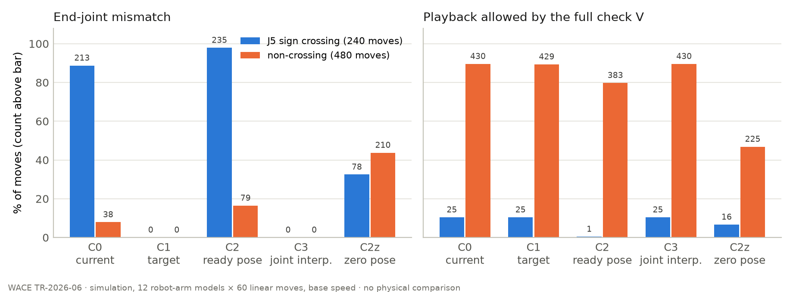

## Abstract

When a linear robot move is taught as six joint values and planned by numerical inverse kinematics that follows only the tool pose, the tool can arrive at the target while the joints end elsewhere. We pre-registered seven predictions and three falsification conditions for 720 linear moves (60 inputs × 12 robot-arm models in one simulator), four initial-guess strategies and three checks, and ran them once. With the current strategy (the previous sample's solution), **213 of the 240 moves whose start and target J5 had opposite signs ended on joint values other than the taught ones (88.8%, including 9 that did not converge; predicted ≥ 80%, correct)**, against **38 of the 480 other moves (7.9%; predicted ≤ 20%, correct)**. A wrist-configuration label computed from the kinematics predicted the case-level outcome: a mismatch occurred in 223 of 232 moves whose wrist label differed between start and target, and in 3 of 447 moves whose labels were all equal (P7, correct). **A check constructed for this report, which keeps every other finding of the product checker but replaces the end-joint comparison by an end tool-pose comparison, would have allowed 73 of the 251 mismatches to play back (29.1%; predicted ≥ 30% — wrong).** The other 178 were blocked by other findings, all with a joint-speed block (not pre-registered). Using the taught target or a joint-space interpolation as the initial guess removed the end mismatch by construction, but the 25 crossing moves that then passed the full check are the same 25 that the current strategy already passed (10.4%; predicted ≤ 20%, correct); the others were blocked by the joint-speed finding, mostly after a large single-sample joint jump (about 180° in model A; median speed ratio about 120; exploratory). None of the three falsification conditions was met. This is a simulation of one numerical inverse-kinematics implementation on models whose geometry was read from mesh files; it says nothing about any controller outside it.

## 1. Question

A linear move in a robot program can be taught by six joint values. The planner then takes the tool pose of those joint values as the end pose of a straight line and solves the line with numerical inverse kinematics, sample by sample. Joint values fix more than the tool pose: they also fix the arm configuration (shoulder, elbow, wrist) and the number of turns of joints 4 and 6. A planner that only follows the tool pose can therefore arrive at the target pose with joint values different from the taught ones. That this happens when no configuration is specified is known; what this report measures is how often and in which form it happens in this simulator's planner and checker, and what different checks see.

The pre-registered questions are:

1. When the tool reaches the target pose, how often do the planned end joint values differ from the taught joint values, and of which type is the difference (Section 3.5)?
2. How often does a **tool-tip comparison check constructed for this report** (T, Section 3.4) let such a move be played back?
3. Does the mismatch disappear when the initial guess of the inverse kinematics is changed, or does only the place where a discontinuity appears move?

## 2. Why this is a simulation-only question

Four initial-guess strategies are run on the same inputs, with everything else bit-identical. The comparisons between strategies and between checks (P3, P5, P6, P7) take place inside one kinematic model, so they do not depend on how well the model matches a physical robot. The levels of the rates (P1, P2) depend on the joint geometry stored in the simulator, which was read from mesh files and not compared with manufacturers' nominal dimensions (Section 7). This report says nothing about how any controller outside this simulator chooses a solution for a linear move.

The code under test is pre-release development code of the WACE Vision 2 robot-teaching feature. It has not been shipped to customers, and the end-joint mismatch cases counted here are blocked by the current checker before playback.

## 3. Experimental design

### 3.1 Code under test

| Item | Behaviour (from the source at commit `e2dc7a7`) |
| --- | --- |
| Target | Six joint values (degrees). The planner uses their forward-kinematics pose as the line's end pose |
| Trajectory | Fixed 4 ms samples. Position on a straight line, orientation by shortest-arc quaternion interpolation, one trapezoidal speed profile satisfying both the linear and the rotational limits |
| Inverse kinematics | One damped least-squares solver: 80 iterations, 8 halving step candidates per iteration, at most 4° per joint per step, clipped to joint limits, damping 1e-10, tolerance 0.01 mm and 0.01° |
| Initial guess | The previous sample's solution (the start joint values for the first sample) |
| Last sample | Joint moves set the last sample to the target; **linear moves do not** — the last IK solution is kept |
| End-joint mismatch finding | Per linear move, \|end − target\| per joint; **block if > 0.01°**, no folding by 360° |
| Joint-speed finding | Neighbour difference ÷ 4 ms ÷ joint maximum speed = ratio; block if > 1 × (1 + 1e-9), warn if > 0.9 × (1 + 1e-9) |
| IK failure | A sample without a solution inside tolerance. **This report counts IK failure and non-convergence as blocking in V and T** |

### 3.2 Inputs

60 linear moves per model, generated by an integer rule with no randomness, selection or retry (`TR-06_입력생성.py`). With b = ⌊k/6⌋ and k = 0…59:

| Joint | Start | Move |
| --- | --- | --- |
| J1 | −35 + 14·((k + b) mod 6) | +10 if k even, −10 if odd |
| J2 | −50 + 9·(b mod 5) | 6·(((k + b) mod 3) − 1) |
| J3 | 26 + 7·(k mod 5) | −8 |
| J4 | −24 + 8·(k mod 7) | +16 |
| J5 | 6 + 9·(k mod 6) | −18 |
| J6 | −30 + 12·(k mod 4) | −24 |

The same 60 inputs are used for all 12 models: 720 moves. Program: one linear move, default settings (125 mm/s, 500 mm/s², 45°/s, 180°/s², no tool offset). The input list's SHA-256 is `43da27bf7d0e63d51fedc9341e5555206550f62f73d723f53c832606e0874f8a`. All 720 moves have both ends inside the model's joint limits (smallest margin 21°). None coincides with the 20 inputs of the preliminary observation (Section 3.8).

### 3.3 Groups

| Group | Definition | Fixed when |
| --- | --- | --- |
| Primary: crossing / non-crossing | Start and target J5 have different / equal signs (k mod 6 ∈ {0, 1} is crossing): 20 / 40 per model | Before the run, from the inputs |
| Secondary: configuration labels equal / different | Shoulder, elbow, wrist labels and turns of J4, J6 computed per model from the planner's own kinematic chain | During the run, written to `labels.json` before any plan is made |

Labels (fixed in the pre-registration): with joint axes z_i and origins p_i from the planner's chain and the wrist centre pw taken as the foot, on the J4 axis, of the common perpendicular between the J4 and J5 axes — wrist = sign(z5 · (z4 × z6)); elbow = sign(z2 · ((p3 − p2) × (pw − p3))); shoulder = sign of the component of pw − p1 perpendicular to z1 along unit(z2 × z1); turns = ⌊(q + 180)/360⌋ for J4 and J6. A label is undetermined within 1° (wrist, elbow) or 1 mm (shoulder) of its boundary. The J5 sign is not the wrist boundary in every model; the secondary grouping and the agreement table (Section 5.4) address this.

### 3.4 Strategies and checks

| Strategy | Initial guess per sample |
| --- | --- |
| C0 current | Previous sample's solution — the product planner unchanged |
| C1 target | The taught target joint values |
| C2 ready pose | (0, −35, 55, 0, 35, 0) |
| C3 joint interpolation | Start and target joint values interpolated at the path parameter s ∈ [0, 1] |
| C2z zero pose (side table) | All zeros — starts on the wrist singularity; not used for any prediction |

C1–C3 re-solve the stored target pose of each C0 sample with the product's IK, changing only the initial guess; sample 0 is fixed to the start joint values. For C1 and C3 the initial guess at s = 1 is the exact solution, so their end mismatch is zero by construction; a non-zero value invalidates the run.

| Check | Definition |
| --- | --- |
| V full | The product checker unchanged (including the end-joint mismatch finding) |
| T tool-tip | **Constructed for this report; it does not represent any product's check.** The product checker without the end-joint mismatch finding, plus "end tool pose within 0.01 mm and 0.01° of the target" |
| V_cfg configuration pre-check | Block before planning if the secondary labels differ; otherwise as T |

"Playback allowed" means zero blocking findings. A "miss" is a C0 move with an end-joint mismatch that T allows.

### 3.5 Mismatch types

| Type | Definition |
| --- | --- |
| (a) turns | J4 and J6 differ by integer multiples of 360° (±0.01°), at least one non-zero; J1, J2, J3, J5 within 0.01° |
| (b) wrist flip | End and target wrist labels differ |
| (c) arm configuration | Elbow or shoulder labels differ |
| (d) same configuration, numerical difference | All labels equal and not (a) — **planner defect candidate** |
| (e) not converged | Mismatch and the plan did not converge |
| (x) undetermined | Any of the end or target wrist, elbow or shoulder labels inside its decision band |

Priority (e) → (x) → (c) → (b) → (a) → (d).

### 3.6 Measurements

Per move and strategy: signed per-joint end difference and type; convergence, number of failed samples and their cause (unreachable / joint limit / other solver failure); end tool-pose error; largest neighbour joint change, its sample and path parameter; cumulative J4 and J6 rotation; minimum manipulability along the path; largest joint-speed ratio; findings by kind; V, T, V_cfg. C0 is planned twice and must be identical; C0 is also run at 50% linear and rotational speed, accelerations unchanged (E4). The number of IK iterations used at the last sample is not measured: the product's solver does not report it.

### 3.7 Runs, invalidation and pre-checks

Runner `native/tools/robot_program_tr06.cpp` at commit `d1c4971`, product code at `e2dc7a7`. Built on one Linux aarch64 machine with Clang 21.1.8 (conda-forge), Release, `-ffp-contract=off`, from the product's 13 kinematics source files and the runner only (executable SHA-256 `ce467845bee57e2afbfee0ecd8811d0f48a64e1e07853552b182b99954e7b585`). The pre-registration draft named macOS arm64; the author moved the official run to this machine before freezing, after the preliminary survey tool built the same way reproduced the macOS result file byte for byte (SHA-256 `4a2c7ef0…6c87aa`). A run is invalid if: the two C0 plans differ; any fixed input hash differs; any input is outside its model's joint limits; the E1 direction rule leaves a limit; a pre-check fails; a converged C0 mismatch fails T's end-pose criterion (this must hold by construction, since convergence and T use the same tolerance); or C1/C3 show any end mismatch. Pre-checks on model A from the ready pose (0, −35, 55, 0, 35, 0) before the official run: negative (J6 target 90°, no mismatch), positive 1 (J6 target 270°, type a), positive 2 (start (0, −35, 55, 0, 30, 0) → target (0, −35, 55, 10, −30, 0), type b; J4 also moves 10° so that the line avoids the wrist singularity, which a J5-only move crosses exactly and follows continuously), and the re-solved C0 joint values bit-identical to the product plan. At most two retries per cause for the whole report; invalid and aborted runs are kept in the run ledger.

### 3.8 Preliminary observation (seen before the predictions)

During development, 12 models × 20 linear moves = 240 moves were judged: 114 normal, 60 warning, 66 blocked; 61 had an end-joint mismatch (53 converged, 8 not); of the 48 moves with a J5 sign change, 44 had a mismatch; of the other 192, 17. Before the end-joint check existed, 29 of the 61 would have been allowed to play back. These counts are kept separate from the confirmation experiment and are never pooled with it. Predictions P1–P3 were set after seeing them (Section 4).

## 4. Pre-registered predictions and verdicts

All verdicts use the base-speed, first-plan rows; ratios are decided by integer inequalities; denominators include non-converged moves. Pre-registration v1.0, SHA-256 `09622072fe062a00f2d1b07d2fbc5ada6aeb868d03848419671c5a5064c33b90`, published in `waceinc/tech-reports` commit `48d8eda` (2026-10-06 08:42:19 KST) before the official round.

**Replication predictions (set after the preliminary observation)**

| | Prediction (C0) | Threshold | Preliminary | Result | Verdict |
| --- | --- | --- | --- | --- | --- |
| P1 | Mismatch rate in the crossing group (240) | ≥ 80% | 44/48 | 213/240 (88.8%) | correct |
| P2 | Mismatch rate in the non-crossing group (480) | ≤ 20% | 17/192 | 38/480 (7.9%) | correct |
| P3 | Share of C0 mismatches that T allows (miss) | ≥ 30% | 29/61 (proxy, not T) | 73/251 (29.1%) | **wrong** |

**New predictions (no preliminary data)**

| | Prediction | Threshold | Result | Verdict |
| --- | --- | --- | --- | --- |
| P5 | C1 playback-allowed (V) rate in the crossing group | ≤ 20% | 25/240 (10.4%) | correct |
| P6 | C3 playback-allowed (V) rate in the crossing group | ≤ 20% | 25/240 (10.4%) | correct |
| P7 | C0: wrist labels differ ⇒ mismatch in ≥ 95%; all labels equal ⇒ mismatch in ≤ 5% (undetermined labels excluded and counted) | both | 223/232 (96.1%); 3/447 (0.7%); 24 excluded | correct |

**Falsification conditions**

| | Condition | Claim recorded as wrong if met | Result |
| --- | --- | --- | --- |
| F1 | Crossing minus non-crossing mismatch rate < 30 percentage points | "Mismatch occurs mainly where start and target configurations differ" | 88.8% − 7.9% = 80.8 points — not met |
| F2 | Miss rate (P3) < 10% | "A tool-tip-only check misses mismatches" | 29.1% — not met |
| F3 | C1, C2 or C3 solves ≥ 50% of the crossing group with no mismatch and V allowed | "Changing the initial guess does not remove it" | C1 25/240, C2 1/240, C3 25/240 — not met |

P3 is wrong: 73 of 251 (passing needed at least 76).

**Sensitivity analysis named in the pre-registration (non-converged moves excluded; not used for any verdict)**

| | P1 | P2 | P3 | P5 | P6 | P7a | P7b | F3 (C1 · C2 · C3) |
| --- | --- | --- | --- | --- | --- | --- | --- | --- |
| Converged only | 204/229 | 22/453 | 73/226 | 25/210 | 25/228 | 207/216 | 2/440 (11 excluded) | 25/210 · 1/200 · 25/228 |

Under this analysis P3 would be 32.3%; the verdict stays wrong.

The report has no overall pass or fail; results are published whichever way they fall, and wrong predictions are not revised.

## 5. Results

The Section 4 values and E1 are the independent check's output on the public files (`results/check_output.json`); the types in 5.2 are the runner's, confirmed by the independent check ((a) and (d) merged for B–L); the other tables were counted from the public files by `scripts/tables.py` (not pre-registered). Per-model denominators below 20 are given as counts only; the 720 moves are the same 60 inputs in 12 models and are not independent, so no statistical test is made.

### 5.1 Mismatch and playback by strategy

| Strategy | Mismatch, crossing | Mismatch, non-crossing | V allowed, crossing | V allowed, non-crossing | Converged |
| --- | --- | --- | --- | --- | --- |
| C0 | 213/240 | 38/480 | 25/240 | 430/480 | 682/720 |
| C1 | 0/240 | 0/480 | 25/240 | 429/480 | 669/720 |
| C2 | 235/240 | 79/480 | 1/240 | 383/480 | 607/720 |
| C3 | 0/240 | 0/480 | 25/240 | 430/480 | 687/720 |
| C2z | 78/240 | 210/480 | 16/240 | 225/480 | 575/720 |

C1 and C3 have no end mismatch by construction (Section 3.4) and none was observed. Their crossing moves are blocked by the joint-speed finding (all 215 of each; 30 in C1 and 12 in C3 also with an IK failure). The 25 crossing moves that C0, C1 and C3 allow are the same 25 moves (16 of model H and 9 of model D), none with an end mismatch.

### 5.2 Mismatch types (C0, base speed)

Of the 251 C0 mismatches: (b) wrist flip 196, (c) arm configuration 19, (e) not converged 25, (x) undetermined 8, (d) same configuration with a numerical difference 3, (a) turns 0. The three type-(d) cases, all in model D, are the planner-defect candidates of this study. For models B–L the public files carry the runner's type but not the end joint values needed to recompute (a) versus (d) (Section 8).

### 5.3 Why T blocked the other 178 (not pre-registered)

T blocked 178 of the 251 C0 mismatches: 153 by the joint-speed finding alone; 25 did not converge (all with an IK failure and a joint-speed block; 18 also outside the end-pose tolerance). In this input set the miss share was higher at 50% linear and rotational speed (E4): 156 of 257 mismatches (60.7%, exploratory; a different set of mismatched moves).

### 5.4 Primary and secondary groups

| Model | Crossing, wrist labels differ | Crossing, wrist labels equal | Non-crossing, wrist labels differ | Non-crossing, wrist labels equal | Any label undetermined |
| --- | --- | --- | --- | --- | --- |
| A | 20 | 0 | 0 | 40 | 0 |
| B | 20 | 0 | 0 | 40 | 0 |
| C | 20 | 0 | 0 | 40 | 0 |
| D | 20 | 0 | 0 | 40 | 0 |
| E | 20 | 0 | 0 | 40 | 0 |
| F | 20 | 0 | 0 | 40 | 0 |
| G | 16 | 0 | 0 | 32 | 12 |
| H | 0 | 16 | 16 | 16 | 12 |
| I | 20 | 0 | 0 | 40 | 0 |
| J | 20 | 0 | 0 | 40 | 0 |
| K | 20 | 0 | 0 | 40 | 0 |
| L | 20 | 0 | 0 | 40 | 0 |

In 10 of 12 models the J5-sign grouping and the wrist label agree in all 60 moves. Models G and H each have 12 moves with an undetermined label. In model H the two groupings disagree in 32 of the 48 moves with determined labels. P7 is stated on the labels for this reason.

### 5.5 Per model (C0)

| Model | Mismatch, crossing | Mismatch, non-crossing | Miss (T allowed / mismatches) |
| --- | --- | --- | --- |
| A | 20/20 | 0/40 | 3/20 |
| B | 20/20 | 1/40 | 4/21 |
| C | 20/20 | 0/40 | 0/20 |
| D | 11/20 | 4/40 | 11/15 |
| E | 20/20 | 0/40 | 4/20 |
| F | 20/20 | 0/40 | 4/20 |
| G | 20/20 | 11/40 | 11/31 |
| H | 2/20 | 20/40 | 0/22 |
| I | 20/20 | 0/40 | 9/20 |
| J | 20/20 | 0/40 | 6/20 |
| K | 20/20 | 2/40 | 9/22 |
| L | 20/20 | 0/40 | 12/20 |

Models D and H have the fewest crossing mismatches (11 and 2 of 20); H and G have the most non-crossing ones (20 and 11 of 40). Model H's mismatches are mostly non-convergence (15 of 22, type e). In model D all 20 crossing moves change the wrist label, yet 9 ended on the taught values; these are all 9 exceptions in P7a.

### 5.6 Checks compared (E5, C0)

| V / T / V_cfg | Moves |
| --- | --- |
| allow / allow / allow | 437 |
| block / block / block | 192 |
| block / allow / block | 71 |
| allow / allow / block | 18 |
| block / allow / allow | 2 |

The configuration pre-check V_cfg blocked 71 of the 73 misses before planning; the 2 it allowed have equal labels at start and target and are both type (d) (model D). It also blocked 18 moves that V allowed and that had no end mismatch: 11 with differing labels and 7 with an undetermined label. The pre-registration asked for this table by strategy and group; the other strategies are in `results/tables.json`.

### 5.7 Largest joint change (E6, crossing group, exploratory)

| Strategy | s < 0.1 | 0.1 ≤ s ≤ 0.9 | s > 0.9 | Median largest speed ratio |
| --- | --- | --- | --- | --- |
| C0 | 7 | 225 | 8 | 1.3 |
| C1 | 214 | 26 | 0 | 120 |
| C3 | 4 | 234 | 2 | 119.5 |

C1 and C3 produced a single-sample change of about 180° in model A (177°–180°); over all models the median speed ratio was about 120. The largest change lay at s < 0.1 in C1 and at 0.1 ≤ s ≤ 0.9 in C3. C0's largest change also lay mostly within 0.1–0.9 but was small (model A at most 9.1°; median ratio 1.3). The discontinuity did not move from C0's path: C1 and C3 created a new, large one. For C1 this does not match the pre-registered expectation that it would move to the middle of the path. No threshold was set.

### 5.8 Exploratory

- **E1 joint-speed rounding.** Of 2,880 joint moves planned at exactly 100% of the joint speed limit, 1,915 exceed the limit by floating-point rounding when compared without a margin (ratio > 1); with the checker's 1e-9 margin, 0 do.
- **E2 IK failures.** Moves with at least one failed sample: C0 38, C1 51, C2 113, C3 33, C2z 145 (of 720 each). By cause (a move can have both): joint limit 16 / other 24 (C0), 27 / 27 (C1), 33 / 105 (C2), 3 / 32 (C3), 64 / 123 (C2z); unreachable 0. Per model in `results/tables.json`.
- **E3 ready-pose and zero-pose guesses.** C2 (ready pose) allowed 1/240 crossing and 383/480 non-crossing moves; C2z (zero pose, on the wrist singularity) 16/240 and 225/480; C0 25/240 and 430/480.
- **E4 speed.** Section 5.3.

## 6. Run ledger

| Run | Date (KST) | Kind | Outcome | Note |
| --- | --- | --- | --- | --- |
| development runs | 2026-10-06 | development inputs k = 100…109 only | — | Runner tests; confirmation inputs not used. Not part of the results |
| tr06-precheck-1 | 2026-10-06 08:47 | pre-check (official executable) | pass | negative none · positive 1 a · positive 2 b · C0 bit-identical |
| tr06-official-1 | 2026-10-06 08:47:58–08:50:03 | official | valid | 5,040 rows + 2,880 E1 rows; runner exit 0; independent check [PASS] on original and public files |

No invalid or aborted official run.

## 7. Threats to validity and what this report does not claim

- It is a simulation. No result was compared with a physical robot or controller.
- One implementation of one numerical IK method (damped least squares, fixed iterations) is tested; analytical or other numerical solvers are not.
- Joint positions and axes of the 12 models were read from mesh files and not compared with nominal dimensions; the code marks all 12 as "unverified". The values are properties of the models in this simulator, not of the products.
- Some models do not have a spherical wrist, so J5 = 0 is not their wrist boundary; the secondary grouping exists for this reason.
- No self-collision or environment check; some models' mechanical constraints are not modelled.
- 720 moves from one integer rule. The rates belong to this input set and do not estimate how often mismatches occur in real programs.
- Multi-turn targets appear only in a pre-check and the preliminary observation.
- No blending; one linear move at a time, no tool offset.
- Line deviation is computed at sample midpoints only; orientation deviation is not measured.
- The 0.01° joint criterion and the 0.01 mm / 0.01° pose tolerance have different scales; near the wrist singularity the joints can move more than 0.01° within the pose tolerance, so part of type (d) may come from this.
- One Linux aarch64 machine (Section 3.7). E1 counts depend on compiler and floating-point behaviour.
- The labels are one fixed geometric definition; near their boundaries they can differ from the configuration a controller would report. 24 C0 moves had an undetermined label.
- IK iterations at the last sample were not measured.
- The frozen pre-registration (v1.0) still says "one macOS arm64 machine" in its limitations list and leaves the product checker's IK-failure severity "to be written in the frozen version"; its section 9 names this Linux machine, and this report counts IK failure as blocking in V and T as section 3 of the pre-registration requires. These are inconsistencies inside the frozen document, recorded here rather than edited.
- In the public files for B–L, `j4_travel_deg` and `j6_travel_deg` are kept at full precision; together with the start values and the joint-limit cause flag they give a weak hint of J4/J6 limits. The public-version rules were fixed before the results and are not changed after them.
- Figures 2 (joint-time plot) and 3 (teaching-screen capture) of the pre-registration's planned list were not produced: per-sample joint values are not in the result files, and the teaching screen was not run on the machine of the official round.

## 8. Released files, and what a reader can and cannot check with them

| File | Content | Licence |
| --- | --- | --- |
| `TR-2026-06.md` · `.pdf` | This report | CC BY 4.0 |
| `TR-2026-06/MANIFEST.md` | SHA-256 and licence of every bundle file | — |
| Pre-registration (frozen) | For comparison with its published hash | CC BY 4.0 |
| `results/`: `results.jsonl.gz` (gzip of the public `results.jsonl`, 5,177,769 bytes uncompressed) · `labels.json` · `e1.jsonl` · `run.json` · `summary.json` · `precheck.json` (public version), `check_output.json`, `tables.json` | Results with models shown as A–L, the independent check's output on them, the tables of Section 5 | CC BY 4.0 |
| `precheck/tr06-precheck-1_precheck.json` | Pre-check of the official executable | CC BY 4.0 |
| `fixed/`: `TR-06_입력생성.py` · `TR-06_입력목록_v2.json` · `TR-06_개발입력_전용.json` | Input rule, confirmation list, development list (hash-fixed, byte-identical) | MIT · CC BY 4.0 · CC BY 4.0 |
| `fixed/`: `TR-06_결과형식_v1.md` · `TR-06_독립검산.py` · `TR-06_공개본변환.py` | Result format, independent check, public-version converter (hash-fixed, byte-identical) | CC BY 4.0 · MIT · MIT |
| `scripts/tables.py` · `scripts/figure1.py` · `figures/figure1.png` | Section 5 tables and Figure 1 from the public files | MIT · MIT · CC BY 4.0 |
| `runner/robot_program_tr06.cpp` | The runner as run (commit `d1c4971`); it calls the unreleased product code | MIT |

Model A is shown by name; B–L are not. Their order is set by a private mapping (random permutation and a 32-byte salt, created on 2026-10-02 before any result); only its SHA-256 (`222d8e47a6de09341f4f358d3fb5b51228510b00446741a8a004aeef4d3339f4`) is published. For B–L, the public files keep only per-joint "difference > 0.01°" flags instead of end joint values, the path parameter instead of sample numbers, no sample counts, IK failure as flags, the speed ratio to two decimals and manipulability as a ratio to the model's maximum, so that joint limits, maximum speeds and link lengths cannot be recovered directly (see Section 7). The SHA-256 of each original file is in the public `run.json`.

A reader can: regenerate the inputs; recompute every numerator and denominator in Section 4 from the public files with the released independent check; recount the Section 5 tables; recheck the types and speed findings of model A (re-planning still needs the unreleased product source). A reader cannot: re-plan any model; recompute types (a) and (d) for B–L (the runner's type is given); confirm that the files came from the stated code. The product source is not released (decision of 2026-10-02); Section 3.1 describes the planner, IK and checker.

The kinematic dimensions of model A (from ROS-Industrial, Apache-2.0), listed as planned in the pre-registration's section 12, are not in this bundle. ABB is a trademark of ABB Ltd; this report is not affiliated with ABB. No patent will be filed on the end-joint check; this report serves as its disclosure.

## 9. Checks before release

| Gate | Status |
| --- | --- |
| Pre-registration hash: the released v1.0 equals the file whose SHA-256 was committed before the run | [PASS] |
| Invalidation criteria (runner exit 0; independent check finds none) | [PASS] |
| Independent check on the original and on the public files (same Section 4 values) | [PASS] |
| Pre-release review by AI agents (11 required changes in the first review, 3 in the final review, all applied in this version) | [PASS] |
| Numbers in the text: every "x/n" fraction against the result files and the check output (the "x of n" forms and table cells were recounted by the reviewer) | [PASS] |
| Public-version leak check (no internal model names, B–L allowed keys only) and bundle search for sensitive strings | [PASS] — one false positive in PNG pixel data (MANIFEST) |
| Forbidden-term sweep | [PASS] |
| Author's release confirmation | given 2026-10-06 |

## 10. Use of generative AI

The planner, checker and survey tool, the runner, the scripts, this report and its pre-registration were written with LLM coding agents. The cross-reviews of the pre-registration (three independent judges and a domain reviewer, 2026-10-02), the adversarial reviews of the scripts and the runner, and the pre-release review of this report were also done by agents of the same family. No person reviewed the planner, checker or runner code line by line. The author decided the open items and approved the runner commit, the move of the official run to the Linux machine, the frozen pre-registration and the release (2026-10-06).

## Appendix A. Where each number comes from

| Number | Source (in the release bundle) |
| --- | --- |
| P1–P7, F1–F3, sensitivity (Section 4, abstract) | `results/check_output.json` → `result.predictions`, `result.sensitivity_converged_only` |
| Mismatch types (5.2) | `type` field of `results/results.jsonl` (runner); the independent check recomputes them for model A and as "(a) or (d)" for B–L (`results/check_output.json`) |
| E1 1,915 / 0 | `results/check_output.json` → `result.e1` |
| Tables 5.1, 5.3–5.7, E2–E4, Figure 1 | `results/tables.json` from `scripts/tables.py`; `scripts/figure1.py` |
| Run times | `results/run.json` |
