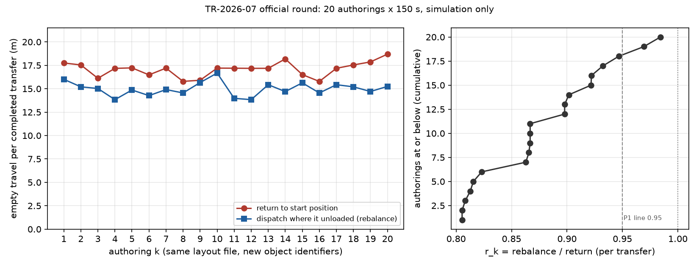

> **Revision note (v1.1).** This version adds one sentence that v1.0 left to the author (Licence section and `MANIFEST.md`): "No patent will be filed on the dispatch rules described in Section 3.1 (the return, rebalance and lookahead rules and the charge variant); this report serves as their disclosure." The pre-registration (section 12) planned this disclosure and the pre-release review asked for it; the author decided on 2026-10-08. No number, table, figure, result file or other text changes, except the matching line of the release-gate table in Section 9.

## Abstract

A fleet of autonomous mobile robots (AMRs) that returns each vehicle to its start position after it unloads drives empty on the way back; dispatching the vehicle from where it unloaded avoids part of that. We measured how large the difference is in one simulated lab, whether it costs completed transfers, and how much it varies when the same lab is built again. The lab is an 18 x 12 m floor with six sites, obstacles and two chargers, and five AMRs of three types run one fixed, one-directional job list for 150 s of simulation (MuJoCo physics, assumed parameters, no physical comparison). Before any official run we registered five predictions and two falsification conditions, then built the lab 20 times from one fixed layout file (each build gives new object identifiers, which changes the run) and ran each build under four dispatch rules. All 20 builds were valid, and the determinism repeats of the first build were identical under all four rules. Empty travel per completed transfer under the rebalance rule divided by that under the return rule had a median of **0.867** (range 0.805 to 0.984) and was below 1 in **20 of 20** builds; completed transfers under rebalance were equal to or more than under return in **16 of 20** (equal 9, more 7, fewer 4). There was no vehicle-to-vehicle contact in 84 of 84 runs, and in the battery variant the low-battery vehicle docked in 20 of 20 builds. **All five predictions held and neither falsification condition was triggered.** The direction of the effect is largely fixed by where the start positions are; what the report adds is its size in this lab, its spread over re-authoring, and that completed transfers were not fewer in 16 of 20 builds (fewer by 1 or 2 in the other 4). The lab was tuned during development while watching the rebalance rule. The application source is not public; the release bundle holds the pre-registration, the public-version results, and the scripts that recompute every verdict.

## 1. Question

In a simulated lab with no factory equipment, only a floor, obstacles, six sites and two chargers (physical values assumed, no physical comparison), five AMRs of three types with different payload limits and roles process the same job list. We asked:

1. When a vehicle that has unloaded is dispatched from **where it unloaded (rebalance)** instead of **driving back to its start position first (return)**, how much does **empty travel per completed transfer** change (size)?
2. Does the rebalance rule **cost completed transfers** in the same 150 s (non-inferiority)?
3. How much does the size vary when the lab is **built again** from the same layout file?

The start positions (x = −7 m) lie outside the pickup column (x = −3.5 m), so under the return rule every transfer ends with a drive back to the start position. The direction of the empty-travel difference is therefore largely fixed by the layout. The report measures its size and spread in this lab, and tests whether it is paid for with completed transfers.

## 2. Why this is a simulation-only question

The same lab, job list and vehicles can be run side by side with only the dispatch rule changed, and a run is bit-reproducible within one build. The comparison between rules takes place inside one simulator. Absolute empty travel, completion counts and times depend on the layout and on assumed vehicle values (Section 3.2) and do not describe any site. The report says nothing about physical AMRs or physical dispatch systems.

## 3. Experimental design

### 3.1 Lab and code under test

The code under test is pre-release development code of a WACE Inc. simulation application. It has not been shipped to customers, and nothing in this report describes a released product.

| Item | Behaviour (product commit `af2d3ef2e811c48a55c56cfd2b0312e8367765d4`) |
| --- | --- |
| Lab | 18 x 12 m floor. West sites A, B, C at x = −3.5 m, east sites D, E, F at x = 3.5 m, z = −3.5, 0, 3.5 m. A central wall of four obstacles with three passages, two box obstacles, two chargers, four waiting positions at x = 6 m, five start positions at x = −7 m (z = −4, −2, 0, 2, 4). Floor marks at the six sites have no collision. One stock station owns the parcels but is neither drawn nor collidable |
| Jobs | 11 job templates, all west to east: 8 light-box (3 kg) carrier jobs, 2 light-box lift jobs, 1 heavy-load (180 kg) carrier job. One job is released every 2 s, cycling through the templates in list order |
| Handoff | Direct: 2.5 s after a vehicle stops at its pickup site the parcel appears on it; 2.5 s after it stops at its drop-off site the parcel is gone (no robot or loading equipment) |
| Dispatch order | Oldest job that some vehicle can take: if no vehicle can take the head job, up to 8 jobs ahead are considered |
| Return rule | The vehicle that unloaded drives to its own start position before it takes the next job |
| Rebalance rule | The vehicle that unloaded takes the next job from where it is; if there is none it steps aside to the nearest free waiting position |
| Lookahead rule | Rebalance plus joint dispatch: with two idle vehicles and two waiting jobs at once, the pair is chosen together |
| Charge variant | Rebalance plus batteries (capacity 1 Wh, 0.002 Wh/m, charging below 25 %; the other battery parameters are in `fixed/TR-07_run.py`). The vehicle at start position (−7, −4) starts at 20 %, the others at 100 %. A different condition: used only for P5, not compared |
| Physics | MuJoCo. Differential drive with wheel velocity servos and motor torque limits; each wheel touches the floor at one point of a thin ellipsoid; the wheel-speed limit keeps the yaw share and reduces forward speed. Parcels are held on the deck; load-safe acceleration limits from friction and parcel size are on |
| Routing | Path planning on the static map plus lidar-sensed stops and detours. Vehicle-to-vehicle contact is counted by the simulator (`amrPeerContactCount`) |
| Empty travel | The engine's fleet meter: the sum of horizontal displacement per fixed step of vehicles that carry no parcel (approach to the pickup, return, moves to waiting positions and chargers, and small motion while stopped). Runs stop at 150 s, so empty travel in progress is included |

### 3.2 Vehicles

| Label | Count, role (start z) | Payload limit | Values in the simulator |
| --- | --- | --- | --- |
| V1 | 2, carrier (−4, −2) | 250 kg | Body 94 kg, payload 250 kg and top speed 2.0 m/s **taken from one manufacturer's public specification**; wheel radius 0.10 m, track 0.46 m, motor and friction assumed |
| V2 | 2, carrier (0, 2) | 100 kg | All assumed: body 65 kg, wheel radius 0.09 m, track 0.36 m, top speed setting 1.8 m/s (1.41 m/s wheel limit) |
| V3 | 1, lift (4) | 150 kg | All assumed: body 80 kg, wheel radius 0.10 m, track 0.62 m, top speed setting 1.8 m/s (1.57 m/s wheel limit) |

The values are what the simulator holds, not properties of any product; apart from the three V1 values they were not compared with manufacturer data, and friction (0.4) and parcel sizes are assumed. Because redistribution rights for the vehicle shape files are not confirmed, no shape file or screen capture showing them is released and no product or manufacturer is named. The labels are not meant to prevent identification: the three V1 values point to a product.

### 3.3 Replication unit and inputs

One fixed layout file is built into a lab **20 times** (authorings k = 1 to 20) by the application's own authoring stage (wizard, placement, dialogs, save). Each authoring gets new random object identifiers and is otherwise identical: the runner checks that a canonical form of every authored project (all identifiers replaced by one token, identifier-keyed maps compared as unordered collections, save time and asset signatures dropped) has the same SHA-256 in all authorings. Runs within one authoring gave the same completed transfers and empty travel whenever repeated during development (Section 3.7), and in the official round the first authoring's repeats under all four rules were identical (Section 4), so an authoring is treated as one replication. What changes between authorings is the identifiers, which change the order in which the physics model is built and in which dispatch ties are broken; the mechanism was not examined. The variation is a sensitivity to an arbitrary ordering, not a random sample from a population.

### 3.4 Rules per authoring

Each authored project is copied four times with only the rule flags changed (return, rebalance, lookahead) or with batteries added (charge variant), and each copy runs once.

### 3.5 Measurements per run

| Measurement | Definition |
| --- | --- |
| Completed transfers | Transfers whose unloading finished within 150 s |
| Empty travel | The fleet meter (Section 3.1) |
| **Empty travel per completed transfer** | Empty travel ÷ completed transfers |
| Completed within 60 s | Transfers completed at or before 60 s |
| Mean transfer time | From load start (first sample with the parcel loaded − 2.5 s) to the end of unloading |
| Vehicles moving | Per 1 s sample after 10 s, vehicles with horizontal speed > 0.05 m/s: minimum, and share of samples with at least 3 |
| Contact | `amrPeerContactCount` |
| Charging | Docked samples of the low-battery vehicle; samples in which one charger is reserved twice |
| Refusals | Dispatch refusals by reason (role mismatch, payload limit, and others) |

### 3.6 Runs, invalidation and positive control

Physics child process, 150 s of simulation, fixed step 0.05 s, four runs in parallel, one Ubuntu machine (Linux aarch64, NVIDIA GB10, Xvfb with VirtualGL). The runner refuses to start if the layout file or any of the four scripts differs from its pre-registered SHA-256, or if the product commit given to it is not 40 hexadecimal characters. A run is good when its exit code is 0, its state is `horizon_reached`, it reports no error, its result, diagnostics and log files exist and it was measured; a run that produced no result would be repeated on the same project at most twice (none was). An authoring is valid when its authoring stage passed, its four rule runs are good and the return run completed at least one transfer. The round is invalid if the canonical forms differ, if the first valid authoring's two runs per rule differ in completed transfers, empty travel or completion times, if more than two authorings are invalid, or if a planned run is missing. Before the official round, a positive control (two authorings with the official executable and the fixed scripts) passed tables, the independent recompute on raw and public files, and the public conversion. An outside watchdog would have stopped the round after two consecutive failed authoring stages.

### 3.7 Preliminary observation (seen before the predictions)

Before the pre-registration was fixed, eight builds had been run with the same physics (seven of the current layout, one with the stock station drawn; the thresholds were set after the first four and left unchanged after the other four): the ratio (Section 4) was 0.845 to 0.924 in all eight, and rebalance completed at least as many transfers as return in 6 of 8. Runs repeated within one build had always given the same completed transfers and empty travel (recorded to two decimals). The lab itself had been tuned during development (layout, release interval, job distance, waiting positions, engine behaviour) while watching a pacing target for the rebalance rule. One trial with jobs in both directions was worse (rebalance 13 transfers, mean transfer 28.7 s) and was reverted. P1 to P3 are reproduction predictions based on these observations.

## 4. Pre-registered predictions and verdicts

Primary measure: for each valid authoring k, **r_k = (rebalance empty travel ÷ rebalance completed transfers) ÷ (return empty travel ÷ return completed transfers)**, computed as exact fractions of the stored values. If rebalance completed no transfer, r_k counts as +∞; the median of an even count is the mean of the two middle values. Rate thresholds are integer comparisons (for example "x/n ≥ 80 %" is 5x ≥ 4n), n = valid authorings = 20.

| No. | Prediction | Line | Preliminary | Result | Verdict |
| --- | --- | --- | --- | --- | --- |
| P1 | Median r_k ≤ 0.95 | wrong if above | 0.845–0.924 | **0.867** | **Held** |
| P2 | r_k < 1 in at least 80 % of authorings | wrong if below | 8/8 | **20/20** | **Held** |
| P3 | Rebalance completed ≥ return completed in at least 70 % | wrong if below | 6/8 | **16/20** | **Held** |
| P4 | No vehicle-to-vehicle contact in any counted run (valid authorings' four rules plus the determinism repeats) | wrong if any | — | **0/84** | **Held** |
| P5 | Charge variant: the low-battery vehicle docks and no charger is double-reserved, in every valid authoring | wrong if any fails | — | **20/20** | **Held** |

| No. | Falsification condition | Claim it would falsify | Result |
| --- | --- | --- | --- |
| F1 | Median r_k ≥ 1.00 | Rebalance shortens empty travel per transfer | Not triggered (0.867) |
| F2 | Rebalance completed fewer than return in more than half of authorings | Rebalance does not cost completed transfers | Not triggered (4/20) |

F1 was expected not to trigger because of the layout (Section 1); P3 and F2 are the predictions that could plausibly have failed. The round was valid: canonical forms identical in 20 of 20 authorings, determinism repeats identical in all four rules, no invalid authoring, 84 of 84 planned runs present.

## 5. Results

### 5.1 Empty travel per completed transfer

| Rule | Median (min–max), m | Completed transfers, median (min–max) |
| --- | --- | --- |
| Return | 17.19 (15.78–18.70) | 14.5 (13–16) |
| Rebalance | 14.97 (13.83–16.67) | 15 (13–17) |
| Lookahead (exploratory) | 14.63 (13.83–16.67) | 15.5 (13–17) |
| Charge (not compared) | 15.23 (13.65–16.71) | 14 (13–16) |

r_k ranged from 0.805 (authorings 4 and 12) to 0.984 (authoring 9); the median 0.867 corresponds to 13.3 % shorter empty travel per transfer. Re-authoring alone moved r_k across this range.

### 5.2 Completed transfers

Rebalance minus return, per authoring: −2 in 3 authorings, −1 in 1, 0 in 9, +1 in 2, +2 in 2, +3 in 1, +4 in 2.

### 5.3 Per authoring

| k | Return completed | Rebalance completed | Return m/transfer | Rebalance m/transfer | r_k |
| --- | --- | --- | --- | --- | --- |
| 1 | 15 | 13 | 17.75 | 16.00 | 0.902 |
| 2 | 14 | 14 | 17.54 | 15.20 | 0.867 |
| 3 | 16 | 16 | 16.11 | 15.02 | 0.932 |
| 4 | 13 | 17 | 17.18 | 13.83 | 0.805 |
| 5 | 13 | 14 | 17.23 | 14.86 | 0.863 |
| 6 | 16 | 16 | 16.48 | 14.27 | 0.866 |
| 7 | 14 | 15 | 17.20 | 14.91 | 0.867 |
| 8 | 16 | 14 | 15.79 | 14.55 | 0.922 |
| 9 | 15 | 15 | 15.91 | 15.66 | 0.984 |
| 10 | 14 | 14 | 17.20 | 16.67 | 0.969 |
| 11 | 15 | 15 | 17.19 | 13.97 | 0.813 |
| 12 | 13 | 17 | 17.18 | 13.83 | 0.805 |
| 13 | 15 | 15 | 17.18 | 15.43 | 0.898 |
| 14 | 13 | 15 | 18.18 | 14.70 | 0.808 |
| 15 | 15 | 14 | 16.51 | 15.63 | 0.947 |
| 16 | 16 | 14 | 15.78 | 14.55 | 0.922 |
| 17 | 15 | 15 | 17.18 | 15.43 | 0.898 |
| 18 | 14 | 14 | 17.54 | 15.20 | 0.867 |
| 19 | 14 | 17 | 17.86 | 14.70 | 0.823 |
| 20 | 13 | 15 | 18.70 | 15.25 | 0.816 |

The 20 authorings gave 17 distinct (return, rebalance) outcomes: authorings 2 and 18, 4 and 12, and 13 and 17 are identical. Different identifier orderings can lead to the same run.

### 5.4 Exploratory (no hypotheses)

- **E1 Lookahead.** Median of (lookahead ÷ rebalance) empty travel per transfer = 1.00; completion times identical to rebalance in 13 of 20 authorings and different in 7, with a median of 15.5 against 15 completed transfers.
- **E2 Development pacing targets** (mean transfer ≤ 20 s, 8 transfers within 60 s, at least 3 vehicles always moving after 10 s), median (min–max): mean transfer time return 20.4 s (18.6–23.2), rebalance 20.6 s (19.0–25.4); completed within 60 s return 6 (6–6), rebalance 6 (4–7); share of samples with at least 3 vehicles moving return 0.665 (0.577–0.739), rebalance 0.641 (0.592–0.697); minimum vehicles moving after 10 s 0 to 1. No authoring met all three targets: the 60 s and moving-vehicle targets were met in none, the mean-transfer target in some (minimum 18.6 s for return, 19.0 s for rebalance).
- **E3 Refusals and speeds.** Summed over 20 authorings (reason keys in the result files: `role-mismatch`, `loaded-drive-incompatible` = payload limit, and others), return: role mismatch 601, payload limit 40; rebalance: role mismatch 218, payload limit 23, vehicle holding or assigned 1,429, vehicle phase 255, pickup site not clear 152. Highest recorded speed per vehicle type over all runs: V1 1.9969 m/s, V2 1.4132 m/s, V3 1.5689 m/s (V2 and V3 are held by their wheel-speed limits, Section 3.2).
- **Charge variant.** The low-battery vehicle docked in 20 of 20 authorings with no double reservation (P5); completed transfers 14 (13–16).

## 6. Run ledger

| Round | Time (KST) | Result |
| --- | --- | --- |
| Positive control (two authorings, official executable, fixed scripts) | 2026-10-06, before the hash commit | Passed tables, independent recompute (raw and public) and public conversion; values in the pre-registration Section 4 |
| Pre-registration hash commit | 2026-10-06 22:00:16 (pushed 22:00:23) | waceinc/tech-reports `bbd88eb` |
| **tr07-official-1** | 2026-10-06 22:00:40–23:05:17 | 20 of 20 authorings passed, 84 of 84 runs, no repeated attempt, watchdog not triggered; round valid |

There was no other official round.

## 7. Threats to validity and what this report does not claim

- This is a simulation. There is no comparison with physical AMRs or a physical dispatch system, and the numbers do not describe any site or product.
- One lab, one one-directional job list, five vehicles, 150 s. **The direction of the effect is largely set by the start positions lying outside the pickup column.** With other layouts or flows (for example jobs in both directions, which was worse in one trial) the size and even the direction may differ.
- **The lab was tuned during development while watching the rebalance rule** (Section 3.7). It is not a lab tuned fairly for every rule.
- The replication unit is re-authoring. The spread is a sensitivity to object-identifier ordering, not the sampling uncertainty of a population; no confidence interval is given. The mechanism of the variation was not examined.
- Empty travel is the engine's meter as defined in Section 3.1. The independent recompute recounts the same result files; it does not measure empty travel by another method.
- Physical values (friction, parcel sizes, wheels, motors) are assumed; the wheel-contact model was changed just before this study (one-point ellipsoid contact, to make in-place rotation follow the command).
- One machine, one executable.
- No vehicle-to-vehicle contact (P4) is a count of contacts inside the simulator, not a safety claim.
- The lookahead rule's median equality with rebalance (E1) describes this lab only; it does not say that joint dispatch has no effect elsewhere.
- Different authorings can produce the same run (17 distinct outcomes in 20), so the 20 authorings are not 20 distinct observations.

## 8. Released files, and what a reader can and cannot check with them

| File | Content | Licence |
| --- | --- | --- |
| `TR-2026-07.md`, `TR-2026-07.pdf` | This report | CC BY 4.0 |
| `TR-2026-07/MANIFEST.md` | SHA-256 and licence of every bundle file | — |
| `TR-2026-07/preregistration/TR-2026-07_사전등록_v1.0.md` | The pre-registration whose SHA-256 is in `PREREGISTRATIONS.md` (Korean) | CC BY 4.0 |
| `TR-2026-07/results/` | Public version of the round: `results.jsonl` (one row per run), `run.json` (ledger), `tables.json` (tables and verdicts), `runs/*.json` (per-run values read from the raw files, for the independent recompute), `layout_public.json` (the fixed layout with vehicle model identifiers replaced by V1 to V3). Vehicle identifiers appear as `V1-1`-style labels | CC BY 4.0 |
| `TR-2026-07/fixed/` | `TR-07_run.py`, `TR-07_tables.py`, `TR-07_recompute.py`, `TR-07_public.py` and `TR-07_fixed.json` (their pre-registered SHA-256) | MIT (scripts), CC BY 4.0 (JSON) |
| `TR-2026-07/scripts/figure1.py`, `TR-2026-07/figures/figure1.png` | Figure 1 from `results/tables.json` | MIT, CC BY 4.0 |

Rule names in the files are `return`, `predictive` (= rebalance), `lookahead` and `charge`. A reader can: hash the pre-registration and compare it with `PREREGISTRATIONS.md`; recompute every table and verdict from the public files (`python3 TR-2026-07/fixed/TR-07_tables.py TR-2026-07/results --json /tmp/tables.json`, then compare with `results/tables.json`); run the independent recompute on the public per-run files (`python3 TR-2026-07/fixed/TR-07_recompute.py TR-2026-07/results TR-2026-07/results/tables.json`); and redraw Figure 1 (`python3 TR-2026-07/scripts/figure1.py TR-2026-07/results/tables.json /tmp/figure1.png`, needs matplotlib; the image is visually identical, not byte-identical). A reader cannot rerun the simulation or confirm that the files came from the stated commit: the application, its physics and dispatch source, the authored projects and the vehicle shape files are not released, and the raw diagnostics and logs (which contain model identifiers and local paths) are kept by the company together with a SHA-256 list. The private map from V1 to V3 to the simulator's model identifiers is not released; its SHA-256 (`d2e9d84a…f2a869`, in the pre-registration) is. The pre-registration names the company's private repository, branches and internal paths; they are not accessible. In `results/layout_public.json` one developer note was redacted by hand (two vehicle display names replaced by V2 / V3, listed in `MANIFEST.md`); two other notes describe an earlier layout (x = ±5) and were kept as fixed — the coordinates in the data are authoritative.

## 9. Checks before release

| Gate | Status |
| --- | --- |
| Pre-registration hash: the released v1.0 equals the file whose SHA-256 was committed before the run (`bbd88eb`) | [PASS] |
| Invalidation criteria (canonical forms, determinism repeats, invalid authorings, planned runs) | [PASS] round valid |
| Independent recompute on the raw and on the public files (same Section 4 values) | [PASS] MATCH on both |
| Pre-release review by AI agents (recount of every number from the public files, pre-registration consistency, claim scope, anonymisation, reproducibility) | [PASS] after fixes: first review 2 must-fix, 8 medium, 13 low, applied or disclosed; one of them (a sentence that the dispatch rules will not be patented) was left to the author in v1.0 and added in v1.1; final review 1 must-fix and 3 medium, applied |
| Numbers in the text against `results/tables.json` | [PASS] |
| Numbers in the PDF against the Markdown | [PASS] 150 distinct numbers, none missing |
| Isolated reproduction from `MANIFEST.md` (tables byte-identical, recompute MATCH, every listed SHA-256) | [PASS] |
| Public-version leak check (no model identifiers, display names, local paths or vehicle shape files) | [PASS] after one documented hand redaction |
| Company, person and legal statements against the company's records | [PASS] after applying the fact-checker's wording verbatim |
| Forbidden-term sweep | [PASS] |
| Author's release confirmation | instruction given 2026-10-06 |

## 10. Use of generative AI

An LLM coding agent wrote and changed the lab, dispatch and physics code during development, wrote the runner, table, recompute and public-conversion scripts, drafted the pre-registration and this report, and ran the official round. Three AI agents that did not read each other's output reviewed the pre-registration draft (design, arithmetic and scripts, public-release risk), and further AI agents reviewed this report before release. No person reviewed the code line by line. The author instructed on 2026-10-06 that the report be published (「기술보고서까지 공개가 되어야 함」) and is responsible for the content.

## Licence

Code (every `.py` file in the bundle) is released under the MIT licence, Copyright (c) 2026 WACE Inc. (주식회사 웨이스); the report, tables, figure, results, the pre-registration and every other file of the bundle that is not code are released under CC BY 4.0. The licence of each file is declared in `MANIFEST.md`, and the licence texts are in `LICENSES/` at the repository root. This release does not grant any licence under patents of WACE Inc., including Korean patents No. 10-2904772 and No. 10-3003470, or under any pending or future patent application of WACE Inc. No patent will be filed on the dispatch rules described in Section 3.1 (the return, rebalance and lookahead rules and the charge variant); this report serves as their disclosure. Other names in this report (MuJoCo, NVIDIA GB10, Ubuntu, Xvfb, VirtualGL) belong to their respective owners; this report is not affiliated with them. This report names no vehicle manufacturer or vehicle product.

## Appendix A. Where each number comes from

| Number | Source |
| --- | --- |
| P1 to P5 values and verdicts, F1 and F2 | `results/tables.json` → `predictions`, `falsifiers` (recomputed by `TR-07_tables.py` and independently by `TR-07_recompute.py`) |
| r_k per authoring, range | `results/tables.json` → `ratios` |
| Table 5.1 medians and ranges | `results/tables.json` → `describe.<rule>.emptyPerTransfer`, `.completed` |
| Table 5.3 | `results/tables.json` → `perAuthoring` (empty travel ÷ completed, rounded to 0.01) |
| Section 5.2 distribution | `perAuthoring.<k>.predictive.completed − perAuthoring.<k>.return.completed` |
| E1 | `results/tables.json` → `exploratory` |
| E2, E3 | `results/tables.json` → `describe.<rule>` |
| Run times, attempts | `results/run.json`, `results/results.jsonl` (`attempts`) |
| Preliminary values | Pre-registration Section 4 |

In the result files the rebalance rule is stored under the key `predictive`; the other keys are `return`, `lookahead` and `charge`.
